# OS  

## 缩写

- `ABI`：应用程序二进制接口
- `API`：应用程序编程接口
- `BF`：最佳适配
- `NF`：下次适配
- `CPL`：当前特权级别
- `DAT`：磁盘分配表
- `DMA`：直接内存存取
- `FAT`：文件分配表
- `FCFS`：先来先服务
- `FIFO`：先进先出
- `FF`：首次适配
- `IDS`：入侵检测系统
- `ISA`：指令系统体系结构
- `ISR`：中断服务例程
- `KLT`：内核级线程
- `LWP`：轻量级进程
- `LRU`：最近最少使用
- `MMU`：内存管理单元
- `PSW`：程序状态字
- `SMP`：对称多处理器
- `PCB`：进程控制块
- `PSR`：处理器状态寄存器
- `ULT`：用户级线程
- `PTE`：页表项
- `TLB`：转换检测缓冲区
- `SPN`：最短进程优先
- `SRT`：最短剩余时间
- `OPT`：最佳算法
- `PFF`：缺页中断频率
- `PRI`：基于优先级
- `RR`：轮转法
- `VSWS`：可变采样间隔的工作集
- `HRRN`：最高响应比
- `SSTF`：最短服务时间优先
- `RAID`：独立磁盘冗余阵列
- `WF`：最差适配

## 第一章

### 基本指令周期

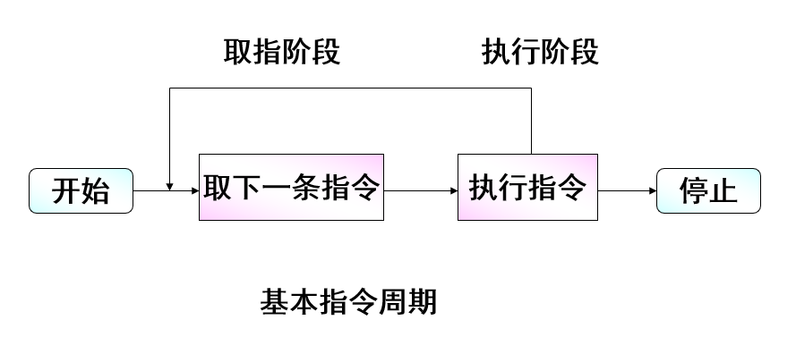  

>PC保存下一指令地址
>IR指令寄存器

### 中断

中断是一种机制，即允许其它模块（I/O、存储器）在处理器正常处理过程中打断其工作  

#### 中断分类

- 程序中断
- 时钟中断
- I/O中断
- 硬件失效中断

#### 中断和指令周期  

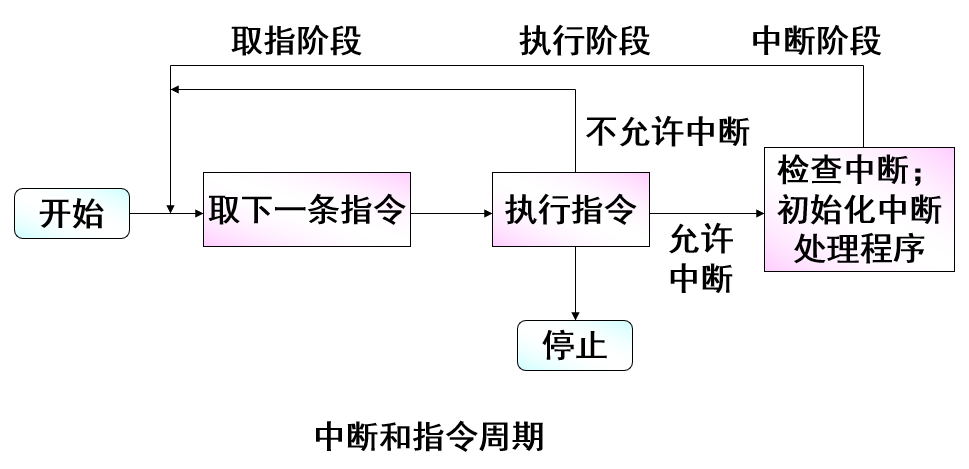

#### 中断处理

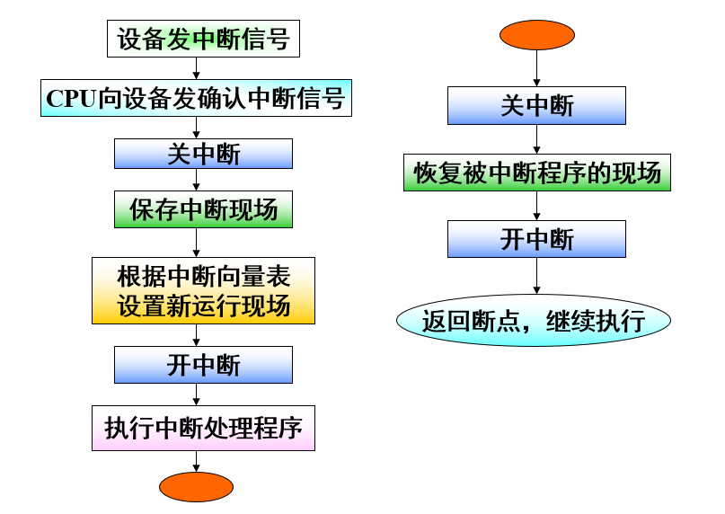

##### 多中断

- 顺序中断处理: 当正在处理一个中断时，禁止中断
- 嵌套中断处理: 定义中断优先级，允许高优先级的中断打断低优先级的中断处理程序的运行

### 访问的局部性原理

在执行程序期间，处理器的指令访存和数据访存呈现“簇”状(一组数据集合)

#### 二级存取平均时间

cache A, 内存B, 命中率C  
$A*C+(A+B)*(1-C)$  

### I/O操作三种可能的技术

- 可编程I/O
- 中断驱动I/O
- 直接内存存取（DMA）

## 第二章

> 操作系统是控制应用程序执行的程序，并充当应用程序和计算机硬件之间的接口

### OS类型

#### 多道批处理系统

- 内存同时保存多个程序，当一个作业需要等待I/O时，处理器可以切换到另一个不需要等待I/O的作业。
- 提高CPU的利用率。
- 需要中断技术、内存管理、进程调度等方面的支持

#### 分时系统

- 允许多个联机用户同时使用一个计算机系统进行交互式计算。
- 时钟中断，时间片技术
- 响应时间快

## 第三章 进程描述和控制

>进程定义
>
>- 一个正在执行中的程序。
>- 一个正在计算机上执行的程序实例。
>- 能分配给处理器并由处理器执行的实体。
>- 一个具有以下特征的活动单元：一组指令序列的执行、一个当前状态和相关的系统资源集。
>
>构成进程的基本元素
>
>- 程序代码
>- 数据集
>
>进程控制块(pcb)

### 五态模型、带两挂起

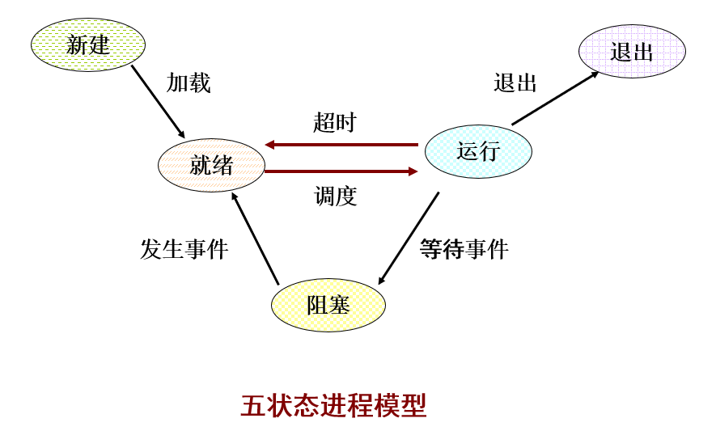

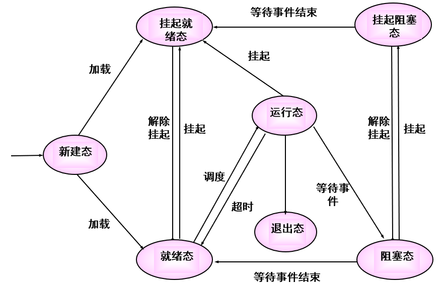

### 进程映像

|项目|说明|
|---|---|
|用户数据|用户空间中的可修改部分，包括程序数据、用户栈区域和可修改的程序|
|用户程序|将被执行的程序|
|系统栈|每个进程有一个或多个系统栈，用于保存参数、过程调用地址和系统调用地址|
|进程控制块|操作系统控制进程所需要的数据|

#### 进程控制块(PCB)

进程标识信息

- 进程ID、父进程ID、用户ID

进程状态信息

- 用户可见寄存器、控制和状态寄存器、栈指针

进程控制信息

- 调度和状态信息、数据结构、进程通信、进程特权、存储管理、资源的所有权和使用情况

### 进程创建

创建进程的步骤

1. 分配进程标识符
2. 分配空间
3. 初始化进程控制块
4. 设置正确的连接
5. 创建或扩充其它数据结构

### 进程切换

> 进程切换是让处于运行态的进程中断运行，让出处理器，让操作系统指定的新进程运行。被中断进程的上下文环境需要保存。

#### 切换时机

1. 中断
   - 时钟中断
   - I/O中断
   - 内存失效
2. 陷阱: 操作系统确定错误是否致命
3. 系统调用: 用户进程被置为阻塞态

### 模式切换

> 模式切换可以不改变正处于运行态的进程状态，保存和恢复上下文环境开销小；
> 进程切换涉及进程状态的变化，开销较大。

非特权：用户态  
特权：系统态、控制态、内核态

### Linux的fork

从fork中返回时，测试返回参数：

- 若值为0，则是子进程，可以转移到相应的用户程序中继续执行；
- 若值不为0（子进程的PID），则是父进程，继续执行主程序。

## 第四章 线程

### 特点

1. 进程包含两个特点：
   - 资源所有权：进程拥有对资源的控制权或所有权。
   - 调度/执行：进程是一个可被操作系统调度和分派的单位。
2. 进程的两个特点是独立的，操作系统可以独立地对其进行处理。
   - 线程（轻量级进程）：分派（调度运行）的单位。
   - 进程（任务）：拥有资源所有权的单位。

### 优点

- 在一个已有进程中创建一个新线程比创建一个全新进程所需的时间少很多。
- 终止一个线程比终止一个进程花费的时间少。
- 同一进程内线程间切换比进程间切换花费的时间少。
- 线程提高了不同的执行程序间通信的效率。

### 状态

1. 线程的关键状态
    - 就绪
    - 运行
    - 阻塞

> 挂起态是一个进程级概念。如果一个进程被换出，由于他的所有线程都共享该进程的地址空间，因此他们必须都被换出

### 用户级线程

> 有关线程管理的所有工作都由应用程序完成，内核意识不到线程的存在。

#### 优点

- 线程切换不需要内核态特权；
- 调度可以是应用程序相关的；
- 用户级线程可以在任何操作系统中运行，不需要对底层内核进行修改以支持用户级线程。

#### 缺点

- 当执行一个系统调用时，会阻塞进程中所有线程；
- 无法利用多处理技术。

### 内核级线程

> 有关线程管理的工作由内核完成，应用程序只有一个到内核线程设施的应用程序编程接口。

#### 优点

- 内核可同时把同一进程中的多个线程调度到多个处理器中；
- 若进程中的一个线程被阻塞，内核可以调度同一进程中的另一个线程；
- 内核例程本身也可以使用多线程。

#### 缺点
在把控制从一个线程传送到同一个进程内的另一个线程时，需要内核的状态切换。

## 第五章 同步与互斥

### 部分术语

1. 原子操作
   - 保证指令序列要么作为一个组来执行，要么都不执行；
2. **临界区**
    - 一段代码，在这段代码中进程将访问共享资源，当一个进程已经在这段代码中运行时，另外一个进程就不能在这段代码中执行；
3. 死锁
    - 两个或两个以上的进程因其中的每个进程都在等待其他进程做完某些事情而不能继续执行；
4. 活锁
    - 两个或两个以上进程为了响应其他进程中的变化而持续改变自己的状态但不做有用的工作；
5. 互斥
    - 当一个进程在临界区访问共享资源时，其他进程不能进入该临界区访问任何共享资源；
6. 竞争条件
    - 多个线程或进程在读写一个共享数据时，结果依赖于它们执行的相对时间；
7. 饥饿
    - 一个可运行的进程被调度程序无限期地忽略，不能被调度执行的情形。

### 进程的交互

- 进程间的资源竞争
  - 互斥、死锁、饥饿
- 进程间通过共享合作
  - 互斥、死锁、饥饿、数据一致性
- 进程间通过通信合作
  - 死锁、饥饿

### 信号量

#### 基本原理

- 两个或多个进程通过简单的信号进行合作，一个进程被迫在某一位置停止，直到它接收到一个特定的信号。
- 任何复杂的合作需求都可以通过适当的信号结构得到满足。

#### 信号量是一个与队列有关的整型变量。

- 可以初始化成非负数；
- semWait操作使信号量减1。若值为负数，则执行semWait的进程阻塞，否则继续执行；
- semSignal操作使信号量加1。若值小于或等于0，则被semWait操作阻塞的进程被解除阻塞。

``` c++
struct semaphore {
    int count;
    queryType queue;
};
void semWait(semaphore s) {
    s.count--;
    if (s.count<0) {
        /* place this process in s.queue */;
        /* block this process */
    }
}
void semSignal(semphore s) {
    s.count++;
    if (s.count<=0) {
        /* remove a process P from s.queue */;
        /* place process P on ready list */;
    }
}
```

##### 生产者/消费者问题

问题描述：

- 有一个或多个生产者生产某种类型的数据，并放置在缓冲区中；
- 有一个消费者从缓冲区中取数据，每次取一项；
- 系统保证避免对缓冲区的重复操作，即任何时候只有一个主体（生产者或消费者）可以访问缓冲区。
- 缓存已满时，生产者不能继续添加数据；
- 缓存已空时，消费者不能继续移走数据。

``` c++
// 无限缓冲
semaphore n=0,s=1;
void producer(){
    while (true) {
        produce();
        semWait(s);
        append();
        semSignal(s);
        semSignal(n);
    }
}
void consumer(){
    while (true) {
        semWait(n);
        semWait(s);
        take();
        semSignal(s);
        consume();
    }
}
// 有限缓冲
semaphore n=0,s=1,e=buf-size;
void producer(){
    while (true) {
        produce();
        semWait(e);
        semWait(s);
        append();
        semSignal(s);
        semSignal(n);
    }
}
void consumer(){
    while (true) {
        semWait(n);
        semWait(s);
        take();
        semSignal(s);
        semSignal(e);
        consume();
    }
}
```

##### 读者/写者问题

问题定义

- 有一个由多个进程共享的数据区，一些进程只读取这个数据区中的数据，一些进程只往数据区中写数据。并须满足以下条件：
- 任意多的读进程可以同时读文件；
- 一次只有一个写进程可以写文件；
- 如果一个写进程正在写文件，那么禁止任何读进程读文件。
- **读者优先：只要有读进程在读，就为读进程保留数据区的控制权。**
- **写者优先：当写进程想写的时候，不允许新的读进程再访问数据区。**

``` c++
// 读者优先
int readcount=0;
semaphore x=1,wsem=1;
void reader() {
    while (true) {
        semWait(x);
        readcount++;
        if(readcount==1)
            semWait(wsem);
        semSignal(x);
        READUNIT();
        semWait(x);
        readcount--;
        if(readcount==0)
            semSignal(wsem);
        semSignal(x);
    }
}
void writer(){
    while (true) {
        semWait(wsem);
        WRITEUNIT();
        semSignal(wsem);
    }
}
// 写者优先
int readcount=0;
    writecount=0;
semaphore x=1,y=1,z=1,rsem=1,wsem=1;
void reader(){
    while (true) {
        semWait(z);
        semWait(rsem);
        semWait(x);
        readcount++;
        if(readcount==1)
            semWait(wsem);
        semSignal(x);  
        semSignal(rsem);
        semSignal(z);
        READUNIT();
        semWait(x);
        readcount--;
        if(readcount==0)
            semSignal(wsem);
        semSignal(x);
    }
}
void writer(){
    while (true) {
        semWait(y);
        writecount++;
        if(writecount==1)
            semWait(rsem);
        semSignal(y);  
        semWait(wsem);
        WRITEUNIT();
        semSignal(wsem);
        semWait(y);
        writecount--;
        if(writecount==0)
            semSignal(rsem);
        semSignal(y);  
    }
}
```

#### 小结

- 多个semWait操作的次序不能颠倒，否则可能导致死锁
- 多个semSignal操作的次序可任意

### 消息传递

1. 消息传递：合作进程之间进行信息交换。
2. 消息传递原语
    - send (destination, message)
    - receive (source, message)

#### 同步

1. 阻塞send,阻塞receive
    - 发送者和接收者都被阻塞，直到完成信息的投递。
2. **无阻塞send,阻塞receive**
    - 接收者阻塞，直到请求的信息到达。
3. 无阻塞send,无阻塞receive
    - 不要求任何一方等待。

## 第六章

> 1. 死锁：一组相互竞争系统资源或进行通信的进程间的永久阻塞。
> 2. 死锁问题没有一种有效的通用解决方案。
> 3. 所有死锁都涉及两个或多个进程之间对资源需求的冲突。

### 资源分配图

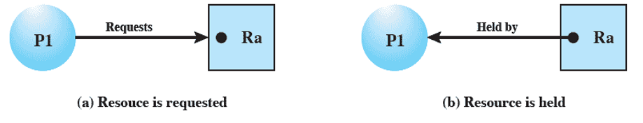
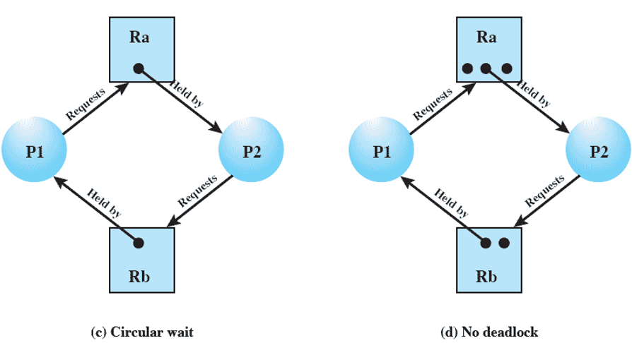

### 死锁条件

1. 互斥
    - 一次只有一个进程可以使用一个资源。
2. 占有且等待
    - 当一个进程等待其他进程时，继续占有已经分配的资源。
3. 不可抢占
    - 不能强行抢占进程已占有的资源。
4. 循环等待
    - 存在一个封闭的进程链，使得每个进程至少占有此链中下一个进程所需要的一个资源。

### 处理死锁的方法

#### 死锁预防

##### 试图设计一种系统来排除发生死锁的可能性

- 间接的死锁预防方法
- 预防前三个条件

##### 直接的死锁预防方法

- 预防第四个条件

1. 互斥
    - 该条件不可能被禁止
2. 占有且等待
    - 可要求进程一次性地请求所有需要的资源，并且阻塞进程直到所有请求都同时满足。
    - 存在的问题：
        - 一个进程可能被阻塞很长时间，已等待满足其所有的资源请求。
        - 分配给一个进程的资源可能有相当长的一段时间不会被使用。
        - 一个进程可能事先并不知道它所需要的全部资源。
3. 不可抢占
    - 如果占有某些资源的进程进一步申请资源时被拒绝，则该进程必须释放它最初占有的资源。
    - 如果进程A请求当前被进程B占有的一个资源，则操作系统可以抢占进程B，要求它释放资源。
4. 循环等待
    - 定义资源类型的线性顺序。如果一个进程已经分配到了R类型的资源，那么它接下来请求的资源只能是那些排在R类型之后的资源类型。
    - 存在的问题：
        - 会导致进程执行速度变慢；
        - 可能在没有必要的情况下拒绝资源访问。

#### 死锁避免

- 如果一个进程的请求会导致死锁，则不启动此进程；
- 如果一个进程增加的资源请求会导致死锁，则不允许此分配。

##### 进程启动拒绝—数据结构

系统有n个进程和m种不同类型的资源：

- Resource=R=(R1,R2,…,Rm)
  - 系统中每种资源的总量
- Available=V=(V1,V2,…Vm)
  - 未分配给进程的每种资源的总量  
- $
Claim=C=
    \left \{
        \begin{matrix}
            C_{11} & C_{12} & … & C_{1m} \\
            C_{21} & C_{22} & … & C_{2m} \\
            …  & … & … & … \\
            C_{n1} & C_{n2} & … & C_{nm} \\
        \end{matrix}
    \right \}
$
  - Cij表示进程i对资源j的需求

###### 死锁避免策略

- 仅当 $R_j≥C_{(n+1)j} +\sum^n_{i=1} C_{ij} （对所有j）$时，才启动一个新进程Pn+1。
- 即只有所有当前进程的最大请求量加上新的进程请求可以满足时，才会启动该进程。

##### 资源分配拒绝

- 主要思想：动态的检测资源分配状态以确保循环等待条件不可能成立。

###### 银行家算法

- 银行家拥有一笔周转资金
- 客户要求分期贷款，如果客户能够得到各期贷款，就一定能够归还贷款，否则就一定不能归还贷款
- 银行家应谨慎的贷款，防止出现坏帐

> 用银行家算法避免死锁
>
> - 操作系统（银行家）
> - 操作系统管理的资源(周转资金)
> - 进程(要求贷款的客户)

1. 安全状态

    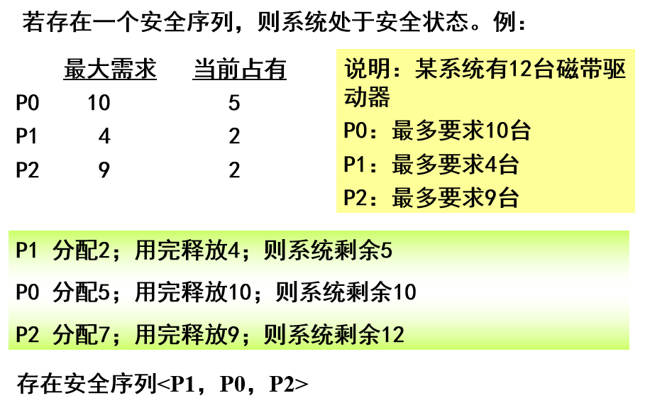

    - 安全状态不是死锁状态
    - 死锁状态是不安全状态
    - 不是所有不安全状态都是死锁状态

2. 数据结构
    - Available：Available[j]=k
        - 资源类型Rj 现有k个实例
    - Claim： Claim[i,j]=k
        - 进程Pi最多可申请k个Rj的实例
    - Allocation：Allocation[i,j]=k
        - 进程Pi现在已经分配了k个Rj的实例
    - Need：Need[i,j]=k
        - 进程Pi还可能申请k个Rj的实例
        - Need[i,j] = Claim[i,j] - Allocation[i,j]

    >符号说明
    > - X<=Y
    >   - （X和Y是长度为n的向量），当且仅当对所有i=1,2,…,n，X[i]<=Y[i]
    > - Allocationi
    >   - 表示分配给进程Pi的资源（将Allocation每行作为向量）
    > - Need同Allocation

##### 死锁避免的优缺点

- 优点
  - 不需要死锁预防中的抢占和回滚进程
  - 比死锁预防的限制少
- 缺点
  - 必须事先声明每个进程请求的最大资源。
  - 进程必须是无关的，其执行的顺序必须没有任何同步要求的限制。
  - 分配的资源数目必须是固定的。
  - 在占有资源时，进程不能退出。

#### 死锁检测

> 死锁检测策略不限制资源访问或约束进程行为。
> 系统周期性地执行检测算法，检测循环等待条件是否成立。

##### 死锁检测算法

- 检测时机
  - 每个资源请求发生时
  - 隔一段时间
- 每次资源请求时检测死锁
  - 优点：可以尽早地检测死锁情况
  - 缺点：频繁的检查会耗费相当多的处理器时间

###### 死锁检测的常用算法

- 新定义一个请求矩阵Q
  1. 标记Allocaiton矩阵中一行全为零的进程。
  2. 初始化一个临时向量W，令W等于Available向量。
  3. 查找下标i，使进程i当前未标记且Q的第i行小于等于W，如果找不到这样的行，终止算法。
  4. 如果找到这样的行，标记进程i，并把Allocation矩阵中的相应行加到W中，返回步骤3.
- **若最后有未标记的进程时，存在死锁，每个未标记的进程都是死锁的。**

#### 恢复

1. 取消所有死锁进程。
2. 把每个死锁进程回滚到某些检查点，并重新启动所有进程。
3. 连续取消死锁进程直到不再存在死锁。选择取消进程的顺序基于某种最小代价原则。每次取消后，必须重新调用检测算法，以测试是否仍存在死锁。
4. 连续抢占资源直到不再存在死锁。同3。

#### 哲学家就餐问题

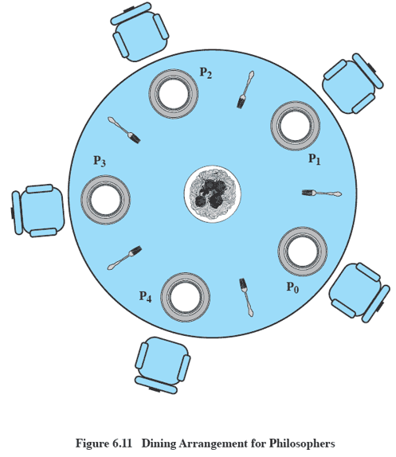

``` c++
// 有死锁的version
semphore fork[5]={1};
int i;
void philosopher(int i) {
    while (true) {
        think();
        wait(fork[i]);
        wait(fork[(i+1)%5]);
        eat();
        signal(fork[(i+1)%5]);
        signal(fork[i]);
    }
}
// 没有死锁的version
semphore fork[5]={1};
semphore room=4;
int i;
void philosopher(int i) {
    while (true) {
        think();
        wait(room);
        wait(fork[i]);
        wait(fork[(i+1)%5]);
        eat();
        signal(fork[(i+1)%5]);
        signal(fork[i]);
        signal(room);
    }
}
```

## 第七章

### 内存分区

#### 固定分区

##### 分区大小

- 大小相等的分区
  - 程序可能太大而不能放到一个分区中
  - 内存的利用率非常低，会有**内部碎片**
- 大小不等的分区
  - 可缓解上述问题，但不能完全解决。

##### 固定分区放置算法

- 大小相等的分区
  - 只要存在可用的分区，进程就可以装入分区。
  - 若所有分区都被处于不可运行状态的进程所占据，则选择其中一个进程换出，为新进程让出空间。
- 大小不等的分区
  - 把每个进程分配到能够容纳它的最小分区。
    - 每个分区维护一个调度队列，用于保存从这个分区换出的进程。
    - 为所有进程只提供一个队列。

##### 固定分区方案的缺陷

- 分区的数目在系统生成阶段已经确定，限制了系统中活动进程的数目。
- 分区大小在系统生成阶段事先设置，小作业不能有效地利用分区空间。

#### 动态分区

- 分区长度和数目是可变的，当进程被装入内存时，系统会给它分配一块和它所需容量完全相等的内存空间。
- 缺陷
  - **外部碎片**
- 外部碎片解决方法
  - 压缩
  - 费时且浪费处理器时间

##### 放置算法

- 首次适配（First Fit）
  - 从开始扫描内存，选择大小足够的第一个可用块；
- 下次适配（Next Fit）
  - 首次适配的变种，每次分配时从未分配区的上次扫描结束处顺序查找，选择下一个大小足够的可用块。
- 最佳适配（Best Fit）
  - 选择与要求的大小最接近的块。
- 最差适配（Worst Fit）
  - 选择符合要求大小的最大容量的块。

#### 伙伴系统

- 伙伴系统是一种固定分区和可变分区折中的主存管理算法。
- 伙伴系统分配原理
  - 可用于分配的整个空间被视为一个大小为2U的块，若请求的大小s满足2U-1﹤s≤2U,则分配整个空间；
  - 否则，该块被分成两个大小相等的伙伴2U-1，如果有2U-2﹤s≤2U-1 ，则给该请求分配两个伙伴中的任何一个，否则，其中一个伙伴又被分成两半……，该过程一直继续，直到产生大于或等于s的最小块。

### 分页

- 内存被划分成大小固定相等的块（**页框**），且块相对比较小，每个进程也被分成同样大小的块（**页**）。
- 进程中称为页的块可以指定到内存中称为页框的可用块。
- 分页与固定分区的区别
  - 分页技术的分区相当小
  - 一个程序可以占据多个分区
  - 一个程序占据的多个分区不需要是连续的

### 分段

- 把程序和其相关的数据划分到几个段中。
- 段有一个最大长度限制，但不要求所有程序的所有段的长度都相等。
- 分段与动态分区的区别
  - 一个程序可以占据多个分区
  - 一个程序占据的多个分区不需要是连续的
  - 会产生外部碎片，但跟动态分区比，会很小

### 逻辑地址到物理地址转换

- 段表：将逻辑地址映射为物理地址
- 段基地址：包含该段在内存中的开始物理地址
- 段界限：指定该段的长度
- 逻辑地址：段号s＋段内偏移d
- 逻辑地址到物理地址的转换
  1. 段号与段表长度进行比较，若段号超过了段表长度，则越界（非法地址），否则转2)
  2. 根据段表始址和段号计算出该段对应段表项的位置，从中读出该段在内存的起始地址，检查段内地址是否超过该段的段长，若超过则越界（非法地址），否则转3)
  3. 将该段的起始地址与段内位移相加，从而得到要访问的物理地址

### 储存的保护

- 保护操作系统不受用户进程所影响，保护用户进程不受其他用户进程所影响
- 方法
  1. 存储键保护
     - 系统将主存划分成大小相等的若干存储块，并给每个存储块都分配一个单独的保护键（锁）；在程序状态字PSW中设置有保护键字段，对不同的作业赋予不同的代码（钥匙）；钥匙和锁相配才允许访问
  2. 界限寄存器（下页图）
     - 上、下界防护：硬件为分给用户作业的连续的主存空间设置一对上、下界，分别指向该存储空间的上、下界
     - 基址、限长防护：基址寄存器存放当前正执行者的程序地址空间所占分区的始址，限长寄存器存放该地址空间的长度
    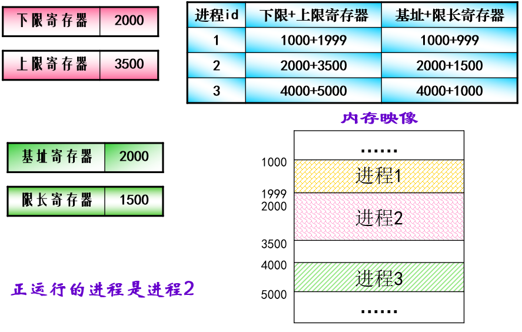

## 第八章

### 杂七杂八8

- 系统抖动：内存中的块被频繁的换入换出
  - 抖动是虚存管理方案中可能出现的一种现象，处理器花费在交换上的时间多于执行指令的时间
- 虚拟地址：在虚拟内存中分配给某一位置的地址使该位置可以被访问，仿佛他是主内存中的一部分
- 实地址：内存中存储位置的地址
- `MMU(Memory Managerment Unit)`：内存管理单元，集成于CPU，或是作为一个协处理器
  - 存取时间跟TLB一样计算
- Belady异常：页错误率随着所分配的帧数增加而增加的现象

### 虚拟内存

#### 虚拟存储管理实现技术

- 使用分页实现虚存
- 使用分段实现虚存
- 使用段页式实现虚存

##### 分页实现

- 分页式虚存不把作业信息(程序和数据)全部装入主存，仅装入立即使用的页面，在执行过程中访问到不在主存的页面时，产生**缺页中断，再从磁盘动态地装入**

###### 多级页表

- 系统为每个进程建一张页目录表,它的每个表项对应一个页表页,而页表页的每个表项给出了页面和页框的对应关系,页目录表是一级页表,页表页是二级页表

###### 倒排页表

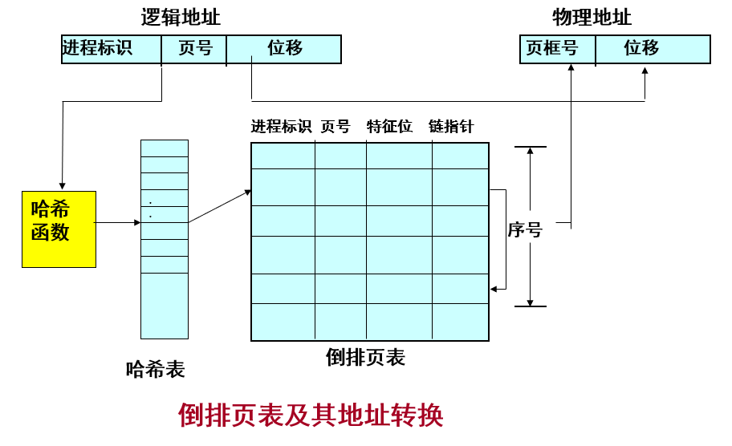

###### 快表

- 转换检测缓冲区（translation look-aside buffer，TLB）
- TLB与页表一起工作
  1. 快表项包含页号及对应的页框号，当把页号交给快表后，它通过并行匹配同时对所有快表项进行比较
  2. 如果找到，立即输出页框号，并形成物理地址
  3. 如果找不到，再查找主存中的页表以形成物理地址，**同时将页号和页框号登记到快表中**
  4. 当快表已满且要登记新页时，系统需要淘汰旧的快表项
- 地址转换
  - 假定访问主存时间为100毫微秒，访问快表时间为20毫微秒，相联存储器为32个单元时快表命中率可达90%，按逻辑地址存取的平均时间为：（100＋20）×90%＋(100+100+20)×(1-90%)＝130
   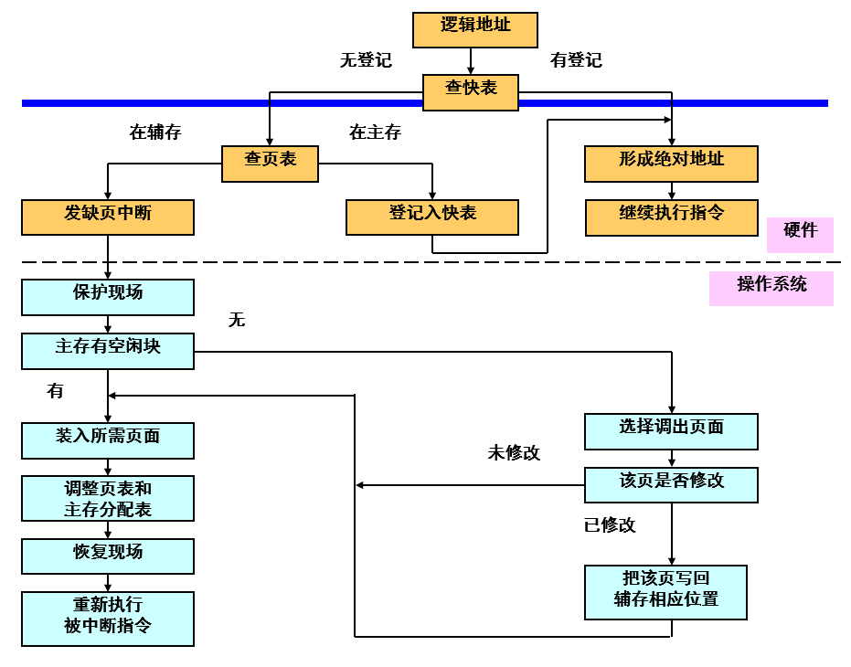

##### 分段实现

- 分段式虚拟存储系统把作业的所有分段的副本都存放在辅助存储器中，当作业被调度投入运行时，首先把当前需要的一段或几段装入主存，在执行过程中访问到不在主存的段时再把它们装入。
- 段表也需要增加一些控制位。

##### 段页式

- 分页对程序员是透明的，消除了外部碎片，可以更有效地使用内存。此外，移入或移出的块是大小相等的，易于处理。
- 分段对程序员是可见的，具有处理不断增长的数据结构的能力以及支持共享和保护的能力。
- 把两者结合起来就是段页式存储管理。
  - 内存划分成大小相等的页框。
  - 用户的地址空间被程序员划分成许多段，每个段一次划分成许多固定大小的页，页的长度等于内存中的页框大小。

### 置换策略

- 内存中所有页框都被占据，并且需要读取一个新页以处理一次缺页中断时，置换策略决定当前在内存中的哪个页将被置换。
- 目标：移出最近最不可能访问的页。
- 方法：基于过去的行为预测将来的行为。
- 基本算法
  - 最佳OPT
  - 最近最少使用LRU
  - 先进先出FIFO
  - 时钟Clock

#### 最佳OPT

- 选择置换下次访问距当前时间最长的那些页。
  - 该算法能导致最少的缺页中断，但它要求操作系统必须知道将来的事件，所以不可能实现，可作为一种标准来衡量其它算法的性能。

#### 先进先出FIFO

- 置换驻留在内存中时间最长的页
  - 思想：一个很久以前取入内存的页，到现在可能已经不会再用到了。
  - 问题：经常出现一部分程序或数据在整个程序的生命周期中使用频率都很高的情况。

#### 最近最少使用LRU

- 置换内存中上次使用距当前最远的页。
  - 根据程序局部性原理，在较长时间里未被使用的页面，可能不会马上使用到。
- 性能接近于OPT，但比较难以实现。
  - 为每一页添加一个最后一次访问的时间戳，并且必须在每次访问内存时，都要更新时间戳。
  - 维护一个关于访问页的栈。
  - 开销很大。

#### 时钟Clock

- 以较小的开销接近LRU的性能。

1. 简单时钟策略
   - 一个页面首次装入内存，其“引用位”置1
   - 主存中的任何页面被访问时, “引用位”也置1
   - 当需要置换一页时,扫描以查找“引用位”为0的页框，把遇到的第一个页框置换。查找过程中，把遇到的“引用位”是1的页面的“引用位”清0,跳过这个页面，继续查找。
   - 扫描时，如果遇到的所有页面的“引用位”为1，指针就会绕整个循环队列一圈，把碰到的所有页面的“引用位”清0;指针停在起始位置，并置换掉这一页
2. 时钟策略改进算法
   - 把”引用位”和”修改位”结合起来使用，共组合成四种情况：
     1. 最近未被引用,也未被修改(u=0,m=0)
     2. 最近被引用,没有被修改(u=1,m=0)
     3. 最近未被引用,但被修改(u=0,m=1)
     4. 最近被引用,也被修改(u=1,m=1)
   - 算法执行过程
     1. 从指针当前位置开始,扫描页框缓冲区。扫描过程中不改变”引用位”，把遇到的第一个u=0,m=0的页面作为置换页面。
     2. 如果步1失败，则重新扫描，查找u=0，m=1的页面，把遇到的第一个这样的页面作为置换页面，而在扫描过程中把指针所扫过的页面的”引用位”u置0。
     3. 如果步2失败，指针再次回到了起始位置，由于此时所有页面的”引用位”u均己为0，再转向步1操作，必要时再做步2操作，这次一定可以挑出一个可置换的页面。

### 驻留集管理

#### 置换范围

- 局部置换策略
  - 仅在产生这次缺页的进程的驻留页中选择
- 全局置换策略
  - 把内存中所有未被锁定的页都作为置换的候选页，不管它们属于哪一个进程。

#### 驻留集管理策略

|   |局部置换|全局置换|
|---|---|---|
|固定分配|分配给一个进程的页框数是固定的 从分配给该进程的页框中选择被置换的页|无此方案|
|可变分配|分配给一个进程的页框数可以变化 从分配给该进程页框中选择被置换的页|从内存中所有可用页框中选择被置换的页，这导致进程驻留集大小不断变化|

## 第九章

### 处理器调度的类型

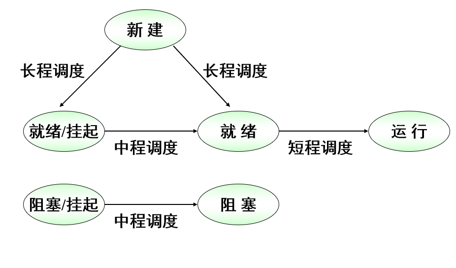

#### 长程调度

- 何时调度？
  - 有作业终止时
  - 处理器的空余时间片超过了一定的阈值
- 调度哪个？
  - 先来先服务
  - 优先级
  - 实时性
  - I/O需求

#### 中程调度

- 换入：取决于管理系统并发度的要求；
- 换出：进程的存储需求。

#### 短程调度

- 长程调度程序执行频率较低；
- 中程调度程序执行频率稍高；
- 短程调度程序执行频率最高。
  - 分派程序，精确地决定下一次执行哪一个进程

### 调度算法

#### 调度准则

- 面向用户的准则
  - 单个用户或进程感知到的系统行为
  - 例：响应时间
- 面向系统的准则
  - 处理器使用的效果和效率
  - 例：吞吐量
- 与性能相关的准则
  - 是定量的，可以很容易地度量
  - 例：响应时间和吞吐量
- 与性能无关的准则
  - 或者本质上是定性的，或者不容易测量和分析
  - 例：可预测性

1. 面向用户，与性能相关
    - 周转时间
      - 从提交到完成之间的时间间隔
    - 响应时间
      - 从提交到开始接收响应之间的时间间隔
    - 最后期限
      - 进程完成的最后期限
2. 面向用户，与性能无关
   - 可预测性
     - 希望提供给用户的服务能够随着时间的流逝展现给用户一贯相同的特性，而与系统执行的其他工作无关。
3. 面向系统，与性能相关
   - 吞吐量
     - 单位时间内完成的进程数目
   - 处理器利用率
     - 处理器处于忙的状态的时间百分比
4. 面向系统，与性能无关
   - 公平性
     - 进程被平等对待
   - 强制优先级
     - 进程被指定优先级，调度策略优先选择高优先级进程。
   - 平衡资源
     - 保持系统中所有资源处于繁忙状态，较少适用紧缺资源的进程应该受到照顾。

##### 优先级的使用

- 每个进程被指定一个优先级，调度程序总是选择具有较高优先级的进程。
  - 纯粹的优先级调度方案可能会导致低优先级进程长时间处于饥饿状态；
  - 一个进程的优先级可随着它的时间或执行历史而变化

##### 选择调度策略

- 选择函数
  - 确定在就绪进程中选择哪一个进程在下一次执行。
- 决策模式
  - 非抢占
  - 抢占
- 调度准则
  - 周转时间Tr
  - 归一化周转时间Tr/Ts

1. 先来先服务 FCFS
2. 轮转 RR， q=时间片长度
3. 最短进程优先 SPN
4. 最短剩余时间 SRT
5. 最高响应比优先 HRRN
   - R=(w+s)/s
     - R：响应比
     - w：已等待处理器的时间
     - s：预计的服务时间
6. 优先级
   - 静态优先级
   - 动态优先级
   - 抢占
   - 非抢占
   - 约定：数小代表优先级高
7. 反馈法

## 第十章

### 进程调度

- 多处理器情况下，调度原则的选择没有在单处理器中显得重要。
- 多处理系统中一般使用简单的FCFS或者在静态优先级方案中使用FCFS。

### 线程调度

- 负载分配
  - 系统维护一个就绪线程的全局队列，每个处理器只要空闲就从队列中选择一个线程。
- 组调度
  - 一组相关的线程基于一对一的原则，同时调度到一组处理器上运行。
- 专用处理器调度
  - 组调度的一种极端形式，在一个应用程序执行期间，把一组处理器专门分配给这个应用程序。
- 动态调度
  - 某些应用程序允许动态地改变进程中线程数目，需要动态调度。操作系统负责分配处理器给作业，作业自行调度。

### 实时调度

- 实时任务
  - 硬实时任务、软实时任务
  - 周期性任务、非周期性任务

## 第十一章

### 执行I/O的三种技术

- 程序控制I/O
  - CPU忙等 I/O 结束，CPU与设备串行工作
- 中断驱动I/O
  - 各种设备通用中断次数多
- 直接存储器访问（DMA）

#### 直接存储器访问(DMA)

- DMA单元能够模拟处理器，像处理器一样获得系统总线的控制权，利用系统总线与存储器进行双向数据传送。
- 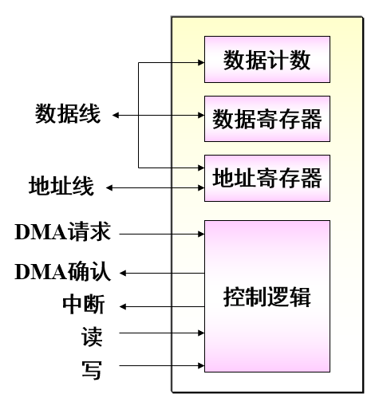

##### DMA技术工作流程

- 当处理器想读或写一块数据时，通过向DMA模块发送以下信息来给DMA模块发出一条命令：
  - 请求读或写操作的信号，通过读写控制线发送。
  - 相关的I/O设备地址，通过数据线发送。
  - 从存储器中读或往存储器中写的起始地址，在数据线上传送，并由DMA模块保存在其地址寄存器中。
  - 读或写的字数，通过数据线传送，并由DMA模块保存在其数据计数寄存器中。
- 处理器继续执行其工作；
- DMA模块直接从存储器中或往存储器中传送整块数据，一次传送一个字；
- 传送结束后，DMA模块给处理器发送一个中断信号

#### I/O缓冲

- 引入缓冲的目的
  - 改善中央处理器与外围设备之间速度不配的矛盾
  - 提高CPU和I/O设备的并行性

#### 磁盘调度

- 寻道时间
  - 将磁头臂移到指定磁道所需要的时间。
- 旋转延迟
  - 将磁盘的待访问地址区域旋转到读/写磁头可访问的位置所需要的时间。
- 传输时间
  - 读或写操作的数据传输所需的时间。
- 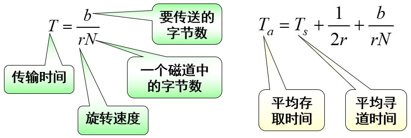

#### 磁盘调度策略

- FIFO调度
- 最短寻道时间优先算法(SSTF)
- SCAN算法(电梯算法)
- C-SCAN调度
  - 将磁头从磁盘一端移到另一端，随着移动不断的处理请求。不过，当磁头移到另一端时，马上返回,返回时不处理请求

#### 独立磁盘冗余阵列(Redundant Array of Independent Disk,RAID)

- RAID0
  - 条带化
    - 一个条带可以是一个物理块、扇区或别的某种单元。条带被循环映射到连续的阵列成员中。
    - 一组逻辑上连续的条带，如果恰好一个条带映射到一个阵列成员上，则称为一条条带。
    - 优点：如果一个I/O请求由多个逻辑上连续的条带组成，该请求可以并行处理，从而减少I/O传输时间。
  - 100%利用率
  > RAID0一时爽，数据火葬场
- RAID1
  - 镜像备份
  - 1/2利用率
- RAID2
  - Hamming码校验
  - 4/7利用率
- RAID3
  - 奇偶校验位
  - 4/5利用率

## 第十二章

### 目录结构

- 层次或树型结构是普遍采用的一种方法

### 文件共享

- 访问权限
  - 无
  - 知道
  - 执行
  - 读
  - 追加
  - 更新
  - 改变保护
  - 删除
- 同时访问
  - 加锁
  - 互斥和死锁问题

### 文件分配

#### 连续分配

- 创建文件时，给文件分配一组连续的块

#### 链接分配

- 同链表

#### 索引分配

- 分成多段（不需每段等长），段内连续

### b树

- 根节点`[1, 2d-1]`
- 非根节点`[d-1, 2d-1]`

### 位表

- 使用一个向量，向量的每一位对应一个块，0表示块空闲，1表示已使用

### i-node

- i-node大小16B
- FCB大小64B
- 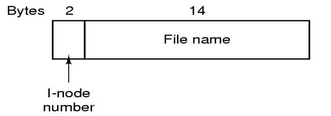
