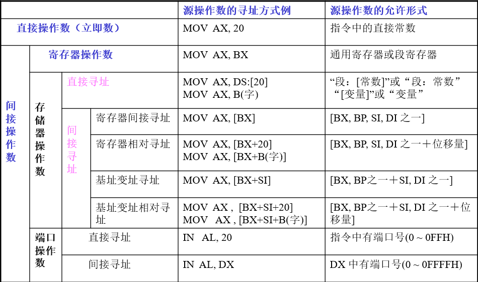

# 汇编

## 杂七杂八

- ASCII
  - `'0':30H; 'A':41H; 'a':61H; '-':2DH, '\n':0DH`
  - 大写转小写: `OR AL,20H`/小写转大写: `AND AL,0DFH`
- 中断，AH
  - `01H`：键盘输入单字符，AL
  - `02H`：屏幕输出单字符，DL
  - `09H`：字符串输出DS:DX，`$`结尾
  - `0AH`：字符输入，DS:DX,DS:(DX+1),AL是否有输入

## 第二章

### 通用寄存器

- 数据寄存器
  - AX –accumulator register
    - AH、AL
  - BX –base register
    - BH、BL
  - CX –count register
    - CH、CL
  - DX –data register
    - DH、DL
- 变址寄存器index registers:
  - SI:source index register
  - DI:destination index register
- 指针寄存器
  - SP:stack pointer register
  - BP:base pointer register

### 标志寄存器

|标志名|标志为1时|标志为0时|
|---|---|---|
|`OF`[Overflow Flag]|ov[OVerflow]|nv[Not oVerflow]|
|`DF`[Direction Flag]|dn[DowN]|up[UP]|
|`IF`[Interrupt Flag]|ei[Enable I~t]|di[Disable I~t]|
|`SF`[Sign Flag]|ng[NeGative sign]|pl[PLus sign]|
|`ZF`[Zero Flag]|zr[ZeRo]|nz[Not Zero]|
|`AF`[Auxiliary carry Flag]|ac[Auxiliary Carry]|na[Not Aux~]|
|`PF`[Parity Flag]|pe[Parity Even]|po[Parity Odd]|
|`CF`[Carry Flag]|cy[CarrY]|nc[Not Carry]|

### 地址

- 物理地址：每个存储单元的唯一的20位地址
- 段地址：段起始地址的高16位
- 偏移地址：段内相对于段起始地址的偏移值（16位）(有效地址EA)  
- 物理地址 = 16d * 段地址 + 偏移地址

## 第三章

### 8086寻址

1. 立即寻址方式 —— 操作数在指令中给出
   - `MOV AH, 3030H`
   - 只能用于 SRC 字段
   - SRC 和 DST 的字长一致
2. 寄存器寻址方式 — 操作数在指定的寄存器中
   - `MOV AX, BX`
   - 字节寄存器只有，`AH  AL  BH  BL  CH  CL  DH  DL`
   - SRC 和 DST 的字长一致
   - CS 不能用 MOV 指令改变
3. 直接寻址方式 — 有效地址EA由指令直接给出
   - `MOV AX, [2000H]`
   - 隐含的段为数据段 DS, 等价于 `MOV AX, DS:[2000H]`
   - 可使用段跨越前缀 `MOV  AX, ES:[2000H]`
   - 操作数地址可由变量（符号地址）表示, 但要注意变量的属性
   - 两操作数不能同时为存取器操作数
4. 寄存器间接寻址 — EA 在基址寄存器(BX/BP)或变址寄存器(SI/DI)中
   - `MOV AX, [BX]`
   - 不允许使用AX、CX、DX 存放 EA
   - SRC 和 DST 的字长一致
   - 适于数组、字符串、表格的处理
   - 段跨越前缀：默认`DS:[BX], SS:[BP], DS:[SI], DS:[DI]`
5. 寄存器相对寻址方式
   - `MOV AX, COUNT[SI]` 或 `MOV AX, [COUNT+SI]`
   - BX, BP, SI, DI,对应方式同(4
   - 适于数组、字符串、表格的处理
   - 支持段跨越前缀
    > 假设 (DS)=3000H, (SI)=2000H, COUNT=3000H,则: PA = 35000H
6. 基址变址寻址方式
   - `MOV AX,[BX][DI]` 或 `MOV AX, [BX+DI]` 或 `MOV AX, ES:[BX][SI]`
   - 适于数组、字符串、表格的处理
   - 必须是一个基址寄存器(BX/BP)和一个变址寄存器的组合(SI/DI)
   - 支持段跨越前缀
7. 相对基址变址寻址方式
   - `MOV AX, MASK[BX][SI]`
   - 支持段跨越前缀

#### 默认段寄存器的使用规定

|访问存储器的方式|默认的段寄存器|可跨越的段寄存器|偏移地址|
|---|---|---|---|
|取指令|CS|无|IP|
|堆栈操作|SS|无|SP|
|一般数据访问|DS|CS  ES  SS|BX SI DI EA|
|BP作为基址的寻址|SS|CS  DS  ES|BP|
|串操作的源操作数|DS|CS  ES  SS|SI|
|串操作的目的操作数|ES|无|DI|

### 8086的指令系统

#### 通用数据传送指令MOV

- 通用数据传送指令MOV
- 传送指令：`MOV DST, SRC`
  - DST、SRC 不能同时为段寄存器 MOV  DS, ES
  - 立即数不能直接送段寄存器 MOV  DS, 2000H
  - DST 不能是立即数和CS
  - DST、SRC 不能同时为存储器寻址
  - 不影响标志位

#### 进栈PUSH(push onto the stack)指令/出栈POP(Pop from  the stack)指令

- PUSH执行操作：(SP)<-(SP)–2 ; ((SP)+1, (SP))<-(SRC)
- POP执行操作：(DST)<-((SP)+1, (SP)) ; (SP)<-(SP) + 2
  - ‘先进后出’的存储区，段地址存放在SS中，SP在任何时候都指向栈顶，进出栈后自动修改SP。
  - 堆栈操作必须以字或双字为单位。
  - 不影响标志位
  - 16位不能用立即寻址方式，但32位的允许
  - DST不能是CS

##### 所有通用寄存器进栈PUSHA/PUSHAD指令：PUSHA/PUSHAD/所有寄存器出栈POPA/POPAD指令

- 执行操作：`AX/EAX,CX/ECA,DX/EDX,BX/EBX`,指令执行前的`SP/ESP,BP/EBP,SI/ESI,DI/EDI`依次进栈
- 执行操作：16位或32位通用寄存器按进栈的相反顺序出栈

#### 交换XCHG(exchange)指令

- `XCHG OPR1, OPR2`
- 执行操作：(OPR1)<->(OPR2)
  - 在寄存器和存储器之间交换
  - 起码有一个操作数是寄存器操作数
  - 不影响标志位
  - 不允许使用段寄存器

#### 输入input指令 IN/ 输出output指令 OUT

- IN (input)（I/O -> CPU）
  - 长格式：`IN AL, PORT`（字节）`IN AX, PORT`（字）
    - 执行操作：(AL)<-(PORT)（字节）(AX)<-(PORT+1, PORT)（字）
  - 短格式：`IN AL, DX`（字节）`IN AX, DX`（字）
    - 执行操作：(AL)<-((DX))（字节）(AX)<-((DX)+1, (DX))（字）
- OUT (output)（CPU <- I/O）
  - 长格式：`OUT PORT, AL`（字节）`OUT PORT, AX`（字）
    - 执行操作：(AL)->(PORT)（字节）(AX)->(PORT+1, PORT)（字）
  - 短格式：`OUT DX, AL`（字节）`OUT DX, AX`（字）
    - 执行操作：(AL)->((DX))（字节）(AX)->((DX)+1, (DX))（字）
- 不影响标志位
- 前256个端口号00H~FFH可直接在指令中指定（长格式）
- 如果端口号 >= 256，**端口号 -> DX**（短格式）

#### 换码translate指令 XLAT

- `XLAT`  或　`XLAT OPR`
  - 执行操作：(AL)<-((BX)+(AL))
- 不影响标志位
- 字节表格(长度不超过256) 首地址 -> **(BX)**
- 需转换的代码位移量 -> (AL)

#### 地址传送指令

- LEA
  - `LEA BX, [BX+SI+0F62H]`

#### 类型转换指令

- `CBW`(convert byte to word)
  - 若(AL)的最高有效位为0，则(AH)= 00H
  - 若(AL)的最高有效位为1，则(AH)= FFH
- `CWD`(convert word to double word)
  - 若(AX)的最高有效位为0，则(DX)= 0000H
  - 若(AX)的最高有效位为1，则(DX)= FFFFH
- 无操作数指令
- 隐含对AL 或AX 进行符号扩展
- 不影响条件标志位

#### 加法指令

- `ADD DST, SRC`
  - (DST)<-(SRC)+(DST)
- `ADC DST, SRC`
  - (DST)<-(SRC)+(DST)+CF
- `INC OPR`
  - (OPR)<-(OPR)+1
- **除INC指令不影响CF标志外，均对条件标志位有影响。**
- CF 位表示 无符号数 相加的溢出。
- OF 位表示 带符号数 相加的溢出。

#### 减法指令

- `SUB DST, SRC`
  - (DST)<-(DST)-(SRC)
- `SBB DST, SRC`
  - (DST)<-(DST)-(SRC)-CF
- `DEC OPR`
  - (OPR)<-(OPR)-1
- `NEG OPR`
  - (OPR) <- -(OPR)
- 除DEC指令不影响`CF`标志外，均对条件标志位有影响
- CF 位表示 无符号数 减法的溢出。
- OF 位表示 带符号数 减法的溢出。

#### 乘法指令

- unsigned multiple无符号数乘法指令 `MUL SRC`
- signed multiple带符号数乘法指令 `IMUL SRC`
  - 字节操作数  (AX) <- (AL)*(SRC)
  - 字操作数    (DX, AX) <- (AX)*(SRC)
- AL(AX) 为隐含的乘数寄存器。
- AX (DX,AX) 为隐含的乘积寄存器。
- SRC不能为立即数。
- 除CF和OF外，对条件标志位无定义。

#### 除法指令

- unsigned divide无符号数除法指令 `DIV SRC`
- signed divide带符号数除法指令 `IDIV SRC`
  - 字节操作  
    - (AL) <- (AX) / (SRC) 的商
    - (AH) <- (AX) / (SRC) 的余数
  - 字操作
    - (AX) <- (DX, AX) / (SRC) 的商
    - (DX) <- (DX, AX) / (SRC) 的余数
- AX (DX,AX) 为隐含的被除数寄存器。
- AL (AX) 为隐含的商寄存器。
- AH (DX) 为隐含的余数寄存器。
- SRC不能为立即数。
- 对所有条件标志位均无定义。

#### 逻辑运算指令

- 逻辑非指令：`NOT OPR`
  - 执行操作: (OPR)<- !(OPR)不影响标志位
- 逻辑与指令：`AND DST, SRC`
  - 执行操作: (DST)<-(DST)&(SRC)
- 逻辑或指令：`OR DST, SRC`
  - 执行操作: (DST)<-(DST)|(SRC)
- 异或指令: `XOR DST, SRC`
  - 执行操作: (DST)<-(DST)^(SRC)
- 测试指令: `TEST OPR1, OPR2`
  - 执行操作: (OPR1)^(OPR2)
- 逻辑左移: `SHL OPR, CNT`
  - CF=0x80 & OPR
  - OPR <<=CNT
- 逻辑右移  `SHR  OPR, CNT`
  - CF=OPR&1
  - OPR >>=CNT
- 算术左移 `SAL OPR, CNT`
  - 同逻辑左移
- 算术右移 `SAR OPR, CNT`
  - CF=OPR&1
  - OPR>>=CNT
  - OPR |= 0x80 & OPR
- 循环左移 `ROL OPR, CNT`
  - 最高位放至最低位
- 循环右移 `ROR OPR, CNT`
  - 最低位放至最高位
- 带进位循环左移 `RCL OPR, CNT`
  - 最高位放至CF
  - CF放至最低位
- 带进位循环右移 `RCR OPR, CNT`
  - 最低位放至CF
  - CF放至最高位

> OPR可用除立即数以外的任何寻址方式  
> CNT>1，`MOV  CL, CNT; SHL OPR, CL`  
> 移位指令：SF、ZF、PF 根据移位结果设置，AF无定义  
> 循环移位指令：不影响 SF、ZF、PF、AF  

#### 串处理指令

- 设置方向
  - `CLD` ;DF=0 ;地址增加
  - `STD` ;DF=1 ;地址减少
- 串传送 `MOVS`(B/W); ((DI))<-((SI))
- 串比较 `CMPS`(B/W); ((SI))-((DI))
- 串扫描 `SCAS`(B/W); (AL)-((DI))
- 从串取 `LODS`(B/W); (AL)←((SI))
- 存入串 `STOS`(B/W); ((DI))←(AX)
- `REP` 重复直到CX=0
- `REPZ`/`REPE` 重复直到不相等或CX=0
- `REPNZ`/`REPNE` 重复直到相等或CX=0
- `MOVS ES:BYTE PTR [DI], DS: [SI]`
  - 只存在这种对应关系，串的地址先`LEA`至`Di`和`SI`

#### 子程序调用/返回指令

- `CALL`
  - (SP)←(SP)-2
  - ((SP)+1,(SP))←(IP)
  - (IP)←(IP)+16位位移量
- `CALL` 段间直接远调用
  - (SP)←(SP)-2
  - ((SP)+1,(SP))←(CS)
  - (SP)←(SP)-2
  - ((SP)+1,(SP)) ← (IP)
  - (IP) ← 偏移地址
  - (CS) ← 段地址
- `RET` 段内近返回
  - (IP) ← ( (SP)+1,(SP) )
  - (SP) ← (SP) + 2
- `RET` 段间远返回
  - (IP) ← ( (SP)+1,(SP) )
  - (SP) ← (SP) + 2
  - (CS) ← ( (SP)+1,(SP) )  
  - (SP) ← (SP) + 2

#### 中断指令

- `INT TYPE`
  - (SP) ← (SP) - 2
  - ( (SP)+1,(SP) ) ← (FLAGS)
  - (SP) ← (SP) - 2
  - ( (SP)+1,(SP) ) ← (CS)
  - (SP) ← (SP) - 2
  - ( (SP)+1,(SP) ) ← (IP)
  - (IP) ← (TYPE*4)
  - (CS) ← (TYPE*4+2)
- 溢出中断指令：`INTO`
  - 若OF=1
    - (SP) ← (SP) - 2
    - ( (SP)+1,(SP) ) ← (FLAGS)
    - (SP) ← (SP) - 2
    - ( (SP)+1,(SP) ) ← (CS)
    - (SP) ← (SP) - 2
    - ( (SP)+1,(SP) ) ← (IP)
    - (IP) ← (10H)
    - (CS) ← (12H)
- 从中断返回指令：`IRET`
  - (IP) ← ( (SP)+1,(SP) )
  - (SP) ← (SP) + 2
  - (CS) ← ( (SP)+1,(SP) )
  - (SP) ← (SP) + 2
  - (FLAGS) ← ( (SP)+1,(SP) )
  - (SP) ← (SP) + 2
- TYPE (0~255) 是中断类型号, 隐含的类型号为3
- `INT` 指令还把 IF 和 TF 置0，但不影响其它标志位
- `IRET` 指令执行完，标志位由堆栈中取出的值确定

## 第四章

### 完整段格式

``` ASM
seg_name SEGMENT [align_type] [combine_type] [use_type][‘class’]

seg_name ENDS
```

- `align_type`
  - `PARA`指定该段从小段边界开始,即起始地址二进制低4位为0；默认值
  - `BYTE`指定该段从任一位置开始
  - `WORD`指定该段从字边界开始，即起始地址必须为偶数
  - `PAGE`指定该段从页边界开始,即起始地址二进制低8位为0
- `combine_type`组合类型
  - `PRIVATE` 私有段，不合并；默认值
  - `PUBLIC`  该段连接时将与有相同名字的其他分段连接在一起，仅有一个起始地址
  - `COMMON` 该段连接时与其他同名分段有相同的起始地址，所以会产生覆盖
  - `STACK` 指定该段为堆栈段
- `‘CLASS’`类别
  - 连接时用于组成段组名

### 伪指令

#### 指定段址伪指令

- `ASSUME 段寄存器:段名`
- `ASSUME CS:CODE,DS:DATA,SS:SAT_SEG`
  - 向汇编程序指示当前各段所用的段寄存器。设定段寄存器与段间的对应关系
  - 本伪指令只是指示各逻辑段使用段寄存器的情况,并没有对段寄存器的内容进行装填。**DS、ES的值必须在程序段中用指令语句进行装填,而CS、SS由系统负责设置,程序中也可对SS进行装填**
  - 如果没有在`ASSUME`中指定DS、ES,则在变量名或地址表达式前用段前缀进行明确说明,以指明所要使用的段寄存器。例如:`MOV AX, ES:ALFA`
  - `ASSUME`伪指令也可以用来取消段寄存器与段之间的对应,然后再建立新的对应关系; `ASSUME DS:NOTHING; ASSUME DS:DATAB`

#### 源程序结束伪指令END

- `END [表达式]`
  - 表达式为存储器地址，通常为标号。
  - 标号为程序第一条可执行指令地址。
- END表示一个模块的结束。通知汇编程序，源程序到此结束，且用表达式指出程序开始执行时的指令地址。
  - 表达式只用于主程序模块中

> 1. CS是系统在加载程序后由系统自动装填的，即由操作系统的任务(进程)管理程序自动完成装填的。此项装填不需要用户管理。堆栈段SS也可以不用用户装填,可由系统自动装填,此时必须在定义堆栈段伪指令中,把参数写全。其形式如下:
> `STACK  SEGMENT   STACK  PARA ′STACK′`
> 2. 当程序装入内存时,系统会自动地把堆栈段地址和栈指针置入SS和SP中,因而不必在代码段中装入SS和SP值。但如果没有给出必要的参数,则还应由用户装填SS和SP寄存器值
> 3. DS、ES、SS的装填可以使用相同的方法,直接由用户程序进行加载
> `MOV AX,DATA; MOV DS,AX`
> 4. 若用MOV ES,AX 指令，此时,ES与DS将使用同一个逻辑数据段DATA

#### 正确返回DOS的问题

1. 用功能调用4CH
    `MOV AH,4CH`  
    `INT 21H`
2. 用中断`INT 20H`
3. 利用标准序结束程序

    ``` ASM
    PUSH DS    ;保存返回
    SUB AX,AX  ;操作系统
    PUSH AX    ;的指针
    …
    RET ;返回操作系统
    ```

#### 表达式赋值伪操作

1. `常量名 EQU 表达式`
2. “ = ” 伪操作 （允许重复定义）

#### 地址计数器与对准伪操作

- 地址计数器 `$`: 当前正在汇编的指令的地址
- `ORG`：设置当前地址计数器的值

    ``` ASM
    data SEGMENT
        ORG 10
        VAL DW 1 ; val的偏移地址为0AH
    data ENDS
    ```

- `EVEN` 使下一个变量或指令开始于偶数字节地址
- `ALIGN boundary` 使下一个变量或指令开始于boundary倍数字节地址，**boundary必须为2的幂次**

#### 表达式操作符

1. 算术操作符：`+,-,*,/,MOD`
2. 逻辑和移位操作符： `AND,OR,XOR,NOT,SHL,SHR`
3. 关系操作符： `EQ,NE,LT,LE,GT,GE`
    - 逻辑值：`真 0FFFFH; 假 0000H`
4. 数值回送操作符： `OFFSET,SEG,TYPE,LENGTH,SIZE`
    - `OFFSET/SEG`: 回送变量或标号的偏址/段址
    - `TYPE`: 变量类型
        |DB|DW|DD|DF|DQ|DT|NEAR|FAR|常数|
        |--|--|--|--|--|--|----|---|----|
        |1 |2 |4 |6 |8 |10|-1  |-2 |0   |
    - `LENGTH`: 回送由DUP定义的变量的个数，其它情况回送1
    - `SIZE`: LENGTH * TYPE
5. 属性操作符: `PTR,段操作符,SHORT,THIS,HIGH,LOW,HIGH WORD,LOW WORD`

    ``` ASM
    类型 PTR 表达式     MOV WORD PTR [BX], 5
    段操作符            MOV ES: [BX], AL
    SHORT 标号          JMP SHORT  NEXT
    THIS 类型           TA EQU THIS BYTE
                        TD DW 1234H
                        NEXT EQU THIS  FAR
                        MOV AX,2
    HIGH和LOW           CONS EQU 1234H
                        MOV AH, HIGH CONS
                        MOV AL, LOW CONS
    ```

## 第五章

### 数据寻址方式



### 转移地址的寻址方式


## 第六章

### 过程定义伪操作

``` ASM
过程名   PROC    NEAR ( FAR )

过程名   ENDP
```

1. `NEAR`属性：调用程序和子程序在同一代码段中（段内调用）
2. `FAR`属性：调用程序和子程序不在同一代码段中（段间调用）

### 子程序的调用与返回

- `call near ptr subp`
  1. 保存返回地址
  2. 转子程序
- `call far ptr subp`
  1. 保存返回地址
  2. 转子程序
- 子程序返回： `ret`/`ret n`
- 隐含使用堆栈保存返回地址

### 保存与恢复寄存器

1. 保护现场
2. 取入口参数
3. 处理
4. 向出口参数输出结果
5. 恢复现场
6. 返回调用程序

> **386之后**
> `PUSHA`
>
> - 依次把`AX,CX,DX,BX,SP,BP,SI,DI`压入栈中
> - SP-16->SP
>
> `POPA`
>
> - 把栈中的值依次弹到`DI,SI,BP,SP,BX,DX,CX,AX`寄存器中
> - SP+16->SP
>
> `PUSHAD`
>
> - 依次把`EAX,ECX,EDX,EBX,ESP,EBP,ESI,EDI`压入栈中
> - SP-32->SP
>
> `POPAD`
>
> - 把栈中的值依次弹到`EDI,ESI,EBP,ESP,EBX,EDX,ECX,EAX`寄存器中
> - SP+32->SP

## 第八章

### I/O 设备的数据传送方式

- 查询方式（程序控制方式）
  - 无条件传送：用于定时已知或数据变化非常缓慢的外部设备，要求有锁存能力
    - 无条件输入：用IN
    - 无条件输出：用OUT
  - 有条件传送（程序查询方式）：具有外设状态标志位
- 中断方式
  - 要求外设有中断请求的“权力”
  - 适用于实时控制
- DMA (Direct Memory Access)方式（直接存储器存取方式/成组传送方式）
  - 适用于高速、大量数据传送
  - 需要设置DMA控制器，电路结构复杂，硬件开销大

### CPU中断过程

1. 取中断类型：CPU ← type  N；
2. 保护现场：FLAGS、CS、IP入栈；
3. IF=0,  TF=0；
4. 取中断向量:(4×N)→IP, (4×N＋2)→CS;
5. 转中断处理程序；
6. 中断返回到INT指令的下一条指令。

### DOS 功能调用(21H)存取中断向量：

- 设置中断向量:
  1. AH=25H
  2. AL=中断类型号
  3. DS:DX=中断向量(子程序地址)
  4. INT 21H
- 取中断向量:
  1. AH=35H
  2. AL=中断类型号
  3. INT 21H
  4. 返回时送 ES:BX=中断向量

### 中断程序的编写步骤：

- 主程序：
  1. 设置中断向量
  2. 设置 CPU 的中断允许位 IF
  3. 设置设备的中断屏蔽位

- 中断处理子程序：
  1. 保存寄存器内容
  2. 如允许中断嵌套，则开中断 ( STI )
  3. 中断处理功能
  4. 关中断
  5. 送中断结束命令( EOI )给中断命令寄存器
  6. 恢复寄存器内容
  7. IRET中断返回