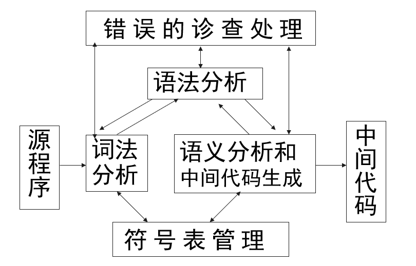

# 编译原理

## 二

- 文法：描述语言的语法结构的形式规则。
- 上下文无关文法(Context-free Grammar)：即文法所定义的语法范畴（语法单位）完全独立于这种范畴可能出现的环境。

1. 规则（Backus-Naur Form，简记为BNF）
   - 规则：也叫产生式，是一个符号与一个符号串的有序对（A,β），通常写作：
A→β (或A ::＝ β)
     - 其中，A是规则的左部， β是规则的右部
     - →表示生成或定义为
2. 文法是规则的非空有穷集合，通常表示成四元式
   - G= （$V_T，V_N ,S, P$），其中
     - $V_T$是一个非空有穷终结符号集合；
     - $V_N$是一个非空有穷的非终结符号集合，且VT∩VN＝Φ；
     - P是一个产生式的非空有穷集合，每个产生式的形式是A → $\alpha$(或A ::＝ $\alpha$)，其中 A∈VN， $\alpha$ ∈（VT∪VN）*。 S∈ VN ，称为开始符号，S必须至少在某个产生式的左部出现一次
3. 推导 `=>`, 规则`->`
4. 句型&句子：
   - 句型$(V_N \cup V_T)^*$
   - 句子$(V_T)^*$
5. 语言
   - 由文法G产生的所有句子所组成的集合就是语言L(G)。
   - $L(G)＝\{ \alpha |S=>^*\alpha 且\alpha \in V_T^*\}$

- 最左推导：推导中的每一步$\alpha => \beta$,都是替换$\alpha$中最左的非终结符号。
- 最右推导：推导中的每一步$\alpha => \beta$,都是替换$\alpha$中最右的非终结符号。
- 规范推导、规范句型
- 归约：推导的逆过程$\beta => \alpha$
- 规范归约（最左归约）

1. L0:0型(无限制)：$G=(V_T,V_N,S,P)$
   - 规则形式: $\alpha \rightarrow \beta ; \alpha,\beta \in (V_T\cup V_N)$
并且$\alpha$至少含有一个非终结符号；
2. L1:1型文法也称上下文有关文法，非终结符的替换要考虑上下文。
3. L2:2型文法也称上下文无关文法，非终结符的替换不考虑上下文。
4. L3:3型（右线性）文法等价于正规式，也称正规文法

> L0 ⊃  L1 ⊃ L2 ⊃ L3
> 上下文无关文法足够描述多数程序设计语言的语法结构

## 三

1. 词法分析：对字符串表示的源程序进行从左到右的扫描和分解，根据语言的词法规则识别出一个个具有独立意义的单词符号。
   - 词法分析作为一个独立的阶段；
   - 与语法分析组织成一遍，作为语法分析的子程序。
   - 

### 单词

1. 语言的单词符号(token),具有独立意义的最小语法单位
    - 关键字: 基本字,保留字
    - 标识符: 表示各种名字
    - 常量: 常数
    - 运算符: +-*/<>
    - 界符: ,;: ()

2. 单词种别
   - 单词种别编码：整数码,一符一种、一类一种
   - 单词自身的值

### 正规式与正规集

|正规表达式|正规表达式表达的语言（正规集）|
|--|--|
|ε，Ф|{ε}，Ф|
|$a_i\in\Sigma$|$a_i$|

### 正规式&正规文法转换

1. 正规文法到正规式的转换
   - 将文法中的规则写成关于每个非终结符的正规式方程，得到一个方程组
   - 若A=αA |β，则解为A= α*β

### DFA

- 一个 DFA M是一个五元式
  - $M=(Q, \sigma, δ , S, F)$
    - Q是有限状态集，是输入字符的字母表，
    - δ是Q×Σ到Q的单值部分映射（即状态转换）δ(qi,a)=qj
    - S∈Q是唯一初态， F 是终态集（可空）

### 正规文法与有穷自动机的等价性

- 对于正规文法G和有限自动机M,如果
- L(G)=L(M),则称G和M是等价的(equivalence)。
- 正规文法G和M的等价性是指：
  1. 对每一个正规文法G,都存在一个FA,M,使得L(M)=L(G)；
  2. 对每一个FA,M,都存在一个GR和GL,使得L(M)=L(GR)=L(GL)

## 四

### 语法分析器的功能

- **按文法的产生式,识别输入符号串是否为一个句子**
- **建立一棵与输入串相匹配的语法分析树**

- 语法分析树
  - 格式化的程序
  - 合法的表达式、语句、函数
- 出错处理要求
  - 尽快发现错误，准确定位，
  - 可能时进行恢复处理，继续语法分析
- top  down   parsing：推导
- bottom up parsing：归约
  
### 自顶向下语法分析

#### 基本思想

- 从文法的开始符号出发,向下推导出句子；
- 试图用一切可能的办法,从文法开始符号出发,自上而下地为输入串建立一课语法树；(寻找一个最左推导)
- 此分析过程本质上是一种试探过程。
- 非确定的自上而下分析法实际上采用的是一种穷尽一切可能的试探法

#### 遇到的主要问题

1. 无限循环
    当文法中出现左递归时，分析过程将陷入无限循环；
2. 回溯
   如果对同一个非终结符号，存在若干个候选，例如
       $A → e \alpha _1|e\alpha _2|...|\alpha _m$
   则推导过程中，如果候选选择错误，将导致回溯
3. 虚假匹配
4. 难以定位出错位置
5. 效率低下

#### 文法的左递归和回溯的消除

1. 文法左递归的消除
   - 左递归：
   - 对于某些 A ，存在推导  $A =^+> A\alpha $

2. 直接左递归的消除方法①：
   - 引入新的非终结符 A’
     - 将$A→A\alpha｜β $替换为$ A→βA'$和$A'→\alpha A'｜ε$

