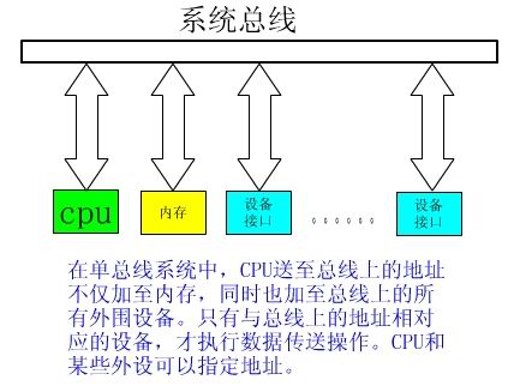
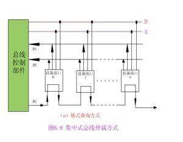
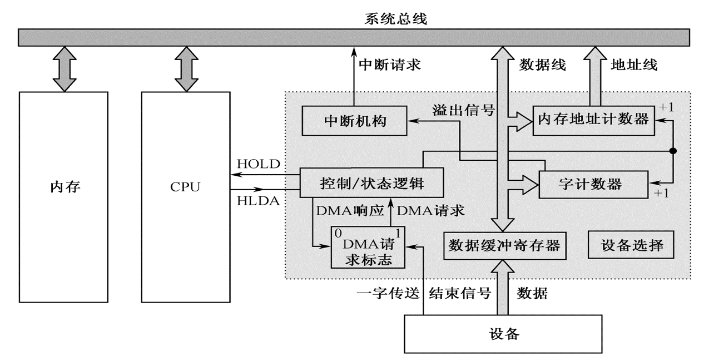

# 机组

## 第一章

### 冯·诺依曼型计算机

- 存储程序
- 按地址自动执行
- **五大部件**：包括控制器、运算器、存储器、输入设备、输出设备
- 以运算器为中心
- 

> 冯.诺伊曼思想（二进制表示信息、存储程序、按地址访问）

### 计算机系统的层次结构

- 五级计算机层次系统
  1. 第一级是**微程序设计级**。这是一个实在的硬件级，它由机器硬件直接执行微指令。如果某一个应用程序直接用微指令来编写，那么可在这一级上运行应用程序。
  2. 第二级是**一般机器级**，也称为机器语言级，它由微程序解释机器指令系统。这一级也是硬件级。
  3. 第三级是**操作系统级**，它由操作系统程序实现。这些操作系统由机器指令和广义指令组成，广义指令是操作系统定义和解释的软件指令，所以这一级也称为混合级。
  4. 第四级是**汇编语言级**，它给程序人员提供一种符号形式语言，以减少程序编写的复杂性。这一级由汇编程序支持和执行。如果应用程序采用汇编语言编写时，则机器必须要有这一级的功能；如果应用程序不采用汇编语言编写，则这一级可以不要。
  5. 第五级是**高级语言级**，它是面向用户的，为方便用户编写应用程序而设置的。这一级由各种高级语言编译程序支持和执行。

## 第二章

### IEEE754

- S：浮点数的符号位，1 位，0表示正数，1表示负数。
- M：尾数，23/52位(32/64位浮点数)，小数表示，小数点放在尾数域的最前面。
- E：阶码8/11位(32/64位浮点数),阶符采用隐含方式，即采用移码方式来表示正负指数。移码方法对两个指数大小的比较和对阶操作都比较方便，因为阶码域值大者其指数值也大。采用这种方式时，将浮点数的指数真值e变成阶码Ｅ 时，应将指数e 加上一个固定的偏移值127(01111111)/1023，(01111111111)即
                          E＝e＋127       (32位浮点数)
                          E＝e＋1023     (64位浮点数)
　　IEEE754 标准中，一个规格化的32位浮点数ｘ的真值可表示为
　　　　$ x＝(－1)s×(1.M)×2^{E－127}　　　 　e＝E－127 $
　　一个规格化的64位浮点数ｘ的真值为
　　　　$ x＝(－1)s×(1.M)×2^{E－1023} 　　  e＝E－1023 $
- 规格化表示：尾数域最高有效位要为1
  - $ 1.1xxx,0.1xxx $

### 各种码

- 原码：符号位+二进制
- 反码：~原码
- 补码
  - 加法：直接加
  - 减法：加负减数得补码
- 移码：补码最高为取反

#### 溢出检测

1. 符号扩展，$V=S_{f1} \bigoplus S_{f2}$, V=1表示有溢出，01上溢，10下溢
2. 无论溢出与否，$S_{f1}$始终指示正确符号

### 加法器

1. 第0类加法器
   - $S_i=A_i \bigoplus B_i \bigoplus C_i $
   - $ C_{i+1}=A_iB_i+B_iC_i+C_iA_i $
   - n位串行进位加法器延迟：$ t_a=(2n+9)T $

### 乘法器

> 对于两个原码数，数值部分直接运算，也就是说原码乘法，算前求补和算后求补都不需要  
> 对于两个补码数，先算前求补，经阵列乘法后算后求补，这种补码运算是间接的补码乘法

#### 直接补码乘法

- **符号位权值为-1**

### 除法器

#### 不恢复余数的阵列乘法器

- 被除数：$ 0.x_1x_2x_3x_4x_5x_6 $ **(整数位一定要是0)**
  - 除数的两倍长
- 除数：$ 0.y_1y_2y_3 $ **(整数位一定要是0)**
  - 被除数的一半
- 商：$ 0.q_1q_2q_3 $
  - 除数等长
- 余数：$ 0.00r_3r_4r_5r_6 $
- 符号位提出来，后面讨论
- 除法器  

- 原码除法运算  
  

> 商的最后如果是0，余数取最后一个商为1的余数

### 浮点加法、减法运算

1. 0操作数检查
2. 比较阶码大小并完成对阶
3. 尾数求和运算
4. 结果规格化
5. 舍入处理
6. 溢出处理

#### 舍入处理

- 补码舍入规则：
  1. 当丢失的各位均为0时，不必舍入
  2. 当丢失的最高位为0，以下各位不全为0时，或者丢失的最高位为1，以下各位均为0时，则舍去丢失位上的值
  3. 当丢失的最高位为1，以下各位不全为0时，在尾数最低位入1的修正操作。

> 丢失的位，最高位为1且非最高位不全为0，则修正

### 运算流水线

- 一个k级流水线处理n个任务需要的时钟数为：$ T_k=k+(n-1) $
- 非流水线处理n个任务需要的时钟数为：$ T_L=nk $
- 线性流水线的加速比：$ C_k = \frac{T_L}{T_k}=\frac{nk}{k+(n-1)} $

## 第三章

### 主存储器的技术指标

> 字存储单元、字节存储单元、按字寻址和按字节寻址

1. 存取时间
2. 存储周期
3. 存储器带宽

### SRAM存储器

1. 基本存储元

2. SRAM存储器的组成
   - SRAM存储器主要由存储体、读写电路、地址译码电路和控制电路

> CS片选信号。WE写使能信号。OE输出使能信号  
> $ t_{RC} = t_{WC} $ 读周期=写周期，存取周期  

### 多模块交叉存储器

#### 存储器的模块化组织

1. 顺序方式
   
2. 交叉方式
   
3. ???
   

### cache基本原理

1. cache的功能
   - 主要解决CPU和主存之间速度不匹配的问题。

#### 主存与cache的地址映射

1. 全相联映射方式
   - 
   - 暴力扫一遍
2. 直接相联映射方式
   - 
   - 指定位置
3. 组相联映射方式
   - 
   - 1对一组

### 虚拟存储器的基本概念

- 虚拟存储器中的逻辑地址到物理地址的转换是由硬件实现的存储管理部件MMU来完成的

## 第四章

### 指令系统的发展与性能要求

- 对指令系统的要求
  - 完备性
  - 有效性
  - 规整性
  - 兼容性

### 指令格式

- 影响计算机指令格式的因素
  - 机器的字长
  - 存储器的容量
  - 指令的功能
- 指令能反映以下信息
  - 做什么操作
  - 如果需要操作数，从哪里取
  - 结果送哪里
  - 下一条指令从哪里取
- 所以指令格式包括两个方面：
  - 

#### 地址码

- 根据一条指令中有几个操作数地址，可将该指令称为几操作数指令或几地址指令。
  - 三地址指令
  - 二地址指令
  - 单地址指令
  - 零地址指令
- 

##### 三地址指令

- 指令格式如下：
- 
- 操作码θ   第一操作数A1   第二操作数A2      结果A3
- 功能描述
  - (A1)θ(A2)→A3
  - (PC) +1→PC
- 这种格式虽然省去了一个地址，但指令长度仍比较长，所以只在字长较长的大、中型机中使用，而小型、微型机中很少使用。

##### 二地址指令

- 其格式如下：
  - 
- 操作码θ第一操作数A1第二操作数A2
- 功能描述：
  - (A1)θ(A2)→A1
  - (PC)+1→PC
- 二地址指令在计算机中得到了广泛的应用，但是在使用时有一点必须注意：指令执行之后，A1中原存的内容已经被新的运算结果替换了。
- 二地址地址根据操作数的物理位置分为：
  - SS 存储器-存储器类型(慢)
  - RS 寄存器-存储器类型
  - RR 寄存器-寄存器类型(快)

##### 一地址指令

- 指令格式为
- 
- 操作码θ     第一操作数A1
- 功能描述
  - (AC)θ(A1) →A1
  - (PC)+1→PC
- 单操作数运算指令，如“+1”、“-1”、“求反”
- 指令中给出一个源操作数的地址

##### 零地址指令  

- 其格式为：
- 
- 操作码θ
- “停机”、“空操作”、“清除”等控制类指令。

#### 指令长度

- 概念
  - 指令字长度（一个指令字包含二进制代码的位数）
  - 机器字长：计算机能直接处理的二进制数据的位数。
  - 单字长指令
  - 半字长指令
  - 双字长指令
- 多字长指令的优缺点
  - 优点提供足够的地址位来解决访问内存任何单元的寻址问题 ；
  - 缺点必须两次或多次访问内存以取出一整条指令，降低了CPU的运算速度，又占用了更多的存储空间。
- 指令系统中指令采用等长指令的优点：各种指令字长度是相等的，指令字结构简单，且指令字长度是不变的 ；
- 采用非等长指令的的优点：各种指令字长度随指令功能而异，结构灵活，能充分利用指令长度，但指令的控制较复杂 。

### ARM

- 格式

| cond | F   | I   | opcode | S   | Rn  | Rd  | operand 2 |
| ---- | --- | --- | ------ | --- | --- | --- | --------- |
| 4位  | 2位 | 1位 | 4位    | 1位 | 4位 | 4位 | 12位      |

- opcode：操作码
- Rd：目标寄存器
- Rn：源寄存器
- operand 2：第二个源操作数
- I：立即数；0：第二个操作数在寄存器中；1：第二个操作数是12位立即数
- S：指明状态，涉及条件转移指令
- cond：指明条件：涉及条件转移指令
- F：说明指令类型

### RISC

- 特点（采用流水线技术）
  - 简单而统一格式的指令译码；
  - 大部分指令可以单周期执行
  - 只有LOAD/STORE可以访问存储器
  - 简单的寻址方式
  - 采用延迟转移技术
  - 采用LOAD延迟技术
  - 三地址指令格式
  - 较多的寄存器
  - 对称的指令格式

## 第五章

### CPU的功能和组成

1. CPU的功能
   - 
   - 指令控制（程序的顺序控制）
   - 操作控制（一条指令有若干操作信号实现）
   - 时间控制（指令各个操作实施时间的定时）
   - 数据加工（算术运算和逻辑运算）
2. CPU的基本组成
   - 
   - 中央处理器CPU=运算器+控制器
     - 运算器
       - ALU
       - 累加器
       - 暂存器
     - 控制器
       - 程序计数器、指令寄存器、数据缓冲器、地址寄存器、通用寄存器、状态寄存器、时序发生器、指令译码器、总线（数据通路）

### 操作控制器和时序产生器

- 硬布线控制器
  - 硬布线控制器，它是采用组合逻辑技术来实现的，其时序控制信号形成部件是由门电路组成的复杂树形网络。这种方法是分立元件时代的产物，以使用最少器件数和取得最高操作速度为设计目标。
  - 组合逻辑控制器的最大优点是速度快，但是时序控制信号形成部件的结构不规整，使得设计、调试、维修较困难，难以实现设计自动化。

### 指令周期

#### 指令周期的基本概念

- 概念
  - **指令周期**：指取指令、分析指令到执行完该指令所需的全部时间。
  - **机器周期** 通常又称 **CPU周期**，**时钟周期**
    - 通常把一条**指令周期**划分为若干个**机器周期**，每个机器周期完成一个基本操作。
    - 主存的 **工作周期(存取周期)** 为基础来规定 **CPU周期**，比如，可以用CPU读取一个指令字的最短时间来规定CPU周期
    - 不同的指令，可能包含不同数目的机器周期。
    - 一个机器周期中，包含若干个机器周期（节拍脉冲或T脉冲）。
    - CPU周期规定，不同的计算机中规定不同
    - 在一个机器周期内，要完成若干个微操作。这些微操作有的可以同时执行，有的需要按先后次序串行执行。因而需要把一个机器周期分为若干个相等的时间段，每一个时间段称为一个节拍。节拍常用具有一定宽度的电位信号表示，称之为节拍电位。
    - 节拍的宽度取决于CPU完成一次基本的微操作的时间，如：ALU完成一次正确的运算，寄存器间的一次数据传送等。
- 

#### meow

- MOV指令的指令周期
  - 
- LAD指令的指令周期
  - 
- ADD指令的指令周期
  - 
- STO指令的指令周期
  - 
- JMP指令的指令周期
  - 
  - `offset = addr - @ - 1, @:目标地址`

#### 用方框图语言表示的指令周期

- 方法：
  - 指令系统设计（模型机的五指令系统）
  - `方框`: 按CPU周期
  - `方框内内容`: 数据通路操作或控制操作
  - `菱形符号`: 判别或测试
  - `~`: 公操作
  - 前边所讲述的5种操作的框图描述
  - 

### 微程序控制器

> 基本思想：仿照解题的方法，把操作控制信号编制成微指令，存放到控制存储器里，运行时，从控存中取出微指令，产生指令运行所需的操作控制信号。从上述可以看出，微程序设计技术是用软件方法来设计硬件的技术

#### 微程序控制原理

- 微命令：控制部件向执行部件发出的各种控制命令叫作微命令，它是构成控制序列的最小单位。
  - 例如：打开或关闭某个控制门的电位信号、某个寄存器的打入脉冲等。
  - 微命令是控制计算机各部件完成某个基本微操作的命令。
- 微操作：是微命令的操作过程。
  - 微命令和微操作是一一对应的。
  - 微命令是微操作的控制信号，微操作是微命令的操作过程。
  - 微操作是执行部件中最基本的操作。
  - 由于数据通路的结构关系，微操作可分为相容的和互斥的两种：
    - 互斥的微操作，是指不能同时或不能在同一个节拍内并行执行的微操作。可以编码
    - 相容的微操作，是指能够同时或在同一个节拍内并行执行的微操作。必须各占一位
- 微指令：把在同一CPU周期内并行执行的微操作控制信息，存储在控制存储器里，称为一条微指令（`Microinstruction`）
  - 它是微命令的组合，微指令存储在控制器中的控制存储器中
  - 一条微指令通常至少包含两大部分信息
    - 操作控制字段，又称微操作码字段，用以产生某一步操作所需的各个微操作控制信号。
      - 某位为1，表明发微指令
      - 微指令发出的控制信号都是节拍电位信号，持续时间为一个CPU周期
      - 微命令信号还要引入时间控制
    - 顺序控制字段，又称微地址码字段，用以控制产生下一条要执行的微指令地址。
- 微程序
  - 一系列微指令的有序集合就是微程序。
    - 一段微程序对应一条机器指令。
    - 微地址 ：存放微指令的控制存储器的单元地址
  - 

##### 微程序控制器原理

- 
- 控制存储器(`μCM`)
  - 这是微程序控制器的核心部件，用来存放微程序。其性能(包括容量、速度、可靠性等)与计算机的性能密切相关
- 微指令寄存器(`μIR`)
  - 用来存放从`μCM`取出的正在执行的微指令，它的位数同微指令字长相等。
- 微地址形成部件
  - 用来产生初始微地址和后继微地址，以保证微指令的连续执行。
- 微地址寄存器(`μMAR`)
  - 它接受微地址形成部件送来的微地址，为下一步从`μCM`中读取微指令作准备。
- 微程序控制器的工作过程
  1. 执行取指令的公共操作。取指令的公共操作通常由一段取指微程序来完成，在机器开始运行时，自动将取指微程序的入口微地址送`μMAR`，并从`μCM`中读出相应的微指令送入`μIR`。微指令的操作控制字段产生有关的微命令，用来控制实现取机器指令的公共操作。取指微程序的入口地址一般为`μCM`的0号单元，当取指微程序执行完后，从主存中取出的机器指令就已存人指令寄存器`IR`中了。
  2. 由机器指令的操作码字段通过微地址形成部件产生出该机器指令所对应的微程序的入口地址，并送入`μMA`
  3. 从`μCM`中逐条取出对应的微指令并执行之，每条微指令都能自动产生下一条微指令的地址
  4. 一条机器指令对应的微程序的最后一条微指令执行完毕后，其下一条微指令地址又回到取指微程序的人口地址，从而继续第(1)步，以完成取下条机器指令的公共操作

##### CPU周期和微指令周期的关系

- 

#### 机器指令与微指令的关系

- 

#### 微程序设计技术

##### 微指令地址的形成

- 入口地址：每条机器指令对应一段微程序，当公用的取指微程序从主存中取出机器指令之后，由机器指令的操作码字段指出各段微程序的入口地址，这是一种多分支(或多路转移)的情况。
- 机器指令的操作码转换成初始微地址的方式主要有两种。
  - 计数器的方式
  - 多路转移的方式

1. 入口地址形成：如果机器指令操作码字段的位数和位置固定，可以直接使操作码与微程序入口地址的部分位相对应
   - 
2. 后继微地址形成方法
   1. 计数器的方式
      - 方法：
        - 微程序顺序执行时，其后继微地址就是现行微地址加上一个增量(通常为1)；
        - 当微程序遇到转移或转子程序时，由微指令的转移地址段来形成转移微地址。
        - 在微程序控制器中也有一个微程序计数器μPC，一般情况下都是将微地址寄存器μMAR作为μPC
      - 特点：
        - 优点是简单、易于掌握，编制微程序容易
        - 缺点是这种方式不能实现两路以上的并行微程序转移，因而不利于提高微程序的执行速度。
   2. 多路转移的方式
      - 根据条件转移如图
      - 条件：状态条件/测试/微指令中微地址/操作码
      - 

3. 微指令格式分为两类：水平型微指令和垂直型微指令
   1. 水平型微指令
      - 水平型微指令是指一次能定义并能并行执行多个微命令的微指令。
      - 格式如下
      - 
      - 优点：
        - 微指令字较长，速度越快。
        - 微指令中的微操作有高度的并行性。
        - 微指令译码简单。
        - 控制存储器的纵向容量小，灵活性强。
      - 缺点：
        - 微指令字比较长，明显地增加了控制存储器的横向容量。
        - 水平微指令与机器指令差别很大，一般要熟悉机器结构、数据通路、时序系统以及指令执行过程的人才能进行微程序设计，这对用户来说是很困难的。
   2. 垂直型微指令：采用编码方式。
      - 设置微操作控制字段时，一次只能执行一到二个微命令的微指令称为垂直型微指令。
      - 
      - 垂直型微指令的特点：
        - 微指令字短，一般为10～20位左右。
        - 微指令的并行微操作能力有限，一条微指令一般只包含一个微操作命令。
        - 微指令译码比较复杂。全部微命令用一个微操作控制字段进行编码，微指令执行时需行完全译码。
        - 设计用户只需注意微指令的功能，而对微命令及其选择、数据通路的结构则不用过多地考虑，因此，便于用户编制微程序。而且，编制的微程序规整、直观，便于实现设计的自动化。
        - 垂直微指令字较短，使控制存储器的横向容量少。
        - 用垂直微指令编制微程序要使用较多的微指令，微程序较长；要求控制存储器的纵向容量大。垂直微指令产生微命令要经过译码，微程序执行速度慢。
        - 不能充分利用数据通路具有多种并行操作能力
   3. 水平型微指令和垂直型微指令的比较
      1. 水平型微指令并行操作能力强，效率高，灵活性强，垂直型微指令则较差
      2. 水平型微指令执行一条指令的时间短，垂直型微指令执行时间长
      3. 由水平型微指令解释指令的微程序，有微指令字较长而微程序短的特点。垂直型微指令则相反
      4. 水平型微指令用户难以掌握，而垂直型微指令与指令比较相似，相对来说，比较容易掌握
   4. 动态微程序设计
      - 对应于一台计算机的机器指令只有一组微程序，这一组微程序设计好之后，一般无须改变而且也不好改变，这种微程序设计技术称为静态微程序设计
      - 采用EPROM作为控制存储器，可以通过改变微指令和微程序来改变机器的指令系统，这种微程序设计技术称为动态微程序设计

### 硬布线控制器

1. 实现方法
   - 通过逻辑电路直接连线而产生的，又称为组合逻辑控制方式
2. 设计目标
   - 使用最少元件（复杂的树形网络）
   - 速度最高
3. 逻辑原理
   - 
   - 微操作控制信号产生
     - 在微程序控制器中，微操作控制信号由微指令产生，并且可以重复使用
     - 在硬联线控制器中，某一微操作控制信号由布尔代数表达式描述的输出函数产生
     - 设计微操作控制信号的方法和过程是，根据所有机器指令流程图，寻找出产生同一个微操作信号的所有条件，并与适当的节拍电位和节拍脉冲组合，从而写出其布尔代数表达式并进行简化，然后用门电路或可编程器件来实现
4. 设计步骤
   1. 画出指令流程图
   2. 列出微操作时间表
      - 将指令流程图中的微操作合理地安排到各个机器周期的相应节拍和脉冲中去；
      - 微操作时间表形象地表明：什么时间、根据什么条件发出哪些微操作信号。
   3. 进行微操作信号的综合
      - 当列出所有指令的微操作时间表之后，需要对它们进行综合分析，把凡是要执行某一微操作的所有条件(哪条指令、哪个机器周期、哪个节拍和脉冲等)都考虑在内，加以分类组合，列出各微操作产生的逻辑表达式，然后加以简化，使逻辑表达式更为合理
   4. 实现电路
      - 根据整理并化简的逻辑表达式组，可以用一系列组合逻辑电路加以实现，加根据逻辑表达式画出逻辑电路图，用逻辑门电路的组合来实现之，也可以直接根据逻辑表达式，用PLA或其他逻辑电路实现

### 流水CPU

#### 并行处理技术

- 并行性（Parrelism）概念
  - 问题中具有可以同时进行运算或操作的特性
  - 例：在相同时延的条件下，用n位运算器进行n位并行运算速度几乎是一位运算器进行n位串行运算的n倍（狭义）
- （广义）含义
  - 只要在同一时刻（同时性）或在同一时间间隔内（并发性）完成两种或两种以上性质相同或- 不同的工作，他们在时间上相互重叠，都体现了并行性
- 三种形式
  - 时间并行（重叠）：让多个处理过程在时间上相互错开，轮流使用同一套硬件设备的各个部件，以加快硬件周转而赢得速度，实现方式就是采用流水处理部件
  - 空间并行（资源重复）：以数量取胜
    - 它能真正的体现同时性
    - LSI和VLSI为其提供了技术保证
  - 时间+空间并行
    - Pentium中采用了超标量流水线技术

#### 流水CPU的结构

- 流水计算机的系统组成
  - 存储器体系：主存采用多体交叉存储器；Cache
  - 流水方式CPU：指令部件、指令队列、执行部件
    - 指令流水线
    - 指令队列：FIFO
    - 执行部件：可以有多个采用流水线方式构成的算术逻辑部件构成，可以将定点运算部件和浮点运算部件分开。
- 流水线CPU时空图
  - IF（Instruction Fetch取指）
  - ID（Instruction Decode指令译码）
  - EX（Execution执行）
  - WB（Write Back写回）
  - 
- 非流水CPU
  - 
- 流水CPU
  - 
- 超标量流水线
  - 具有两条以上的指令流水线
  - 
  - 上图中流水线满载时，每一个时钟周期可以执行2条指令
  - 采用时间和空间并行技术
- 流水线（Pipelining）的分类
  - 按级别分为
    - 指令流水线
    - 算术流水线
    - 处理机流水线（宏流水线）

#### 流水线中的主要问题

- 瓶颈问题（流水线中有速度慢的段）
  - 再分成几个段
  - 用资源重复的方法也可以解决
- 资源相关：多条指令进入流水线后在同一时钟周期内争用同一功能部件。
  - 解决办法：后边指令拖一拍再推进；增设一个功能部件
- 数据相关
  - RAW(Read After Write)
    - 后面指令用到前面指令所写的数据
  - WAW(Write After Write)
    - 两条指令写同一个单元
    - 在简单流水线中没有此类相关，因为不会乱序执行
  - WAR(Write After Read)
    - 后面指令覆盖前面指令所读的单元
    - 在简单流水线中没有此类相关
  - 解决办法：
    - 可以推后后继指令对相关单元的读操作
    - 设置相关的直接通路（Forwarding）
- 控制相关
  - 引起原因：转移指令
  - 解决办法：延迟转移法，转移预测法

## 第六章

### 总线的概念和结构形态

#### 总线的基本概念

- 数字计算机是由若干系统功能部件构成的，这些系统功能部件在一起工作才能形成一个完整的计算机系统
- 总线定义：计算机的若干功能部件之间不可能采用全互联形式，因此就需要有公共的信息通道，即总线
- 总线是构成计算机系统的互联机构，是多个系统功能部件之间进行数据传送的公共通路。借助于总线连接，计算机在各系统功能部件之间实现地址、数据和控制信息的交换，并在争用资源的基础上进行工作
- 总线可分为以下几类：
  - 内部总线：CPU内部连接各寄存器及运算器部件之间的总线
  - 系统总线：外部总线。CPU和计算机系统中其他高速功能部件相互连接的总线
  - I/O总线：中低速I/O设备相互连接的总线
- 总线的特性可分为：物理特性、功能特性、电气特性、时间特性。
  - 物理特性：总线的物理连接方式（根数、插头、插座形状，引脚排列方式）
  - 功能特性：每根线的功能
  - 电气特性：每根线上信号的传递方向及有效电平范围。
  - 时间特性：规定了每根总线在什么时间有效
- 相同的指令系统，相同的功能，不同厂家生产的各功能部件在实现方法上几乎没有相同的,但各厂家生产的相同功能部件却可以互换使用，其原因何在呢?
  - 为了使不同厂家生产的相同功能部件可以互换使用，就需要进行系统总线的标准化工作。目前，已经出现了很多总线标准，如PCI、ISA等
- 采用标准总线的优点
  - 简化系统设计
  - 简化系统结构，提高系统可靠性
  - 便于系统的扩充和更新
- 总线带宽：总线本身所能达到的最高传输速率
  - 一次操作可以传输的数据位数
  - 如S100为8位，ISA为16位，EISA为32位，PCI-2可达64位
  - 总线宽度不会超过微处理器外部数据总线的宽度

#### 总线的连接方式

- 适配器（接口）：实现高速CPU与低速外设之间工作速度上的匹配和同步，并完成计算机和外设之间的所有数据传送和控制
- 单机系统中总线结构的两种基本类型：
  - 单总线：使用一条单一的系统总线来连接CPU、内存和I/O设备
    - 
    - 单总线结构特点：
    - 在单总线结构中，要求连接到总线上的逻辑部件必须高速运行，以便在某些设备需要使用总线时，能迅速获得总线控制权；而当不再使用总线时，能迅速放弃总线控制权。否则，由于一条总线由多种功能部件共用，可能导致很大的时间延迟。
  - 多总线：在CPU、主存、I/O之间互联采用多条总线
    - 
  - 高速的CPU总线：CPU和cache之间采用
  - 系统总线：主存连在其上。
  - 高速总线上可以连接高速LAN（100Mb/s局域网）、视频接口、图形接口、SCSI接口（支持本地磁盘驱动器和其他外设）、Firewire接口（支持大容量I/O设备）。高速总线通过扩充总线接口与扩充总线相连，扩充总线上可以连接串行方式工作的I/O设备。
  - 通过桥CPU总线、系统总线和高速总线彼此相连。桥实质上是一种具有缓冲、转换、控制功能的逻辑电路。
  - 多总线结构体现了高速、中速、低速设备连接到不同的总线上同时进行工作，以提高总线的效率和吞吐量，而且处理器结构的变化不影响高速总线。

#### 总线的内部结构

- 早期总线的内部结构如图所示，它实际上是处理器芯片引脚的延伸，是处理器与I/O设备适配器的通道。这种简单的总线一般也由50～100条线组成，这些线按其功能可分为三类：地址线、数据线和控制线
  - 
- 早期总线结构的不足之处在于：
  - CPU是总线上惟一的主控者。即使后来增加了具有简单仲裁逻辑的DMA控制器以支持DMA传送，但仍不能满足多CPU环境的要求。
  - 总线信号是CPU引脚信号的延伸，故总线结构紧密与CPU相关，通用性较差。
- 当代流行的总线内部结构
  - 
  - 由地址线、数据线、控制线组成。其结构与简单总线相似，但一般是32条地址线，32或64条数据线。为了减少布线，64位数据的低32位数据线常常和地址线采用多路复用方式
  - 仲裁总线：包括总线请求线和总线授权线
  - 中断和同步总线：用于处理带优先级的中断操作，包括中断请求线和中断认可线
  - 公用线：包括时钟信号线、电源线、地线、系统复位线以及加电或断电的时序信号线等
  - 大多数计算机采用了分层次的多总线结构。
  - 右图它是一个三层次的多总线结构即有CPU总线、PCI总线和ISA总线
  - 

#### 总线接口

##### 信息的传送方式

- 计算机系统中，传输信息基本有三种方式：
  - 串行传送
  - 并行传送
  - 分时传送
- 出于速度和效率上的考虑，系统总线上传送的信息必须采用并行传送方式。分时传送即总线的分时复用
- 串行传送
  - 使用一条传输线，采用脉冲传送。
  - 主要优点是只需要一条传输线，这一点对长距离传输显得特别重要，不管传送的数据量有多少，只需要一条传输线，成本比较低廉。
  - 缺点就是速度慢
- 并行传送
  - 每一数据位需要一条传输线，一般采用电位传送
- 分时传送
  - 总线复用或是共享总线的部件分时使用总线

##### 总线接口的基本概念

- 接口是CPU和主存、外设之间通过总线进行连接的逻辑部件
- 接口的典型功能：控制、缓冲、状态、转换、整理、程序中断
- 一个适配器的两个接口：一个同系统总线相连，采用并行方式，另外一个同设备相连，可能采用并行方式或是串行方式

#### 总线的仲裁

- 连接到总线上的功能模块有主动和被动两种形态，其中主方可以启动一个总线周期，而从方只能响应主方请求。每次总线操作，只能有一个主方，但是可以有多个从方
- 为了解决多个功能模块争用总线的问题，必须设置总线仲裁部件
- 总线占用期：主方持续控制总线的时间
- 按照总线仲裁电路的位置不同，仲裁方式分为集中式和分布式两种

##### 集中式仲裁

- 
- 集中式仲裁有三种：
  1. 链式查询方式：
     - 离中央仲裁器最近的设备具有最高优先权，离总线控制器越远，优先权越低。
     - 
     - 优点：只用很少几根线就能按一定优先次序实现总线控制，并且这种链式结构很容易扩充设备。
     - 缺点：是对询问链的电路故障很敏感，优先级固定
  2. 计数器定时查询方式：
     1. 总线上的任一设备要求使用总线时，通过BR线发出总线请求。
     2. 中央仲裁器接到请求信号以后，在BS线为“0”的情况下让计数器开始计数，计数值通过一组地址线发向各设备。每个设备接口都有一个设备地址判别电路，当地址线上的计数值与请求总线的设备地址相一致时，该设备 置“1”BS线，获得了总线使用权，此时中止计数查询
     3. 每次计数可以从“0”开始，也可以从中止点开发始。如果从“0”开始，各设备的优先次序与链式查询法相同，优先级的顺序是固定的。如果从中止点开始，则每个设备使用总线的优级相等。
     - 计数器的初值也可用程序来设置，这可以方便地改变优先次序，但这种灵活性是以增加线数为代价的。可方便的改变优先级
  3. 独立请求方式
     - 每一个共享总线的设备均有一对总线请求线BRi和总线授权线BGi。当设备要求使用总线时，便发出该设备的请求信号。总线仲裁器中有一个排队电路，它根据一定的优先次序决定首先响应哪个设备的请求，给设备以授权信号BGi。独立请求方式的优点是响应时间快，即确定优先响应的设备所花费的时间少，用不着一个设备接一个设备地查询。其次，对优先次序的控制相当灵活。它可以预先固定，例如BR0优先级最高，BR1次之…BRn最低；也可以通过程序来改变优先次序；还可以用屏蔽（禁止）某个请求的办法，不响应来自无效设备的请求。因此当代总线标准普遍采用独立请求方式
     - 独立请求方式：优点是响应时间快，即确定优先响应的设备所花费的时间少。对优先次序的控制也是相当灵活的
     - 
- **分布式仲裁**
  - 分布式仲裁：不需要中央仲裁器，而是多个仲裁器竞争使用总线。当它们有总线请求时，把它们唯一的仲裁号发送到共享的仲裁总线上，每个仲裁器将仲裁总线上得到的号与自己的号进行比较。如果仲裁总线上的号大，则它的总线请求不予响应，并撤消它的仲裁号。最后，获胜者的仲裁号保留在仲裁总线上。显然，分布式仲裁是以优先级仲裁策略为基础
  - 分布式仲裁示意图
    - 
  1. 所有参与本次竞争的各主设备将设备竞争号CN取反后打到仲裁总线AB上，以实现“线或”逻辑。AB线低电平时表示至少有一个主设备的CNi为1，AB线高电平时表示所有主设备的CNi为0
  2. 竞争时CN与AB逐位比较，从最高位（b7）至最低位（b0）以一维菊花链方式进行，只有上一位竞争得胜者Wi+1位为1。当CNi=1，或CNi=0且ABi为高电平时，才使Wi位为1。若Wi=0时，将一直向下传递，使其竞争号后面的低位不能送上AB线
  3. 竞争不到的设备自动撤除其竞争号。在竞争期间，由于W位输入的作用，各设备在其内部的CN线上保留其竞争号并不破坏AB线上的信息
  4. 由于参加竞争的各设备速度不一致，这个比较过程反复（自动）进行，才有最后稳定的结果。竞争期的时间要足够，保证最慢的设备也能参与竞争
  - 裁决过程
    - 逻辑线仲裁时“线或”，因此只要有一个设备把逻辑“1”送到某个特定的仲裁线上，那么这根线的信号就是“1”，即低电平。每个设备中的裁决逻辑检测仲裁线上的结果，并根据下列规则修改它放到总线上的仲裁号：如果该设备的仲裁号中有某一位为0，而这一位对应的仲裁线信号为“1”，则修改这个仲裁号，使其所有低位都从总线上撤销，也即使所有低位对应的仲裁线送出一个为“0”的信号。这样，具有最高仲裁号的设备将会发现它的仲裁号和留在仲裁线上的好匹配，所以将赢得总线的使用权
    - 

#### 总线的定时和数据传送模式

##### 总线定时

- 总线的信息传送过程：请求总线、总线仲裁、寻址、信息传送、状态返回
- 定时：事件出现在总线上的时序关系
  - 同步定时：
    - 
    - 事件出现在总线上的时刻由总线时钟信号来确定，一次IO传送被称为时钟周期或总线周期
    - 由于使用了公共时钟，每个功能模块发送或接受信息的时间都由统一时钟规定，因此，同步定时具有较高的传输频率
    - 适用于总线长度较短、各功能模块存取时间比较接近的情况。当各功能模块存取时间相差较大时，会大大损失总线效率
  - 异步定时：
    - 
    - 后一时间出现在总线的时刻取决于前一事件的出现，即建立在应答或互锁机制基础上。在这种系统中，不需要统一的公共时钟信号。总线周期长度是可变的
    - 总线周期长度不变，不把相应时间强加到功能模块上，因而允许快速和慢速的功能模块都链接到同一总线上。但这以增加总线复杂性和成本为代价

## 第七章

### 数据在磁盘上的记录格式

- 
- 一个扇区**512Byte**
- 存储密度：存储密度分道密度、位密度和面密度
  - 道密度：沿磁盘半径方向单位长度上的磁道数，单位为道/英寸
  - 位密度：磁道单位长度上能记录的二进制代码位数，单位为位/英寸
  - 面密度：位密度和道密度的乘积，单位为位/平方英寸
- 存储容量：一个磁盘存储器所能存储的字节总数，称为磁盘存储器的存储容量
- 存取时间：存取时间是指从发出读写命令后，磁头从某一起始位置移动至新的记录位置，到开始从盘片表面读出或写入信息加上传送数据所需要的时间。取决于以下三个因素决定
  - 一个是将磁头定位至所要求的磁道上所需的时间，称为找道时间
  - 第二个是找道完成后至磁道上需要访问的信息到达磁头下的时间，称为等待时间，这两个时间都是随机变化的，因此往往使用平均值来表示，平均找道时间是最大找道时间与最小找道时间的平均值。平均等待时间和磁盘转速有关，它用**磁盘旋转一周所需时间的一半来表示**
  - 第三个是数据传送时间
- 数据传输率：磁盘存储器在单位时间内向主机传送数据的字节数，叫数据传输率，传输率与存储设备和主机接口逻辑有关。从主机接口逻辑考虑，应有足够快的传送速度向设备接收/发送信息。从存储设备考虑，假设磁盘旋转速度为n转/秒，每条磁道容量为N个字节，则数据传输率：
  - Dr=nN(字节/秒) 或Dr=D·v(字节/秒)
- 内径/外径：**直径**

### 显示器带宽

- 刷新所需带宽=分辨率×每个像素点颜色深度×刷新速率

## 第八章

### 信息交换方式

- 程序查询方式
- 程序中断方式
- DMA方式
- 通道方式

#### 程序查询方式

- 

1. 设备编址
   - 统一编址
   - 独立编址
2. 输入输出指令
3. 程序查询接口
   - 设备选择电路
   - 数据缓冲寄存器
   - 设备状态寄存器

#### 程序中断方式

##### 中断的概念、功能

- 中断（Interrupt）是指CPU暂时中止现行程序，转去处理随机发生的紧急事件，处理完后自动返回原程序的功能和技术。中断系统是计算机实现中断功能的软硬件总称。一般在CPU中设置中断机构，在外设接口中设置中断控制器，在软件上设置相应的中断服务程序
  - 中断系统的功能包括：
    1. 实现主机和外设的并行工作
    2. 处理故障
    3. 实现多道程序和分时操作
    4. 实时控制
    5. 实现人机联系
    6. 实现多机通信
  - 中断源：能够向CPU发出中断请求的事件。常见中断源有：
    - 输入、输出设备中断。如键盘、打印机等工作过程中已做好接收或发送准备
    - 数据通道中断。如磁盘、磁带等要同主机进行数据交换等
    - 实时时钟中断
    - 故障中断。例如电源掉电、设备故障等要求CPU进行紧急处理等
    - 系统中断。如运算过程出现溢出、数据格式非法，数据传送过程出现校验错，控制器遇到非法指令等等
    - 为了调试程序而设置的中断
  - 中断处理过程注意几个问题：
    - 响应中断时机：外界中断请求时随机的，但CPU只有在当前指令执行完毕后，才转至公操作
    - 断点保护问题（PC，寄存器内容和状态的保存）
    - 原子操作：开中断和关中断问题
    - 中断是由软硬件结合起来实现的
    - 

##### 程序中断方式的基本接口

- 设备选择器。设备选择器用来判别总线上送出的地址（或称呼叫的设备）是否为本设备，它实际上是设备地址的译码比较电路。
- BS外设接口忙（BuSy）标志
- RD外设准备就绪（ReaDy）标志
- EI（Enable Interrupt中断允许触发器）
- IR（Interrupt Request）中断请求触发器
- IM（Interrupt Mask）中断屏蔽触发器
- 
  1. 表示由程序启动外设，将该外设接口的“忙”标志BS置“1”，“准备就绪”标志RD清“0”；
  2. 表示接口向外设发出启动信号；
  3. 表示数据由外设传送到接口的缓冲寄存器；
  4. 表示当设备动作结束或缓冲寄存器数据填满时，设备向接口送出一控制信号，将数据“准备就绪”标志RD置“1”；
  5. 表示允许中断标志EI为“1”时，接口向CPU发出中断请求信号；
  6. 表示在一条指令执行末尾CPU检查中断请求线，将中断请求线的请求信号接收到“中断请求”标志IR；
  7. 表示如果“中断屏蔽”标志IM为“0”时，CPU在一条指令执行结束后受理外设的中断请求，向外设发出响应中断信号并关闭中断；
  8. 表示转向该设备的中断服务程序入口；
  9. 表示在中断服务程序通过输入指令把接口中数据缓冲寄存器的数据读至CPU中的寄存器；
  10. 表示CPU发出控制信号C将接口中的BS和RD标志复位。

##### 单级中断

- 所有中断源属于同一级，离CPU越近，优先级越高，图8.7类似于第六章的链式查询方式。
- **中断源的识别**：串行排队链法
  - 
  - IR1，IR2，IR3为中断请求信号
  - IS1，IS2，IS3为中断选中信号
  - INTI为中断排队输入
  - INTO为中断排队输出
- 中断向量的产生
  - 向量地址转移法
- 中断向量：
  - 当CPU响应中断时，由硬件直接产生一个固定的地〗址(即向量地址)
  - 由向量地址指出每个中断源设备的中断服务程序入口，这种方法通常称为向量中断

##### 多级中断

- 
- 概念
  - 每级有一个中断优先权
  - 一维多级中断和二维多级中断
  - 说明：
    - 一个系统有n级中断，则CPU中有n个IR，n个IM，某级中断被响应后，则关闭本级和低于本级的IM，开放更高级的IM。
    - 多级中断可以嵌套，但同一级的中断不允许嵌套
    - 中断响应时，确定哪一级中断和中断源采用硬件实现。采用了独立请求方式和链式查询方式相结合的方式。
    - 使用多级堆栈保存现场（包括IM）
- 多级中断源的识别
  - 中断优先排队电路
  - 中断向量产生电路
  - 
- 中断屏蔽
  - 整级屏蔽：设置IM
  - 单个源屏蔽：EI

#### DMA方式

##### DMA方式的一般概念

- 直接存储器访问（Direct Memory Address）DMA方式是为了在主存储器与I/O设备间高速交换批量数据而设置的。
- 基本思想是：通过硬件控制实现主存与I/O设备间的直接数据传送，在传送过程中无需CPU的干预。数据传送是在DMA控制器控制下进行的，
- 优点：速度快。有利于发挥CPU的效率。
- 过程描述：
  - 由DMA控制器给出当前正在传送的数据的主存地址，并统计传送数据的个数以确定一组数据的传送是否已结束。在主存中要开辟连续地址的专用缓冲器，用来提供或接收传送的数据。在数据传送前和结束后要通过程序或中断方式对缓冲器和DMA控制器进行预处理和后处理。

##### DMA传送方式

1. CPU暂停方式
   - 主机响应DMA请求后，让出存储总线，直到一组数据传送完毕后，DMA控制器才把总线控制权交还给CPU，采用这种工作方式的I/O设备，在其接口中一般设置有小容量存储器，I/O设备先与小容量存储器交换数据，然后由小容量存储器与主机交换数据，这样可减少DMA传送占用存储总线的时间，也即减少了CPU暂停工作的时间
   - 
   - 优点: 控制简单，它适用于数据传输率很高的设备进行成组传送。
   - 缺点: 在DMA控制器访内阶段，内存的效能没有充分发挥，相当一部分内存工作周期是空闲的。这是因为，外围设备传送两个数据之间的间隔一般总是大于内存存储周期，即使高速I/O设备也是如此。
2. 周期挪用方式
   - DMA控制器与主存储器之间传送一个数据，占用（窃取）一个CPU周期，即CPU暂停工作一个周期，然后继续执行程序
   - 
   - 如果CPU的工作周期比内存存取周期长很多，可以采用该种方法
   - 总线控制权的转移速度快，DMA效率高
   - 

##### DMA传送一个数据的过程

1. DMA基本构成
   - 
     1. 内存地址计数器: 用于存放内存中要交换的数据的地址。在DMA传送前，须通过程序将数据在内存中的起始位置(首地址)送到内存地址计数器。而当DMA传送时，每交换一次数据，将地址计数器加“1”，从而以增量方式给出内存中要交换的一批数据的地址
     2. 字计数器: 用于记录传送数据块的长度(多少字数)。其内容也是在数据传送之前由程序预置，交换的字数通常以补码形式表示。在DMA传送时，每传送一个字，字计数器就加“1” ，当计数器溢出即最高位产生进位时，表示这批数据传送完毕，于是引起DMA控制器向CPU发中断信号
     3. 数据缓冲寄存器: 用于暂存每次传送的数据(一个字)。当输入时，由设备(如磁盘)送往数据缓冲寄存器，再由缓冲寄存器通过数据总线送到内存。反之，输出时，由内存通过数据总线送到数据缓冲寄存器，然后再送到设备
     4. “DMA请求”标志: 每当设备准备好一个数据字后给出一个控制信号，使“DMA请求” 标志置“1”。该标志置位后向“控制/状态”逻辑发出DMA请求，后者又向CPU发出总线使用权的请求(HOLD)，CPU响应此请求后发回响应信号HLDA，“控制/状态”逻辑接收此信号后发出DMA响应信号，使“DMA请求”标志复位，为交换下一个字做好准备
     5. “控制/状态”逻辑: 由控制和时序电路以及状态标志等组成，用于修改内存地址计数器和字计数器，指定传送类型(输入或输出)，并对“DMA请求”信号和CPU响应信号进行协调和同步
     6. 中断机构: 当字计数器溢出时(全0)，意味着一组数据交换完毕，由溢出信号触发中断机构，向CPU提出中断报告。这里的中断与上一节介绍的I/O中断所采用的技术相同，但中断的目的不同，前面是为了数据的输入或输出，而这里是为了报告一组数据传送结束。因此它们是I/O系统中不同的中断事件
2. 传送过程
   - 当外设有DMA请求时，通常CPU在本机器周期结束后，响应DMA请求
   - 
   - 传送一个数据块可以分为三个阶段。
     - 第一阶段是进行初始化，即CPU通过程序I/O的方式给DMA控制器预置初值，取状态和送传送需要的有关参数。
     - 第二阶段由DMA控制器控制外设与主存之间的数据交换。
     - 第三阶段即CPU中断原程序后进行后处理。若需要继续交换数据，则又要对DMA进行初始化；若不需要交换数据，则停止外设；若为出错，则转错误诊断及处理程序

##### 选择型和多路型DMA控制器

- 选择型
  - 
- 多路型
  - 
- 典型DMA芯片
  - 

#### 通道方式

- 通道的基本概念
  - 通道”是计算机系统中代替CPU管理控制外设的独立部件，是一种能执行有限I／O指令集合—通道命令的I／O处理机
  - 在通道控制方式中，一个主机可以连接几个通道。每个通道又可连接多台I／O设备，这些设备可具有不同速度，可以是不同种类。这种输入输出系统增强了主机与通道操作的并行能力以及各通道之间、同一通道的各设备之间的并行操作能力。同时也为用户提供了增减外围设备的灵活性
  - 采用通道方式组织输入输出系统，多使用主机—通道—设备控制器—I／O设备四级连接方式。
  - 在CPU启动通道后，通道自动地去内存取出通道指令并执行指令。直到数据交换过程结束向CPU发出中断请求，进行通道结束处理工作

##### 通道的功能

- 执行通道指令，组织外围设备和内存进行数据传输，按I/O指令要求启动外围设备，向CPU报告中断等，具体有以下五项任务
  1. 接受CPU的I/O指令，按指令要求与指定的外围设备进行通信
  2. 从内存选取属于该通道程序的通道指令，经译码后向设备控制器和设备发送各种命令
  3. 组织外围设备和内存之间进行数据传送，并根据需要提供数据缓存的空间，以及提供数据存入内存的地址和传送的数据量
  4. 从外围设备得到设备的状态信息，形成并保存通道本身的状态信息，根据要求将这些状态信息送到内存的指定单元，供CPU使用
  5. 将外围设备的中断请求和通道本身的中断请求，按次序及时报告CPU
- 通道工作过程
  - 在一般用户程序中，通过调用通道来完成一次数据输入输出的过程如图所示
  - CPU执行用户程序和管理程序，通道处理机执行通道程序的时间关系如图所示
  - 
- 主要过程分为如下三步进行：
  1. 在用户程序中使用访管指令进入管理程序，由CPU通过管理程序组织一个通道程序，并启动通道。
  2. 通道处理机执行CPU为它组织的通道程序．完成指定的数据输入输出工作
  3. 通道程序结束后向CPU发中断请求。CPU响应这个中断请求后，第二次进入操作系统，调用管理程序对输入输出中断请求进行处理。
- 通道的种类
  - 选择通道
    - 选择通道每次只能从所连接的设备中选择一台I／O设备的通道程序，此刻该通道程序独占了整个通道。连接在选择通道上的若干设备，只能依次使用通道与主存传送数据
    - 数据传送以成组（数据块）方式进行，每次传送一个数据块，因此，传送速率很高。选择通道多适合于快速设备（磁盘），这些设备相邻字之间的传送空闲时间极短
  - 字节多路通道 （Byte Multiplexor Channel）  
    - 是一种简单的共享通道，在时间分割的基础上，服务于多台低速和中速面向字符的外围设备。
    - 字节多路通道包括多个子通道，每个子通道服务于一个设备控制器，可以独立地执行通道指令。每个子通道都需要有字符缓冲寄存器、I／O请求标志／控制寄存器、主存地址寄存器和字节计数寄存器。而所有于通道的控制部分是公共的，由所有子通道所共享。通常，每个通道的有关指令和参量存放在主存固定单元中。当通道在逻辑上与某一设备连通时，将这些指令和参量取出来，送入公共控制部分的寄存器中使用。
    - 字节多路通道要求每种设备分时占用一个很短的时间片，不同的设备在各自分得的时间片内与通道建立传输连接，实现数据的传送
  - 数组多路通道（Block Multiplexor Channel）
    - 数组多路通道把字节多路通道和选择通道的特点结合起来。它有多个子通道，既可以执行多路通道程序，象字节多路通道那样，所有子通道分时共享总通道；又可以用选择通道那样的方式传送数据。
  - 数组多路通道和字节多路通道的比较
