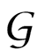
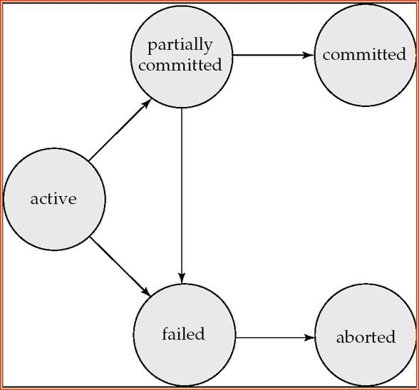

# 数据库

## 第一章

1. DBS contains information about a particular enterprise
   - Collection of interrelated data
   - Set of programs to access the data
   - An environment that is both convenient and efficient to use
2. Data redundancy and inconsistency（数据冗余和不一致性）
   - 多文件存储且文件间数据不一致
3. Data isolation — multiple files and formats（数据孤立）
4. Integrity problems（一致性问题）
   - Integrity constraints  (一致性约束，e.g. account balance > 0) become “buried” in program code rather than being stated explicitly
   - Hard to add new constraints or change existing ones
5. Data Abstraction（数据抽象）
   - Physical level（物理层）: describes how a record is stored.
   - Logical level（逻辑层）: describes data stored in database, and the relationships among the data.
   - View level（视图层）: application programs hide details of data types.  Views can also hide information (such as an employee’s salary) for security purposes.
6. Instances and Schemas（实例和模式）
   - Schema（模式） – the logical structure of the database
     - Physical schema: 在物理层描述数据库设计
     - Logical schema: 在逻辑层描述数据库设计
   - Instance（实例） – the actual content of the database at a particular point in time
     - Analogous to the value of a variable
   - Physical Data Independence（数据的物理独立性） – the ability to modify the physical schema without changing the logical schema
7. Data Models（数据模型）
   - A collection of tools for describing
     - 描述数据、数据联系、数据语义以及一致性约束的概念工具集合
   - Relational model（关系模型）
   - Entity-Relationship data model （ER模型）
   - Object-based data models (Object-oriented and Object-relational)(面向对象数据模型面向对象、对象-关系模型）
   - Semi-structured data model  (XML)（半结构化模型）
8. Data Manipulation Language (DML 数据操纵语言)
   - Language for accessing and manipulating the data organized by the appropriate data model/访问或操作那些按照某种适当的数据模型组织起来的数据
     - DML also known as query language
9. 1.4.2 Data Definition Language (DDL，数据定义语言)
   - Specification notation for defining the database schema/**用来表达数据库模式的特殊语言，也可用于定义数据的其他特征**
   - DDL compiler generates a set of tables stored in a data dictionary （数据字典）
   - metadata (元数据 data about data, schema of DB) in Data dictionary/**关于数据的数据**
     - Data storage and definition language
     - Integrity constraints（完整性约束）
       - Domain constraints（域约束）
       - Referential integrity (references constraint in SQL参照完整性)
       - Assertions（断言）
       - Authorization(权限管理)
10. Transaction Management（事务管理）
    - A transaction（事务） is a collection of operations that performs a single logical function in a database application/完成单一逻辑功能的操作集合
    - Transaction-management component（事务管理组件） ensures that the database remains in a consistent (correct) state despite system failures and transaction failures.
    - Concurrency-control manager（并发管理程序） controls the interaction among the concurrent transactions, to ensure the consistency of the database.
    - 原子性：要么全执行，要么全不执行
    - 故障恢复：检测到系统错误并将数据库恢复到故障发生前的状态
    - 并发控制：控制并发事务间的互相影响，保证数据库的一致性
11. 结构
    - two-tier architecture 两层体系结构，应用-数据库系统
    - three-tier architecture 三层体系结构，应用-应用服务器-数据库系统

12. Storage manager（存储管理程序）
    - is a program module that provides the interface between the low-level data stored in the database and the application programs and queries submitted to the system.
    - The storage manager is responsible to the following tasks:
    - Interaction with the file manager
    - Efficient storing, retrieving and updating of data

## 第二章

### 杂七杂八

1. tuple元组，row行
2. attribute属性，columns列
3. **R** = (A1, A2, …, An ) is a **relation schema**（关系模式）
4. sets D1, D2, …. Dn a **relation r** is a subset of D1 x  D2  x … x Dn
5. The current values **(relation instance，关系实例)** of a relation are specified by a table
6. K is a **superkey（超码）** of R if values for K are sufficient to identify a unique tuple of each possible relation r(R) 可以在关系中唯一标识一个元组
7. K is a **candidate key（候选码）** if K is minimalPrimary key（主码）: chosen as the principal means of identifying tuples within a relation 最小化主码
8. **Normalization theory (规范化理论)** deals with how to design “good” relational schemas
9. 数据库模式：数据库逻辑设计
10. 数据库实例：给定时刻数据库中数据的一个快照

### 关系代数

1. 选择：SELECT $\sigma_{condition}(relation)$
2. 投影：Projection $\Pi_{attribute,}(relation)$
3. 笛卡儿积：Cartesian Product $r_1 \times r_2$
4. 关系并：Union of two relations $r_1\cup r_2$
5. 关系差：Set difference of two relations $r_1-r_2$
6. 关系交：Set Intersection of two relations$r_1 \cap r_2$
7. 自然连接：Natural Join $r_1 \Join r_2$
8. 重命名：rename $\rho_{d}(E)$, $d.attribute$，或$\rho_{x(A_1,...A_n)}(E)$当n==E.Length时
9. 聚集计算：Aggregation function $_{G_1,...G_n}$  $_{func(attribute)}(E)$,$func():avg(),min(),max(),sum(),count()$,$G_i$是聚集属性
10. as，attribute as name，给属性改名字
11. 赋值：$r_1\leftarrow r_2$

## 第三章

1. with

   ``` SQL
   with max_budget (value) as
        (select max(budget) from department)
   select budget
   from department, max_budget
   where department.budget = max_budget.value
   ```

2. insert

   ``` SQL
   insert into table1 select * from table1
   ```

3. case

   ``` SQL
    update instructor set salary =
    case
        when salary <= 100000 then salary * 1.05
        when xxxxxxxxxxxxxxxx then xxxxxxxxxxxxx
        else salary * 1.03
    end

   ```

4. keys

   ``` SQL
   primary key (attribute1, attribute2),
   foreign key (attributeX) references tableX,
   ```

## 第四章

1. 数据类型
   - date
   - time
   - timestamp
2. JOIN

   ``` SQL
   table1 [full,right,left] [outer,inner]
        join table2 on table1.a=table2.b [on columnX]
        [using (columnX)]
   -- 不加inner&outer，默认为inner
   natural [full,right,left] join
   ```

3. VIEW

   ``` SQL
   create view v as (
        select * from xxxx;
   )
   ```

4. unique

   ``` SQL
   unique (column1, column2)
   -- 使得括号内属性成为候选码，具有唯一性
   ```

5. assertion

   ```SQL
   create assertion name check (
       condition
   )
   ```

6. MySql时间函数
   - NOW() 2019-12-12 13:57:13
   - CURDATE() 2019-12-12
   - CURTIME() 13:57:13
   - unix_timestamp()

7. index

   ```SQL
   create index indexName on tableName(columnName);
   ```

8. 自定义类型

   ```SQL
   create type newName as oriType final
   ```

9. create

   ```SQL
   create table t2 like takes;
   create table t3 as (
       select * from XXX
   ) with data;
   ```

10. alter

    ```SQL
    alter table takes drop primary key;
    alter table takes add primary key (id);

    alter table takes drop foreign key takes_ibfk_3;
    alter table takes add foreign key(id) references student(id);

    alter table takes add unique(id,sec_id);

    alter table t2 modify id varchar(5) not null;

    alter table takes alter column grade set default 1;
    ```

11. 权限管理

    ```SQL
    grant all on homework.* to kong with grant option;
    revoke all on * from kong;
    show grants;
    ```

    ``` SQL
    create role rXX;
    grant XXX on XXX to rXX;
    grant rXX to users/roles
    ```

## 第七章

1. 实体用tuple表示，实体集用{tuple}
2. binary relationship（二元关系）
   - involve two entity sets (or degree two)
3. Domain（域） – the set of permitted values for each attribute
   - Attribute types:
     - Simple and composite attributes.
     - Single-valued and multivalued attributes
       - Example: multivalued attribute: phone_numbers
     - Derived attributes
       - Can be computed from other attributes
4. An entity set that does not have a primary key is referred to as a weak entity set(弱实体集）.
   - The existence of a weak entity set depends on the existence of a identifying entity set（标识实体集）
     - It must relate to the identifying entity set via a total, one-to-many relationship set from the identifying to the weak entity set
     - Identifying relationship（标识联系） depicted using a double diamond

## 第八章

1. 1NF第一范式：一个关系的所有属性的域都是原子的，不可分割的
2. 函数依赖
   - The functional dependency(函数依赖) $\\ \alpha \rightarrow \beta \\ $holds on（成立） R if and only if for any legal relations r(R), whenever any two tuples $t_1$ and $t_2$ of r agree on the attributes $\alpha$, they also agree on the attributes $\beta$.  That is,$t1[\alpha]=t2[\alpha] \rightarrow t1[\beta]=t2[\beta]$
   - trivial（平凡的）
     - $ID\rightarrow ID$
     - In general, $\alpha\rightarrow\beta$ is trivial if $\beta\subseteq \alpha$
3. Armstrong’s Axioms:
   - if $\beta \subseteq \alpha$ then $\alpha \rightarrow \beta$ (reflexivity，自反律)
   - if $\alpha \rightarrow \beta$ then $\gamma \alpha \rightarrow \gamma \beta$ (augmentation，增广律)
   - if $\alpha \rightarrow \beta, and, \beta \rightarrow \gamma$ then $\alpha \rightarrow \gamma$ (transitivity，传递律)
4. Additional rules:
   - If $\alpha \rightarrow \beta$ holds and $\alpha \rightarrow \gamma$ holds,  then $\alpha \rightarrow \beta \gamma$ holds (union,合并律)
   - If $\alpha \rightarrow \beta \gamma$ holds, then $\alpha \rightarrow \beta$  holds and $\alpha \rightarrow \gamma$ holds (decomposition，分解律)
   - If $\alpha \rightarrow \beta$ holds and $\beta \gamma \rightarrow \sigma$ holds, then $\alpha \gamma \rightarrow \sigma$ holds (pseudotransitivity，伪传递律)
5. BCNF: BC范式,对于模式R中所有的函数依赖
   - $\alpha \rightarrow \beta$ 是平凡函数依赖
   - $\alpha$ 是超码
6. 3NF: Each attribute A in $\beta - \alpha$ is contained in a candidate key for R.

## 第十二章

1. ACID Properties
   - Atomicity（原子性） all in one.**全执行或全不执行**
   - Consistency（一致性） Database is in consistent before and after a transaction is finished。**隔离执行事务时保持数据库的一致性**
   - Isolation（隔离性）Although multiple transactions may execute concurrently, each transaction must be unaware of other concurrently executing transactions.**每个事务都察觉不到系统中有其他事务在并发执行**
   - Durability（持久性）After a transaction completes successfully, the changes it has made to the database persist, even if there are system failures.**即使数据库故障，一个事务执行完毕后，他对数据库的修改是永久的**
2. Transaction State
   - Active（活跃） – the initial state; the transaction stays in this state while it is executing。初始状态，事务执行时处于这个状态
   - Partially committed（部分提交） – after the final statement has been executed.
   - Failed（失败） -- after the discovery that normal execution can no longer proceed.
   - Aborted（放弃） – after the transaction has been rolled back and the database restored to its state prior to the start of the transaction.  Two options after it has been aborted:
   - Committed（提交） – after successful completion.
   - 

3. Schedule（调度） – a sequences of instructions that specify the chronological order in which instructions of concurrent transactions are executed
   - a schedule for a set of transactions must consist of all instructions of those transactions（完全调度）保持所有命令
   - must preserve the order in which the instructions appear in each individual transaction.（维持事务内部指令的执行顺序）

4. A (possibly concurrent) schedule is serializable if it is equivalent to a serial schedule
   - conflict serializability（冲突可串行化）
   - view serializability（视图可串行化）
   - 除了读-读，其他都有冲突
5. conflict serializable（冲突可串行化的）and recoverable and preferably cascadeless（可恢复的、无级联的）
   - 无级联调度：不同事务之间，一个读操作发生在写操作后的话，那么写操作必须在读操作之前被提交
6. 隔离级别
   - Serializable（可串行化）default
   - Repeatable read(可重复读)只允许读取已提交数据，同一事务中对同一数据读取之间，不允许其他事务修改
   - Read committed（提交读）只允许读取已提交数据
   - Read uncommitted（未提交读）允许读取未提交数据
7. Lock-Based Protocols（基于锁的协议）
   - shared (S) mode(共享)
   - exclusive (X) mode(排他)

   | | S | X |
   | ---- | ---- | ---- |
   | S | true  | false |
   | X | false | false |

8. The Two-Phase Locking Protocol（2阶段锁协议）
   - Phase 1: Growing Phase(扩张阶段）事务只获得不释放
     - transaction may obtain locks
     - transaction may not release locks
   - Phase 2: Shrinking Phase（收缩阶段）事务只释放不获得
     - transaction may release locks
     - transaction may not obtain locks
9. Log-Based Recovery(基于日志的恢复)
   - A  log is kept on stable storage. 
   - The log is a sequence of log records, and maintains a record of update activities on the database.
   - Immediate Database Modification 
     - Recovery procedure has two operations instead of one: undo(Ti )，redo(Ti)
     - Both operations must be idempotent（幂等）
     - When recovering after failure:
       - undo(Ti )  if the log contains \<Ti start\>, but not \<Ti commit\>.
       - redo(Ti) if the log contains both \<Ti start\> and \<Ti commit\>.
     - Undo operations are performed first, then redo operations.

10. Streamline recovery procedure by periodically performing checkpointing
    - Output all log records currently residing in main memory onto stable storage.日志输出到硬盘
    - Output all modified buffer blocks to the disk.所有修改写入磁盘
    - Write a log record \< checkpoint\> onto stable storage.写入\< checkpoint\>到硬盘
    - 恢复时，只处理checkpoint或commit后的记录
