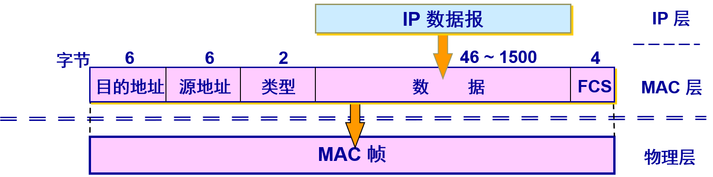
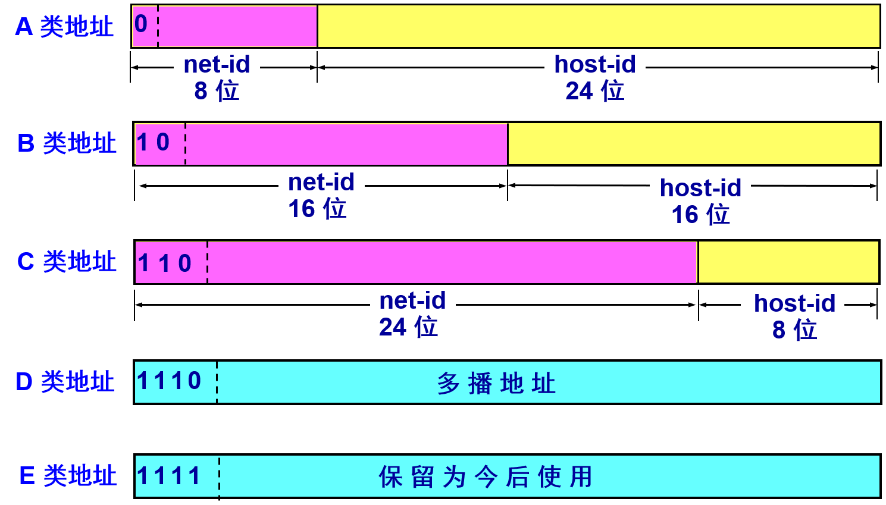
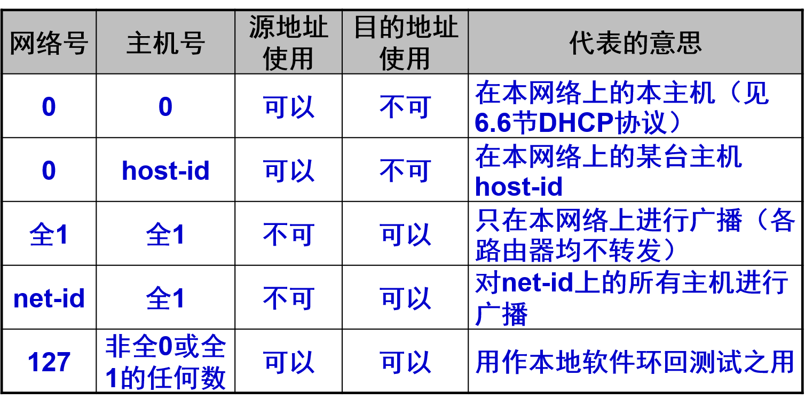
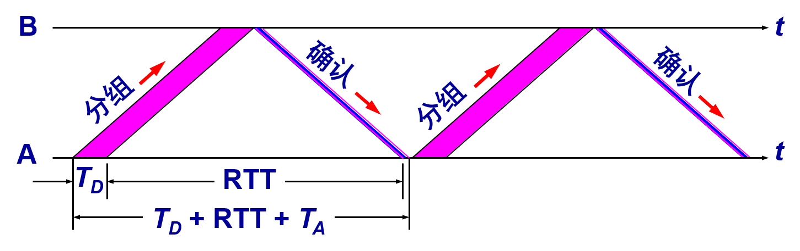
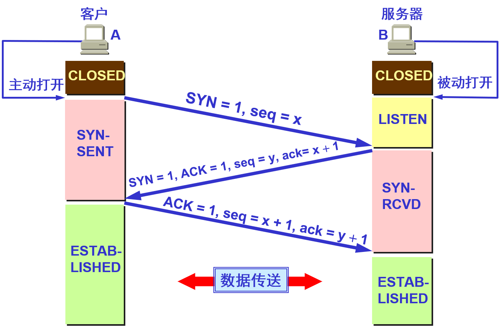
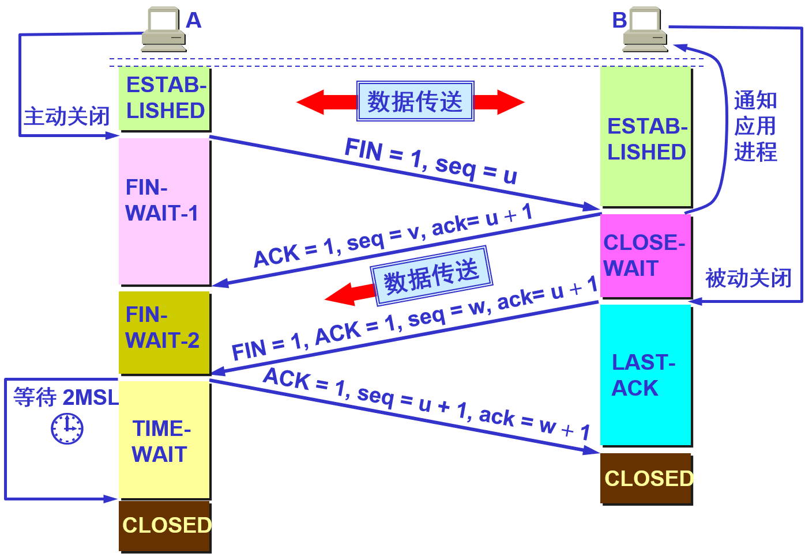
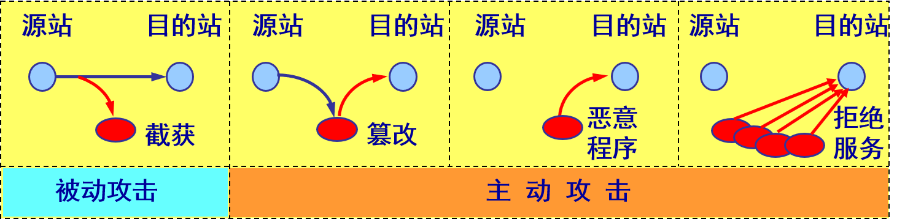

# 计网

- 固定首部长度
  - TCP:20
  - IP:20

## 第一章

- OSI 参考模型把对等层次之间传送的数据单位称为该层的**协议数据单元 PDU** (Protocol Data Unit)
- OSI把层与层之间交换的数据的单位称为**服务数据单元 SDU** (Service Data Unit)

### 分层

1. 优点
   - 各层之间是独立的。
   - 灵活性好。
   - 结构上可分割开。
   - 易于实现和维护。
   - 能促进标准化工作。
2. 分层功能
   - **差错控制**：使相应层次对等方的通信更加可靠。
   - **流量控制**：发送端的发送速率必须使接收端来得及接收，不要太快。
   - **分段和重装**：发送端将要发送的数据块划分为更小的单位，在接收端将其还原。
   - **复用和分用**：发送端几个高层会话复用一条低层的连接，在接收端再进行分用。
   - **连接建立和释放**：交换数据前先建立一条逻辑连接，数据传送结束后释放连接。

## 第二章

- 屏蔽双绞线 STP (Shielded Twisted Pair)
  - 带金属屏蔽层
- 无屏蔽双绞线 UTP (Unshielded Twisted Pair)

### 编码

### 奈氏准则

- 在任何信道中，**码元传输的速率是有上限的**，否则就会出现**码间串扰**的问题，使接收端对码元的判决（即识别）成为不可能
- 如果信道的频带越宽，也就是能够通过的信号高频分量越多，那么就可以用更高的速率传送码元而不出现码间串扰

### 香农公式

- 信噪比(dB) = 10 log10(S/N) (dB)
- $C = W log_2(1+S/N) (bit/s)$
  - W 为信道的带宽（以 Hz 为单位）；
  - S 为信道内所传信号的平均功率；
  - N 为信道内部的高斯噪声功率。

### 信道复用技术

- **频分复用**的所有用户在同样的时间**占用不同的带宽资源**（请注意，这里的“带宽”是频率带宽而不是数据的发送速率）
- **时分复用**则是将时间划分为一段段等长的**时分复用帧**（TDM 帧）。每一个时分复用的用户在每一个 TDM 帧中占用固定序号的时隙。
  - 每一个用户所占用的时隙是**周期性地出现**（其周期就是 TDM  帧的长度）。
  - TDM 信号也称为**等时**(isochronous)信号。
  - **时分复用的所有用户是*在不同的时间*占用同样的频带宽度。**
  - 时分复用可能会造成线路资源的浪费
- 波分复用 WDM
  - 波分复用就是光的频分复用。使用一根光纤来同时传输多个光载波信号
- 码分复用 CDM
  - 常用的名词是码分多址 CDMA(Code Division Multiple Access)。
  - 各用户使用经过特殊挑选的不同码型，因此彼此不会造成干扰。
  - 这种系统发送的信号有很强的抗干扰能力，其频谱类似于白噪声，不易被敌人发现
  - 码片序列
    - 两个不同站的码片序列正交，就是向量 S 和T 的规格化内积 (inner product) 等于 0
    - 任何一个码片向量和该码片向量自己的规格化内积都是 1
    - 一个码片向量和该码片反码的向量的规格化内积值是 –1

### 宽带接入技术

#### ADSL

- **非对称数字用户线 ADSL (Asymmetric Digital Subscriber Line)** 技术就是用数字技术对现有的模拟电话用户线进行改造，使它能够承载宽带业务
- ADSL 技术就把 0~4 kHz 低端频谱留给传统电话使用，而**把原来没有被利用的高端频谱留给用户上网使用。**
- DSL 就是数字用户线 (Digital Subscriber Line) 的缩写。

#### 光纤同轴混合网（HFC网）

- HFC (Hybrid Fiber Coax) 网是在目前覆盖面很广的有线电视网 CATV 的基础上开发的一种居民宽带接入网
- HFC 网对 CATV 网进行了改造
  - HFC 网将原 CATV 网中的同轴电缆**主干部分改换为光纤**，并使用**模拟光纤技术。**
  - 在模拟光纤中采用**光的振幅调制 AM**，这比使用数字光纤更为经济。
  - 模拟光纤从头端连接到光纤结点 (fiber node)，即光分配结点 ODN (Optical Distribution Node)。在光纤结点光信号被转换为电信号。在光纤结点以下就是同轴电缆

### 透明传输

- **字节填充** (byte stuffing) 或**字符填充** (character stuffing)
  - 发送端的数据链路层在数据中出现控制字符“SOH”或“EOT”的前面插入一个转义字符“ESC” (其十六进制编码是 1B)。

### 差错检测

#### CRC

- 在数据链路层传送的帧中，广泛使用了**循环冗余检验 CRC** 的检错技术。
- 在发送端，先把数据划分为组。假定每组 k 个比特
- 假设待传送的一组数据 M = 101001（现在 k = 6）。我们在 M 的后面再添加供差错检测用的 n 位冗余码一起发送
- 用二进制的模 2 运算进行 2n 乘 M 的运算，这相当于在 M 后面添加 n 个 0
- 得到的 (k + n) 位的数除以事先选定好的长度为 (n + 1) 位的除数 P，得出商是 Q 而余数是 R，余数 R 比除数 P 少 1 位，即 R 是 n 位
- 将余数 R 作为冗余码拼接在数据 M 后面发送出去。

#### FCS

- 在数据后面添加上的冗余码称为**帧检验序列 FCS** (Frame Check Sequence)。
- 循环冗余检验 CRC 和帧检验序列 FCS 并不等同。
  - CRC 是一种常用的检错方法，而 FCS 是添加在数据后面的冗余码。
  - FCS 可以用 CRC 这种方法得出，但 CRC 并非用来获得 FCS 的唯一方法

#### add

- 仅用循环冗余检验 CRC 差错检测技术只能做到**无差错接受** (accept)。
- “无差错接受”是指：“凡是接受的帧（即不包括丢弃的帧），我们都能以非常接近于 1 的概率认为这些帧在传输过程中没有产生差错”。
- 也就是说：“凡是接收端数据链路层接受的帧都没有传输差错”（有差错的帧就丢弃而不接受）。
- **要做到“可靠传输”（即发送什么就收到什么）就必须再加上确认和重传机制**
- 应当明确，**“无比特差错”与“无传输差错”是不同的概念**。
- 在数据链路层使用 CRC 检验，能够实现无比特差错的传输，但这还不是可靠传输。
- 本章介绍的数据链路层协议都不是可靠传输的协议。

## 第三章

### PPP

#### 字符填充

- 将信息字段中出现的每一个 0x7E 字节转变成为 2 字节序列 (0x7D, 0x5E)。
- 若信息字段中出现一个 0x7D 的字节, 则将其转变成为 2 字节序列 (0x7D, 0x5D)。
- 若信息字段中出现 ASCII 码的控制字符（即数值小于 0x20 的字符），则在该字符前面要加入一个 0x7D 字节，同时将该字符的编码加以改变

#### 零比特填充

- PPP 协议用在 SONET/SDH 链路时，使用同步传输（一连串的比特连续传送）。这时 PPP 协议采用零比特填充方法来实现透明传输。
- 在发送端，只要发现有 5 个连续 1，则立即填入一个 0。
- 接收端对帧中的比特流进行扫描。每当发现 5 个连续1时，就把这 5 个连续 1 后的一个 0 删除

### 共享技术

- 适配器的重要功能：
  - 进行串行/并行转换。
  - 对数据进行缓存。
  - 在计算机的操作系统安装设备驱动程序。
  - 实现以太网协议

#### 以太网

- 采取的措施
  1. 采用较为灵活的无连接的工作方式
  2. 以太网发送的数据都使用曼彻斯特 (Manchester) 编码

#### CSMA/CD

- CSMA/CD 含义：**载波监听多点接入 / 碰撞检测**  (Carrier Sense Multiple Access with Collision Detection)
  - “**多点接入**”表示许多计算机以多点接入的方式连接在**一根总线**上
  - “**载波监听**”是指每一个站在发送数据之前先要检测一下总线上是否有其他计算机在发送数据，如果有，则暂时不要发送数据，以免发生碰撞
    - 总线上并没有什么“载波”。因此， **“载波监听”就是用电子技术检测总线上有没有其他计算机发送的数据信号**
  - “**碰撞检测**”就是计算机边发送数据边检测信道上的信号电压大小。
    - 当几个站同时在总线上发送数据时，总线上的信号电压摆动值将会增大（互相叠加）。
    - 当一个站检测到的信号电压摆动值超过一定的门限值时，就认为总线上至少有两个站同时在发送数据，表明产生了碰撞。
    - **所谓“碰撞”就是发生了冲突。因此“碰撞检测”也称为“冲突检测”**
    - 每一个正在发送数据的站，一旦发现总线上出现了碰撞，就要**立即停止发送**，免得继续浪费网络资源，然后**等待一段随机时间**后再次发送
    - 需要**单程传播时延的2倍**$2\tau$的时间，才能检测到冲突
    - **争用期 碰撞窗口**:$2\tau$ （两倍的端到端往返时延）
      - 经过争用期这段时间还没有检测到碰撞，才能肯定这次发送不会发生碰撞

#### 使用集线器的星形拓扑

- 采用双绞线的以太网采用星形拓扑，在星形的中心则增加了一种可靠性非常高的设备，叫做集线器 (hub)
- 1990年 IEEE 制定出星形以太网 10BASE-T 的标准 802.3i
- 
- 集线器是使用电子器件来模拟实际电缆线的工作，因此整个系统仍然像一个传统的以太网那样运行
- 使用集线器的以太网在**逻辑上仍是一个总线网**，各工作站使用的还是 CSMA/CD 协议，并**共享逻辑上的总线**
- 集线器很像一个多接口的转发器，**工作在物理层**
- 集线器采用了专门的芯片，进行自适应串音回波抵消，减少了近端串音

#### 以太网的信道利用率

- 设帧长为 L (bit)，数据发送速率为 C (bit/s)，则帧的发送时间为$T0=L/C$ (s)
- 参数 α 与利用率
- 在以太网中定义了参数 α，它是以太网单程端到端时延$\tau$与帧的发送时间 T0 之比：$\alpha=\tau / T_0$
  - α →0，表示一发生碰撞就立即可以检测出来， 并立即停止发送，因而信道利用率很高。
  - α 越大，表明争用期所占的比例增大，每发生一次碰撞就浪费许多信道资源，使得信道利用率明显降低
- 成功发送一个帧需要占用信道的时间是 $\tau + T_0$
- 理想情况下的极限信道利用率 Smax 为 $S_{max}=\frac{T_0}{T_0+\tau}=\frac{1}{1+\alpha} $
  - 只有当参数 a 远小于 1 才能得到尽可能高的极限信道利用率。
  - 据统计，当以太网的利用率达到 30%时就已经处于重载的情况。很多的网络容量被网上的碰撞消耗掉了。

### 48 位的 MAC 地址

- 
- 生产适配器时，6 字节的 MAC 地址已被固化在适配器的 ROM，因此，MAC 地址也叫作**硬件地址** (hardware address)或**物理地址**
- IEEE规定地址字段的第一字节的最低位为 I/G 位。I/G 表示 Individual / Group。
  - 当 I/G位=0 时，地址字段表示一个单站地址。
  - 当 I/G位=1 时，表示组地址，用来进行多播（以前曾译为组播）。此时，IEEE 只分配地址字段前三个字节中的23位
  - IEEE 把地址字段第一字节的最低第 2 位规定为 G/L 位，表示 Global / Local。
    - 当 G/L位=0 时，是**全球管理**（保证在全球没有相同的地址），厂商向IEEE购买的 OUI 都属于全球管理。
    - 当 G/L位=1 时， 是**本地管理**，这时用户可任意分配网络上的地址

#### MAC 帧的格式

- 常用的以太网 MAC 帧格式有两种标准 ：
  - DIX Ethernet V2 标准
  - IEEE 的 802.3 标准
- 最常用的 MAC 帧是**以太网 V2 的格式**
- 
- 数据字段的正式名称是 MAC 客户数据字段。最小长度 64 字节  18 字节的首部和尾部 = 数据字段的最小长度（46字节）最大1500字节

#### 帧间最小间隔

- 帧间最小间隔为$9.6\mu s$，相当于 96 bit 的发送时间
  - 一个站在检测到总线开始空闲后，还要等待 $9.6\mu s$ 才能再次发送数据。
  - 这样做是为了使刚刚收到数据帧的站的接收缓存来得及清理，做好接收下一帧的准备

## 第四章

- 网络层向上只提供简单灵活的、**无连接的、尽最大努力交付的数据报服务**
- 网络在发送分组时不需要先建立连接。每一个分组（即 IP 数据报）独立发送，与其前后的分组无关（不进行编号）
- **网络层不提供服务质量的承诺**。即所传送的分组可能出错、丢失、重复和失序（不按序到达终点），当然也不保证分组传送的时限
- TTL (Time To Live)：地址映射有效时间

### 网际协议 IP

- 网际协议 IP 是 TCP/IP 体系中两个最主要的协议之一。
- 与 IP 协议配套使用的还有三个协议：
  - **地址解析协议 ARP** (Address Resolution Protocol)
  - **网际控制报文协议 ICMP** (Internet Control Message Protocol)
  - **网际组管理协议 IGMP** (Internet Group Management Protocol)

#### 中继设备

- 将网络互相连接起来要使用一些中间设备
- 中间设备又称为中间系统或中继 (relay)系统。
- 有以下五种不同的中间设备：
  - **物理层**中继系统：**转发器** (repeater)。
  - **数据链路层**中继系统：**网桥** 或 **桥接器** (bridge)。
  - **网络层**中继系统：**路由器** (router)。
  - **网桥和路由器**的混合物：**桥路器** (brouter)。
  - **网络层以上**的中继系统：**网关** (gateway)
- **网络互连都是指用路由器进行网络互连和路由选择**

#### 虚拟互连网络的意义

- **所谓虚拟互连网络也就是逻辑互连网络**，它的意思就是互连起来的各种物理网络的异构性本来是客观存在的，但是我们**利用 IP 协议就可以使这些性能各异的网络从用户看起来好像是一个统一的网络**。
- 使用 IP 协议的虚拟互连网络可简称为 **IP 网**。
- 使用虚拟互连网络的好处是：当互联网上的主机进行通信时，就好像在一个网络上通信一样，而看不见互连的各具体的网络异构细节。
- **如果在这种覆盖全球的 IP 网的上层使用 TCP 协议，那么就是现在的互联网 (Internet)**

#### IP

##### IP 地址的编址方法

- **分类的 IP 地址**。这是**最基本的编址方法**，在 1981 年就通过了相应的标准协议。
  - 将IP地址划分为若干个固定类。
  - 每一类地址都由两个固定长度的字段组成，其中一个字段是网络号 **net-id**，它标志主机（或路由器）所连接到的网络，而另一个字段则是主机号 **host-id**，它标志该主机（或路由器）
  - 主机号在它前面的网络号所指明的网络范围内必须是唯一的
  - **一个 IP 地址在整个互联网范围内是唯一的**
  - 
  - 
  - 特点
    - **IP 地址是一种分等级的地址结构**
    - **实际上 IP 地址是标志一个主机（或路由器）和一条链路的接口**
    - **用转发器或网桥连接起来的若干个局域网仍为一个网络**，因此这些局域网都具有同样的网络号 net-id
    - **所有分配到网络号 net-id 的网络，无论是范围很小的局域网，还是可能覆盖很大地理范围的广域网，都是平等的**
- **子网的划分**。这是对最基本的编址方法的**改进**，其标准[RFC 950] 在 1985 年通过。
- **构成超网**。这是比较新的**无分类编址方法**。1993 年提出后很快就得到推广应用

#### 地址解析协议 ARP

- ARP 作用：从网络层使用的 IP 地址，解析出在数据链路层使用的硬件地址。
- 每一个主机都设有一个 **ARP 高速缓存 (ARP cache)**，里面有所在的局域网上的各主机和路由器的 IP 地址到硬件地址的映射表

- **ARP请求分组**：包含发送方硬件地址 / 发送方 IP 地址 / **目标方硬件地址(未知时填 0)** / 目标方 IP 地址。
- **本地广播 ARP 请求**（路由器不转发ARP请求）。
- **ARP 响应分组**：包含发送方硬件地址 / 发送方 IP地址 / 目标方硬件地址 / 目标方 IP 地址。
- **ARP 分组封装在物理网络的帧中传输**
- ARP 是解决同一个局域网上的主机或路由器的 IP 地址和硬件地址的映射问题。
- 如果所要找的主机和源主机不在同一个局域网上，那么就要通过 ARP 找到一个位于本局域网上的某个路由器的硬件地址，然后把分组发送给这个路由器，让这个路由器把分组转发给下一个网络。剩下的工作就由下一个网络来做

#### IP 数据报的格式

- 一个 IP 数据报由首部和数据两部分组成。
- 首部的前一部分是固定长度，共 20 字节，是所有 IP 数据报必须具有的。
- 在首部的固定部分的后面是一些可选字段，其长度是可变的
- 校验和：首部，16bit为一单位，反码求和(正常二进制加法，溢出位加到最低位)
- 片偏移：数据大小/8

#### 划分子网和构造超网

##### 划分子网

1. 从两级 IP 地址到三级 IP 地址
   - 从 1985 年起在 IP 地址中又增加了一个“子网号字段”，使两级的 IP 地址变成为三级的 IP 地址
   - 这种做法叫作划分子网 (subnetting)
   - 划分子网已成为互联网的正式标准协议

- 划分子网纯属一个单位内部的事情。单位对外仍然表现为没有划分子网的网络。
- 从主机号借用若干个位作为子网号 subnet-id，而主机号 host-id 也就相应减少了若干个位

#### 无分类编址 CIDR

- 1987 年，RFC 1009 就指明了在一个划分子网的网络中可同时使用几个不同的子网掩码。
- 使用**变长子网掩码 VLSM** (Variable Length Subnet Mask)可进一步提高 IP 地址资源的利用率。
- 在 VLSM 的基础上又进一步研究出无分类编址方法，它的正式名字是**无分类域间路由选择 CIDR** (Classless Inter-Domain Routing)
- 特点
  - CIDR 消除了传统的 A 类、B 类和 C 类地址以及划分子网的概念，因而可以更加有效地分配 IPv4 的地址空间。
  - CIDR使用各种长度的“**网络前缀**”(network-prefix)来代替分类地址中的网络号和子网号。
  - **IP 地址从三级编址（使用子网掩码）又回到了两级编址**
- CIDR 使用“**斜线记法**”(slash notation)，它又称为 **CIDR 记法**，即在 IP 地址面加上一个斜线“/”，然后写上网络前缀所占的位数（这个数值对应于三级编址中子网掩码中 1 的个数）
- CIDR 把网络前缀都相同的连续的 IP 地址组成“**CIDR 地址块**”

##### 路由聚合 (route aggregation)

- 一个 CIDR 地址块可以表示很多地址，这种地址的聚合常称为**路由聚合**，它使得路由表中的一个项目可以表示很多个（例如上千个）原来传统分类地址的路由。
- 路由聚合有利于**减少**路由器之间的路由选择信息的交换，从而提高了整个互联网的性能。
- **路由聚合也称为*构成超网* (supernetting)**。
- CIDR 虽然不使用子网了，但仍然使用“**掩码**”这一名词（但不叫子网掩码）。
- 对于 /20  地址块，它的掩码是 20 个连续的 1。 斜线记法中的数字就是掩码中1的个数

##### 最长前缀匹配

- 使用 CIDR 时，路由表中的每个项目由“网络前缀”和“下一跳地址”组成。**在查找路由表时可能会得到不止一个匹配结果**
- 应当从匹配结果中选择具有最长网络前缀的路由：**最长前缀匹配** (longest-prefix matching)。
- 网络前缀越长，其地址块就越小，因而路由就越具体 (more specific) 。
- 最长前缀匹配又称为**最长匹配或最佳匹配**

#### ICMP

- ICMP 报文的种类有两种，即 **ICMP 差错报告报文**和 **ICMP 询问报文**
  - 差错报告报文
    - 终点不可达
    - 时间超过
    - 参数问题
    - 改变路由（重定向）(Redirect)  

- ICMP 报文的前 4 个字节是统一的格式，共有三个字段：即**类型、代码和检验和**。接着的 4 个字节的内容与 ICMP 的类型有关

### 互联网的路由选择协议

#### 关于“最佳路由”

- 不存在一种绝对的最佳路由算法。
- 所谓“最佳”只能是相对于某一种特定要求下得出的较为合理的选择而已。
- 实际的路由选择算法，应尽可能接近于理想的算法。
- 路由选择是个非常复杂的问题
  - 它是网络中的所有结点共同协调工作的结果。
  - 路由选择的环境往往是不断变化的，而这种变化有时无法事先知道。  
- **静态路由**选择策略——即非自适应路由选择，其特点是简单和开销较小，但不能及时适应网络状态的变化
- **动态路由**选择策略——即自适应路由选择，其特点是能较好地适应网络状态的变化，但实现起来较为复杂，开销也比较大

#### 分层次的路由选择协议

- **互联网采用分层次的路由选择协议**

##### 自治系统 AS (Autonomous System)

- **自治系统 AS 的定义**：在单一的技术管理下的一组路由器，而这些路由器使用一种 AS 内部的路由选择协议和共同的度量以确定分组在该 AS 内的路由，同时还使用一种 AS 之间的路由选择协议用以确定分组在 AS之间的路由。
- 现在对自治系统 AS 的定义是强调下面的事实：尽管一个 AS 使用了多种内部路由选择协议和度量，但**重要的是一个 AS 对其他 AS 表现出的是一个*单一的和一致的路由选择策略***。

- 路由选择协议
  - **内部网关协议** IGP (Interior Gateway Protocol)  
    - 在一个**自治系统内部使用**的路由选择协议。
    - 目前这类路由选择协议使用得最多，如 RIP 和 OSPF 协议。
  - **外部网关协议** EGP (External Gateway Protocol)
    - 若源站和目的站处在不同的自治系统中，当数据报传到一个自治系统的边界时，就需要使用一种协议**将路由选择信息传递到另一个自治系统**中。这样的协议就是外部网关协议 EGP。
  - 自治系统之间的路由选择也叫作**域间路由选择** (interdomain routing)，在自治系统内部的路由选择叫作**域内路由选择** (intradomain routing)

###### RIP

1. 工作原理
   - 路由信息协议 RIP (Routing Information Protocol) 是内部网关协议 IGP 中最先得到广泛使用的协议。
   - RIP 是一种**分布式的、基于距离向量的路由选择协议**。
   - **RIP 协议要求**网络中的每一个路由器都要维护从它自己到其他每一个目的网络的距离记录。
   > 从一个路由器到**直接连接**的网络的距离定义为 1。
   > 从一个路由器到非直接连接的网络的距离定义为所经过的路由器数加 1。
   > RIP 协议中的“距离”也称为“**跳数**”(hop count)，因为每经过一个路由器，跳数就加 1。
   > 这里的“距离”实际上指的是“**最短距离**”
   > RIP 认为一个**好的路由**就是它通过的路由器的数目少，即“**距离短**”。
   > **RIP 允许一条路径最多只能包含 15 个路由器**
   > **“距离”的最大值为 16 时即相当于不可达**。可见 RIP 只适用于小型互联网。
   > **RIP 不能在两个网络之间同时使用多条路由**。RIP 选择一个具有最少路由器的路由（即最短路由），哪怕还存在另一条高速(低时延)但路由器较多的路由
2. 特点
   - 仅和**相邻路由器**交换信息
   - 交换的信息是当前本路由器所知道的**全部信息，即自己的路由表**
   - 按**固定的时间间隔**交换路由信息，例如，每隔 30 秒。当网络拓扑发生变化时，路由器也及时向相邻路由器通告拓扑变化后的路由信息
3. 优点：
   - 实现简单，开销较小。
4. 缺点：
   - RIP 限制了网络的规模，它能使用的最大距离为 15（16 表示不可达）
   - 路由器之间交换的路由信息是路由器中的完整路由表，因而随着网络规模的扩大，开销也就增加
   - “坏消息传播得慢”，使更新过程的收敛时间过长

###### 内部网关协议 OSPF

- 基本特点
  - “**开放**”表明 OSPF 协议不是受某一家厂商控制，而是公开发表的。
  - “**最短路径优先**”是因为使用了 Dijkstra 提出的最短路径算法 SPF
  - 采用**分布式的链路状态协议** (link state protocol)
  - 注意：OSPF 只是一个协议的名字，它并不表示其他的路由选择协议不是“最短路径优先”
- 要点
  - **向本自治系统中所有路由器发送信息**，这里使用的方法是**洪泛法**。
    - 发送的信息就是与本路由器**相邻**的所有路由器的**链路状态**，但这只是路由器所知道的**部分信息**。
      - “**链路状态”就是说明本路由器都和哪些路由器相邻，以及该链路的“度量”(metric)**
  - 只有当链路状态**发生变化**时，路由器才用洪泛法向所有路由器发送此信息

- 链路状态数据库
  - 由于各路由器之间频繁地交换链路状态信息，因此所有的路由器最终都能建立一个链路状态数据库。
  - 这个数据库实际上就是**全网的拓扑结构图**，**它在全网范围内是一致的**（这称为链路状态数据库的同步）。
  - OSPF 的链路状态数据库能**较快地进行更新**，使各个路由器能及时更新其路由表。
  - **OSPF 的更新过程收敛得快是其重要优点**
- 其他特点
  - OSPF 对不同的链路可根据 IP 分组的不同服务类型 TOS 而设置成不同的代价。因此，**OSPF 对于不同类型的业务可计算出不同的路由**。
  - 如果到同一个目的网络有多条相同代价的路径，那么可以将通信量分配给这几条路径。这叫作**多路径间的负载平衡**。
  - 所有在 OSPF 路由器之间交换的分组都具有**鉴别**的功能。
  - **支持可变长度的子网划分和无分类编址 CIDR**。
  - 每一个链路状态都带上一个 32 位的序号，序号越大状态就越新。
  - OSPF 还规定每隔一段时间，如 30 分钟，要刷新一次数据库中的链路状态。
  - 由于一个路由器的链路状态只涉及到与相邻路由器的连通状态，因而与整个互联网的规模并无直接关系。因此**当互联网规模很大时，OSPF 协议要比距离向量协议 RIP 好得多**
  - **OSPF 没有“坏消息传播得慢”的问题**，据统计，其响应网络变化的时间小于 100 ms

##### BGP

- **BGP 支持 CIDR**，因此 BGP 的路由表也就应当包括目的网络前缀、下一跳路由器，以及到达该目的网络所要经过的各个自治系统序列。
- 在BGP 刚刚运行时，BGP 的邻站是交换整个的 BGP 路由表。但以后只需要在发生变化时**更新有变化的部分。这样做对节省网络带宽和减少路由器的处理开销都有好处**

#### 路由器的构成

- 路由器的主要作用是：
  - 连通不同的网络。
  - 选择信息传送的线路。选择通畅快捷的近路，能大大提高通信速度，减轻网络系统通信负荷，节约网络系统资源，提高网络系统畅通率，从而让网络系统发挥出更大的效益来

##### 分组丢弃

- 若路由器处理分组的速率赶不上分组进入队列的速率，则队列的存储空间最终必定减少到零，这就使后面再进入队列的分组由于没有存储空间而只能被丢弃。
- **路由器中的输入或输出队列产生溢出是造成分组丢失的重要原因**

### VPN&NAT

- **RFC 1918 指明的专用 IP 地址**
  - 3个专用地址
    - 10.0.0.0 到 10.255.255.255
      - A类，或记为10.0.0.0/8，它又称为24位块
    - 172.16.0.0 到 172.31.255.255
      - B类，或记为172.16.0.0/12，它又称为20位块
    - 192.168.0.0 到 192.168.255.255
      - C类，或记为192.168.0.0/16，它又称为16位块
  - 专用网
    - 采用这样的专用 IP 地址的互连网络称为**专用互联网或本地互联网**，或更简单些，就叫作**专用网**
    - 因为这些专用地址仅在本机构内部使用。专用IP地址也叫作**可重用地址**(reusable address)

## 第五章

- 从通信和信息处理的角度看，运输层向它上面的应用层提供通信服务，**它属于面向通信部分的最高层，同时也是用户功能中的最低层。**
- 当网络的边缘部分中的两个主机使用网络的核心部分的功能进行端到端的通信时，**只有位于网络边缘部分的主机的协议栈才有运输层**，而网络核心部分中的路由器在转发分组时都只用到下三层的功能

### 运输层的作用

- “**逻辑通信**”的意思是“好像是这样通信，但事实上并非真的这样通信”。
- **从IP层来说，通信的两端是两台主机**。但“两台主机之间的通信”这种说法还不够清楚。
- 严格地讲，两台主机进行通信就是两台主机中的应用进程互相通信。
- **从运输层的角度看，通信的真正端点并不是主机而是主机中的进程**。也就是说，**端到端的通信是应用进程之间的通信**

### 运输层的端口

- 运行在计算机中的进程是用**进程标识符**来标志的。
- **但运行在应用层的各种应用进程却不应当让计算机操作系统指派它的进程标识符**。这是因为在互联网上使用的计算机的操作系统种类很多，而不同的操作系统又使用不同格式的进程标识符。
- 为了使运行不同操作系统的计算机的应用进程能够互相通信，就**必须用统一的方法**对 TCP/IP 体系的应用进程进行标志。
- 解决这个问题的方法就是在运输层使用协议**端口号 (protocol port number)**，或通常简称为端口 (port)
  - 端口用一个 16 位端口号进行标志。
  - 端口号只具有**本地意义**，即端口号只是为了标志本计算机应用层中的各进程。
  - 在互联网中，不同计算机的相同端口号是没有联系的

### UDP

- 特点
  1. **UDP 是无连接的**，发送数据之前不需要建立连接，因此减少了开销和发送数据之前的时延。
  2. **UDP 使用尽最大努力交付**，即不保证可靠交付，因此主机不需要维持复杂的连接状态表。
  3. **UDP 是面向报文的**。UDP 对应用层交下来的报文，既不合并，也不拆分，而是保留这些报文的边界。UDP 一次交付一个完整的报文。
  4. **UDP 没有拥塞控制**，因此网络出现的拥塞不会使源主机的发送速率降低。这对某些实时应用是很重要的。很适合多媒体通信的要求
  5. **UDP 支持一对一、一对多、多对一和多对多的交互通信**
  6. **UDP 的首部开销小**，只有 8 个字节，比 TCP 的 20 个字节的首部要短

### TCP

- 特点
  - TCP 是**面向连接**的运输层协议。
  - 每一条 TCP 连接**只能有两个端点** (endpoint)，每一条 TCP 连接只能是点对点的（一对一）
  - TCP 提供**可靠交付**的服务。
  - TCP 提供**全双工**通信。
  - **面向字节流**
    - TCP 中的“流”(stream)指的是流入或流出进程的字节序列。
    - “面向字节流”的含义是：虽然应用程序和 TCP 的交互是一次一个数据块，但 TCP 把应用程序交下来的数据看成仅仅是一连串无结构的字节流
    - TCP **不保证**接收方应用程序所收到的数据块和发送方应用程序所发出的**数据块具有对应大小**的关系。
    - 但接收方应用程序收到的字节流必须和发送方应用程序发出的**字节流完全一样**

### 可靠传输的工作原理

- 理想的传输条件有以下两个特点：
  1. 传输信道不产生差错。
  2. 不管发送方以多快的速度发送数据，接收方总是来得及处理收到的数据。
  - **然而实际的网络都不具备以上两个理想条件**

#### 停止等待协议

- “停止等待”就是每发送完一个分组就停止发送，等待对方的确认。在收到确认后再发送下一个分组。
- **全双工通信的双方既是发送方也是接收方**

##### 出现差错

- 在接收方 B 会出现两种情况：
  - B 接收 M1 时检测出了差错，就丢弃 M1，其他什么也不做（不通知 A 收到有差错的分组）。
  - M1 在传输过程中丢失了，这时 B 当然什么都不知道，也什么都不做。
  - 在这两种情况下，**B 都不会发送任何信息**。
- 如何保证 B 正确收到了 M1 呢？
  - 解决方法：**超时重传**
  - A 为每一个已发送的分组都设置了一个**超时计时器**。
  - A 只要在超时计时器到期之前收到了相应的确认，就撤销该超时计时器，继续发送下一个分组 M2

##### 确认丢失和确认迟到

- 确认丢失
  - 若 B 所发送的对 M1 的确认丢失了，那么 A 在设定的超时重传时间内不能收到确认，但 A 并无法知道：是自己发送的分组出错、丢失了，或者 是 B 发送的确认丢失了。因此 **A 在超时计时器到期后就要重传** M1
  - 假定 B 又**收到了重传的分组** M1。这时 B 应采取两个行动：
    - 第一，**丢弃**这个重复的分组 M1，不向上层交付。
    - 第二，向 A **发送确认**。不能认为已经发送过确认就不再发送，因为 A 之所以重传 M1 就表示 A 没有收到对 M1 的确认
- 确认迟到
  - 传输过程中没有出现差错，但 B 对分组 M1 的确认迟到了。
  - A 会收到重复的确认。对重复的确认的处理很简单：收下后就丢弃。
  - B 仍然会收到重复的 M1，并且同样要丢弃重复的 M1，并重传确认分组

> 在发送完一个分组后，必须**暂时保留**已发送的分组的副本，以备重发。  
> **分组和确认分组都必须进行编号**。  
> 超时计时器的重传时间应当比数据在分组传输的平均往返时间**更长一些**  

- 自动重传请求 ARQ
  - **通常 A 最终总是可以收到对所有发出的分组的确认**。如果 A 不断重传分组但总是收不到确认，就说明通信线路太差，不能进行通信。
  - **使用上述的确认和重传机制，我们就可以在不可靠的传输网络上实现可靠的通信**。
  - 像上述的这种可靠传输协议常称为**自动重传请求 ARQ**  (Automatic Repeat reQuest)。意思是重传的请求是自动进行的，接收方不需要请求发送方重传某个出错的分组

- **停止等待协议的优点是简单，缺点是信道利用率太低**

#### 连续 ARQ 协议

- 滑动窗口协议比较复杂，是 TCP 协议的精髓所在。
- 发送方维持的**发送窗口**，它的意义是：**位于发送窗口内的分组都可连续发送出去，而不需要等待对方的确认**。这样，信道利用率就提高了。
- 连续 ARQ 协议规定，**发送方每收到一个确认，就把发送窗口向前滑动一个分组的位置**

##### 累积确认

- 接收方一般采用**累积确认**的方式。即不必对收到的分组逐个发送确认，而是**对按序到达的最后一个分组发送确认**，这样就表示：**到这个分组为止的所有分组都已正确收到了**。
  - 优点：容易实现，即使确认丢失也不必重传。
  - 缺点：不能向发送方反映出接收方已经正确收到的所有分组的信息

##### Go-back-N（回退 N）

- 如果发送方发送了前 5 个分组，而中间的第 3 个分组丢失了。这时接收方只能对前两个分组发出确认。发送方无法知道后面三个分组的下落，而**只好把后面的三个分组都再重传一次**。
- 这就叫做 Go-back-N（回退 N），**表示需要再退回来重传已发送过的 N 个分组**。
- 可见当通信线路质量不好时，连续 ARQ 协议会带来负面的影响
- 
- 信道利用率 $U=\frac{T_D}{T_D+RTT+T_A}$

#### TCP 可靠通信的具体实现

- TCP 连接的每一端都必须设有两个窗口——一个**发送窗口**和一个**接收窗口**。
- TCP 的可靠传输机制用**字节的序号**进行控制。TCP 所有的确认都是基于序号而不是基于报文段。
- TCP 两端的四个窗口经常处于**动态变化**之中。
- TCP 连接的往返时间 RTT 也不是固定不变的。需要使用特定的算法**估算较为合理的重传时间**

##### TCP报文

- MSS 与接收窗口值没有关系。
- 若选择较小的 MSS 长度，网络的利用率就降低。
- 加权平均往返时间
  - TCP 保留了 RTT 的一个加权平均往返时间 RTTS（这又称为平滑的往返时间）。
  - 第一次测量到 RTT 样本时，RTTS 值就取为所测量到的 RTT 样本值。以后每测量到一个新的 RTT 样本，就按下式重新计算一次 $RTT_S$
  - $RTT_S = (1 - \alpha) \times (RTT_S) + \alpha \times (RTT)$
  - RFC 2988 推荐的 $\alpha$ 值为 1/8，即 0.125
- 超时重传时间 RTO
- RTO (Retransmission Time-Out) 应略大于上面得出的加权平均往返时间 RTTS
- $RTO=RTT_S+4\times RTT_D$

#### TCP 的流量控制

- **流量控制** (flow control) 就是让发送方的发送速率不要太快，既要让接收方来得及接收，也不要使网络发生拥塞。
- 利用**滑动窗口机制**可以很方便地在 TCP 连接上实现流量控制
- 可能发生死锁
  - B 向 A 发送了零窗口的报文段后不久，B 的接收缓存又有了一些存储空间。于是 B 向 A 发送了 rwnd = 400 的报文段。
  - 但这个报文段在传送过程中丢失了。A 一直等待收到 B 发送的非零窗口的通知，而 B 也一直等待 A 发送的数据。
  - 如果没有其他措施，这种互相等待的死锁局面将一直延续下去。
  - 为了解决这个问题，TCP 为每一个连接设有一个持续计时器 (persistence timer)

#### TCP 的拥塞控制

- 在某段时间，若对网络中某资源的需求超过了该资源所能提供的可用部分，网络的性能就要变坏。这种现象称为**拥塞 (congestion)**
- 若网络中有许多资源同时产生拥塞，网络的性能就要明显变坏，整个网络的吞吐量将随输入负荷的增大而下降
- 增加资源不能解决拥塞
  - 增大缓存，但未提高输出链路的容量和处理机的速度，排队等待时间将会大大增加，引起大量超时重传，解决不了网络拥塞；
  - 提高处理机处理的速率会会将瓶颈转移到其他地方
- **拥塞引起的重传并不会缓解网络的拥塞，反而会加剧网络的拥塞**

- **拥塞控制**就是防止过多的数据注入到网络中，使网络中的路由器或链路不致过载。
- **拥塞控制所要做的都有一个前提，就是网络能够承受现有的网络负荷**。
- 拥塞控制是一个全局性的过程，涉及到所有的主机、所有的路由器，以及与降低网络传输性能有关的所有因素

##### 拥塞控制的一般原理

- 实践证明，拥塞控制是很难设计的，因为它是一个动态的（而不是静态的）问题。
- 当前网络正朝着高速化的方向发展，这很容易出现缓存不够大而造成分组的丢失。但**分组的丢失是网络发生拥塞的征兆而不是原因。**
- **在许多情况下，甚至正是拥塞控制本身成为引起网络性能恶化甚至发生死锁的原因。这点应特别引起重视**

##### TCP 的拥塞控制方法

- TCP 采用**基于窗口的方法**进行拥塞控制。该方法属于闭环控制方法。
- TCP发送方维持一个**拥塞窗口 CWND** (Congestion Window)
  - 拥塞窗口的大小取决于网络的拥塞程度，并且动态地在变化。
  - 发送端利用**拥塞窗口**根据网络的拥塞情况调整发送的数据量。
  - 所以，发送窗口大小不仅取决于接收方公告的接收窗口，还取决于网络的拥塞状况，所以真正的发送窗口值为min(公告窗口值，拥塞窗口值)

##### 拥塞的判断

- **重传定时器超时**
  - 现在通信线路的传输质量一般都很好，因传输出差错而丢弃分组的概率是很小的（远小于 1 %）。只要出现了超时，就可以猜想网络可能出现了拥塞。
- **收到三个相同（重复）的 ACK**
  - 个别报文段会在网络中丢失，预示可能会出现拥塞（实际未发生拥塞），因此可以尽快采取控制措施，避免拥塞。

##### TCP拥塞控制算法

- 四种（ RFC 5681） ：
  - 慢开始 (slow-start)
  - 拥塞避免 (congestion avoidance)
  - 快重传 (fast retransmit)
  - 快恢复 (fast recovery)
- “拥塞避免”并非指完全能够避免了拥塞。利用以上的措施要完全避免网络拥塞还是不可能的。
- “拥塞避免”是说在拥塞避免阶段把拥塞窗口控制为按线性规律增长，**使网络比较不容易出现拥塞**
- 出现了一个新的情况，就是发送方一连收到 3 个对同一个报文段的重复确认（图中记为3-ACK）。发送方改为**执行快重传和快恢复算法**。
  - 采用快重传FR (Fast Retransmission) 算法可以让发送方**尽早知道发生了个别报文段的丢失**。
  - **快重传** 算法首先要求接收方不要等待自己发送数据时才进行捎带确认，而是要立即发送确认，即使收到了失序的报文段也要立即发出对已收到的报文段的重复确认
  - 发送方只要一连收到三个重复确认，就知道接收方确实没有收到报文段，因而应当**立即进行重传**（即“快重传”），这样就不会出现超时，发送方也不就会误认为出现了网络拥塞
    - 不难看出，快重传并非取消重传计时器，而是在某些情况下可**更早地重传**丢失的报文段
- 当发送端收到连续三个重复的确认时，由于发送方现在认为网络很可能没有发生拥塞，因此现在**不执行慢开始算法**，而是执行**快恢复算法 FR** (Fast Recovery) 算法：
  1. 慢开始门限 ssthresh = 当前拥塞窗口 cwnd / 2
  2. 新拥塞窗口 cwnd = 慢开始门限 ssthresh
  3. 开始执行拥塞避免算法，使拥塞窗口缓慢地线性增大
- 加法增大，乘法减小 (AIMD)
  - 可以看出，在拥塞避免阶段，拥塞窗口是按照线性规律增大的。这常称为“加法增大” AI (Additive Increase)。
  - 当出现超时或3个重复的确认时，就要把门限值设置为当前拥塞窗口值的一半，并大大减小拥塞窗口的数值。这常称为“乘法减小”MD (Multiplicative Decrease)。
  - 二者合在一起就是所谓的 AIMD 算法

##### 主动队列管理 AQM

- 网络层的策略对 TCP 拥塞控制**影响最大**的就是路由器的**分组丢弃策略**
- **AQM 实际上就是对路由器中的分组排队进行智能管理，而不是简单地把队列的尾部丢弃**

### TCP运输连接管理

#### 运输连接的三个阶段

- TCP 是面向连接的协议。
- 运输连接有三个阶段：
  - 连接建立
  - 数据传送
  - 连接释放
- **运输连接的管理**就是使运输连接的建立和释放都能正常地进行

##### TCP 的连接建立

- TCP 建立连接的过程叫做**握手**。
- 握手需要在客户和服务器之间交换三个 TCP 报文段。称之为**三报文握手**。
- 采用三报文握手主要是为了防止已失效的连接请求报文段突然又传送到了，因而产生错误
  1. A 的 TCP 向 B 发出连接请求报文段，其首部中的同步位 **SYN = 1**，并选择序号 **seq = x**，表明传送数据时的第一个数据字节的序号是 x
  2. B 的 TCP 收到连接请求报文段后，如同意，则发回确认。B 在确认报文段中应使 **SYN = 1**，使 **ACK = 1**，其确认号**ack = x + 1**，自己选择的序号 **seq = y**
  3. A 收到此报文段后向 B 给出确认，其 **ACK = 1**，确认号 **ack = y + 1**
     - A 的 TCP 通知上层应用进程，连接已经建立
     - B 的 TCP 收到主机 A 的确认后，也通知其上层应用进程：TCP 连接已经建立
- 

##### TCP 的连接释放

- TCP 连接释放过程比较复杂。
- 数据传输结束后，通信的双方都可释放连接。
- TCP 连接释放过程是四报文握手
  1. 数据传输结束后，通信的双方都可释放连接。
     - 现在 A 的应用进程先向其 TCP 发出连接释放报文段，并停止再发送数据，主动关闭 TCP连接。
     - A 把连接释放报文段首部的 **FIN = 1**，其序号**seq = u**，等待 B 的确认
  2. B 发出确认，确认号 **ack=u+1**，而这个报文段自己的序号 **seq = v**。TCP 服务器进程通知高层应用进程。**从A到B**这个方向的连接就释放了，TCP 连接处于**半关闭**状态。**B若发送数据，A仍要接收**
  3. 若 B 已经没有要向 A 发送的数据，其应用进程就通知 TCP 释放连接. **seq=w, ack=u+1**
  4. A 收到连接释放报文段后，必须发出确认.在确认报文段中**ACK=1**，确认号**ack=w+1**，自己的序号**seq=u+1**
- 
  - TCP 连接必须经过时间 2MSL 后才真正释放掉

## 第六章

1. UDP:DNS,TFTP,DHCP
2. TCP:FTP,TELNET

- WWW
  - 统一资源定位符 URL (Uniform Resource Locator)
  - 超文本传送协议 HTTP (HyperText Transfer Protocol)
  - 超文本标记语言 HTML (HyperText Markup Language)
- 发送邮件的协议：SMTP
- 读取邮件的协议：POP3 和 IMAP
- 动态主机配置协议 DHCP (Dynamic Host Configuration Protocol) 提供了即插即用连网 (plug-and-play networking) 的机制

## 第七章

- 计算机网络上的通信面临以下两大类威胁：**被动攻击**和**主动攻击**
  - 
- 被动攻击
  - 指攻击者从网络上窃听他人的通信内容。
  - 通常把这类攻击成为**截获**。
  - 在被动攻击中，攻击者只是观察和分析某一个协议数据单元 PDU，以便了解所交换的数据的某种性质。但不干扰信息流。
  - 这种被动攻击又称为**流量分析** (traffic analysis)
- 主动攻击主要有：
  1. **篡改**——故意篡改网络上传送的报文。这种攻击方式有时也称为**更改报文流**。
  2. **恶意程序**——种类繁多，对网络安全威胁较大的主要包括：计算机病毒、计算机蠕虫、特洛伊木马、逻辑炸弹、后门入侵、流氓软件等。
  3. **拒绝服务**——指攻击者向互联网上的某个服务器不停地发送大量分组，使该服务器无法提供正常服务，甚至完全瘫痪
     - 若从互联网上的成百上千的网站集中攻击一个网站，则称为**分布式拒绝服务 DDoS** (Distributed Denial of Service)。
     - 有时也把这种攻击称为**网络带宽攻击**或**连通性攻击**

- 数字签名
  1. 报文鉴别——接收者能够核实发送者对报文的签名（证明来源）；
  2. 报文的完整性——发送者事后不能抵赖对报文的签名（防否认）；
  3. 不可否认——接收者不能伪造对报文的签名（防伪造）
