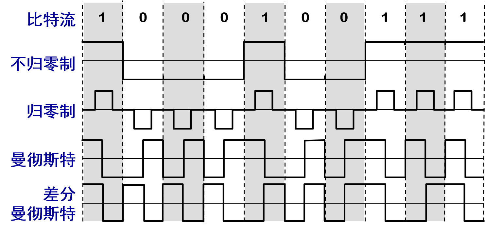
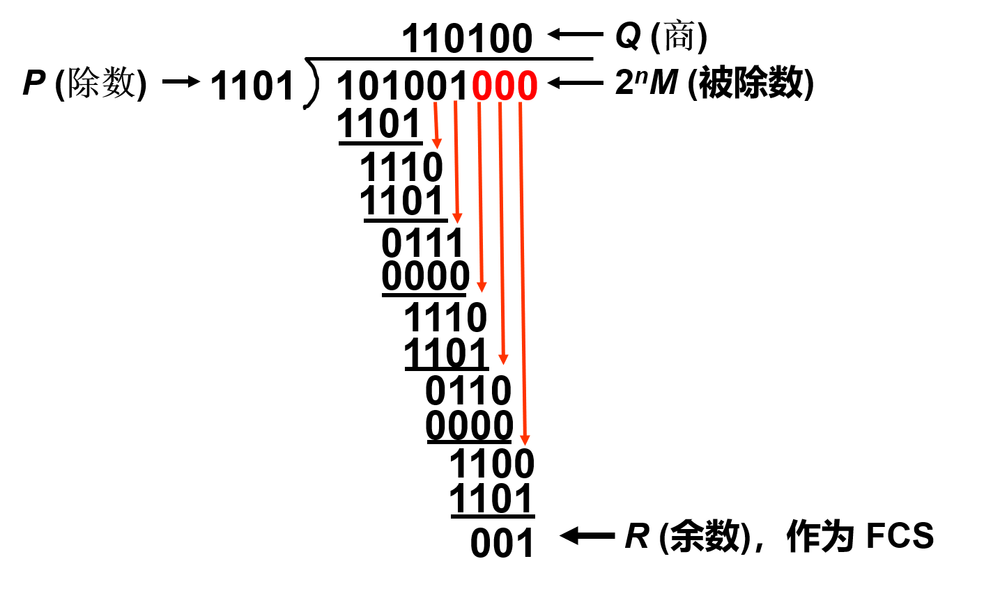
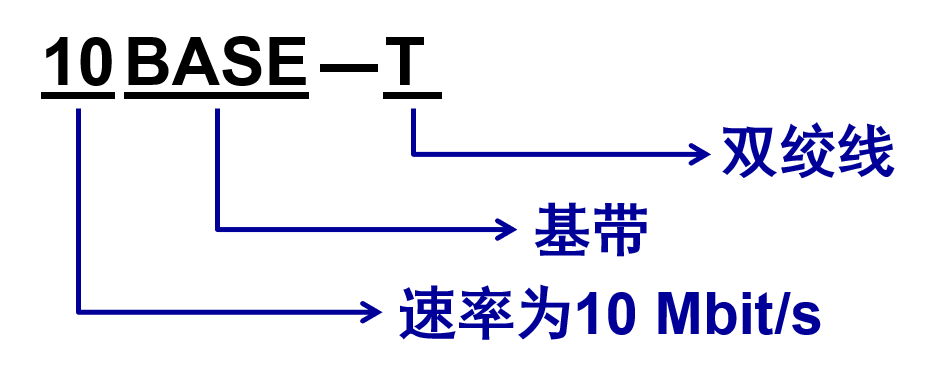

# 计网

## 第一章

- OSI 参考模型把对等层次之间传送的数据单位称为该层的**协议数据单元 PDU** (Protocol Data Unit)
- OSI把层与层之间交换的数据的单位称为**服务数据单元 SDU** (Service Data Unit)

### 分层

1. 优点
   - 各层之间是独立的。
   - 灵活性好。
   - 结构上可分割开。
   - 易于实现和维护。
   - 能促进标准化工作。
2. 分层功能
   - **差错控制**：使相应层次对等方的通信更加可靠。
   - **流量控制**：发送端的发送速率必须使接收端来得及接收，不要太快。
   - **分段和重装**：发送端将要发送的数据块划分为更小的单位，在接收端将其还原。
   - **复用和分用**：发送端几个高层会话复用一条低层的连接，在接收端再进行分用。
   - **连接建立和释放**：交换数据前先建立一条逻辑连接，数据传送结束后释放连接。

## 第二章

- 屏蔽双绞线 STP (Shielded Twisted Pair)
  - 带金属屏蔽层
- 无屏蔽双绞线 UTP (Unshielded Twisted Pair)

### 编码

### 奈氏准则

- 在任何信道中，**码元传输的速率是有上限的**，否则就会出现**码间串扰**的问题，使接收端对码元的判决（即识别）成为不可能
- 如果信道的频带越宽，也就是能够通过的信号高频分量越多，那么就可以用更高的速率传送码元而不出现码间串扰

### 香农公式

- 信噪比(dB) = 10 log10(S/N) (dB)
- $C = W log_2(1+S/N) (bit/s)$
  - W 为信道的带宽（以 Hz 为单位）；
  - S 为信道内所传信号的平均功率；
  - N 为信道内部的高斯噪声功率。

### 信道复用技术

- **频分复用**的所有用户在同样的时间**占用不同的带宽资源**（请注意，这里的“带宽”是频率带宽而不是数据的发送速率）
- **时分复用**则是将时间划分为一段段等长的**时分复用帧**（TDM 帧）。每一个时分复用的用户在每一个 TDM 帧中占用固定序号的时隙。
  - 每一个用户所占用的时隙是**周期性地出现**（其周期就是 TDM  帧的长度）。
  - TDM 信号也称为**等时**(isochronous)信号。
  - **时分复用的所有用户是*在不同的时间*占用同样的频带宽度。**
  - 时分复用可能会造成线路资源的浪费
- 波分复用 WDM
  - 波分复用就是光的频分复用。使用一根光纤来同时传输多个光载波信号
- 码分复用 CDM
  - 常用的名词是码分多址 CDMA(Code Division Multiple Access)。
  - 各用户使用经过特殊挑选的不同码型，因此彼此不会造成干扰。
  - 这种系统发送的信号有很强的抗干扰能力，其频谱类似于白噪声，不易被敌人发现
  - 码片序列
    - 两个不同站的码片序列正交，就是向量 S 和T 的规格化内积 (inner product) 等于 0
    - 任何一个码片向量和该码片向量自己的规格化内积都是 1
    - 一个码片向量和该码片反码的向量的规格化内积值是 –1

### 宽带接入技术

#### ADSL

- **非对称数字用户线 ADSL (Asymmetric Digital Subscriber Line)** 技术就是用数字技术对现有的模拟电话用户线进行改造，使它能够承载宽带业务
- ADSL 技术就把 0~4 kHz 低端频谱留给传统电话使用，而**把原来没有被利用的高端频谱留给用户上网使用。**
- DSL 就是数字用户线 (Digital Subscriber Line) 的缩写。

#### 光纤同轴混合网（HFC网）

- HFC (Hybrid Fiber Coax) 网是在目前覆盖面很广的有线电视网 CATV 的基础上开发的一种居民宽带接入网
- HFC 网对 CATV 网进行了改造
  - HFC 网将原 CATV 网中的同轴电缆**主干部分改换为光纤**，并使用**模拟光纤技术。**
  - 在模拟光纤中采用**光的振幅调制 AM**，这比使用数字光纤更为经济。
  - 模拟光纤从头端连接到光纤结点 (fiber node)，即光分配结点 ODN (Optical Distribution Node)。在光纤结点光信号被转换为电信号。在光纤结点以下就是同轴电缆

### 透明传输

- **字节填充** (byte stuffing) 或**字符填充** (character stuffing)
  - 发送端的数据链路层在数据中出现控制字符“SOH”或“EOT”的前面插入一个转义字符“ESC” (其十六进制编码是 1B)。

### 差错检测

#### CRC

- 在数据链路层传送的帧中，广泛使用了**循环冗余检验 CRC** 的检错技术。
- 在发送端，先把数据划分为组。假定每组 k 个比特
- 假设待传送的一组数据 M = 101001（现在 k = 6）。我们在 M 的后面再添加供差错检测用的 n 位冗余码一起发送
- 用二进制的模 2 运算进行 2n 乘 M 的运算，这相当于在 M 后面添加 n 个 0
- 得到的 (k + n) 位的数除以事先选定好的长度为 (n + 1) 位的除数 P，得出商是 Q 而余数是 R，余数 R 比除数 P 少 1 位，即 R 是 n 位
- 将余数 R 作为冗余码拼接在数据 M 后面发送出去。

#### FCS

- 在数据后面添加上的冗余码称为**帧检验序列 FCS** (Frame Check Sequence)。
- 循环冗余检验 CRC 和帧检验序列 FCS 并不等同。
  - CRC 是一种常用的检错方法，而 FCS 是添加在数据后面的冗余码。
  - FCS 可以用 CRC 这种方法得出，但 CRC 并非用来获得 FCS 的唯一方法

#### add

- 仅用循环冗余检验 CRC 差错检测技术只能做到**无差错接受** (accept)。
- “无差错接受”是指：“凡是接受的帧（即不包括丢弃的帧），我们都能以非常接近于 1 的概率认为这些帧在传输过程中没有产生差错”。
- 也就是说：“凡是接收端数据链路层接受的帧都没有传输差错”（有差错的帧就丢弃而不接受）。
- **要做到“可靠传输”（即发送什么就收到什么）就必须再加上确认和重传机制**
- 应当明确，**“无比特差错”与“无传输差错”是不同的概念**。
- 在数据链路层使用 CRC 检验，能够实现无比特差错的传输，但这还不是可靠传输。
- 本章介绍的数据链路层协议都不是可靠传输的协议。

### PPP

#### 字符填充

- 将信息字段中出现的每一个 0x7E 字节转变成为 2 字节序列 (0x7D, 0x5E)。
- 若信息字段中出现一个 0x7D 的字节, 则将其转变成为 2 字节序列 (0x7D, 0x5D)。
- 若信息字段中出现 ASCII 码的控制字符（即数值小于 0x20 的字符），则在该字符前面要加入一个 0x7D 字节，同时将该字符的编码加以改变

#### 零比特填充

- PPP 协议用在 SONET/SDH 链路时，使用同步传输（一连串的比特连续传送）。这时 PPP 协议采用零比特填充方法来实现透明传输。
- 在发送端，只要发现有 5 个连续 1，则立即填入一个 0。
- 接收端对帧中的比特流进行扫描。每当发现 5 个连续1时，就把这 5 个连续 1 后的一个 0 删除

### 共享技术

- 适配器的重要功能：
  - 进行串行/并行转换。
  - 对数据进行缓存。
  - 在计算机的操作系统安装设备驱动程序。
  - 实现以太网协议

#### 以太网

- 采取的措施
  1. 采用较为灵活的无连接的工作方式
  2. 以太网发送的数据都使用曼彻斯特 (Manchester) 编码

#### CSMA/CD

- CSMA/CD 含义：**载波监听多点接入 / 碰撞检测**  (Carrier Sense Multiple Access with Collision Detection)
  - “**多点接入**”表示许多计算机以多点接入的方式连接在**一根总线**上
  - “**载波监听**”是指每一个站在发送数据之前先要检测一下总线上是否有其他计算机在发送数据，如果有，则暂时不要发送数据，以免发生碰撞
    - 总线上并没有什么“载波”。因此， **“载波监听”就是用电子技术检测总线上有没有其他计算机发送的数据信号**
  - “**碰撞检测**”就是计算机边发送数据边检测信道上的信号电压大小。
    - 当几个站同时在总线上发送数据时，总线上的信号电压摆动值将会增大（互相叠加）。
    - 当一个站检测到的信号电压摆动值超过一定的门限值时，就认为总线上至少有两个站同时在发送数据，表明产生了碰撞。
    - **所谓“碰撞”就是发生了冲突。因此“碰撞检测”也称为“冲突检测”**
    - 每一个正在发送数据的站，一旦发现总线上出现了碰撞，就要**立即停止发送**，免得继续浪费网络资源，然后**等待一段随机时间**后再次发送
    - 需要**单程传播时延的2倍**的时间，才能检测到冲突
    - **争用期 碰撞窗口**:$2\tau$ （两倍的端到端往返时延）
      - 经过争用期这段时间还没有检测到碰撞，才能肯定这次发送不会发生碰撞

#### 使用集线器的星形拓扑

- 采用双绞线的以太网采用星形拓扑，在星形的中心则增加了一种可靠性非常高的设备，叫做集线器 (hub)
- 1990年 IEEE 制定出星形以太网 10BASE-T 的标准 802.3i
- 
- 集线器是使用电子器件来模拟实际电缆线的工作，因此整个系统仍然像一个传统的以太网那样运行
- 使用集线器的以太网在**逻辑上仍是一个总线网**，各工作站使用的还是 CSMA/CD 协议，并**共享逻辑上的总线**
- 集线器很像一个多接口的转发器，**工作在物理层**
- 集线器采用了专门的芯片，进行自适应串音回波抵消，减少了近端串音

#### 以太网的信道利用率

- 设帧长为 L (bit)，数据发送速率为 C (bit/s)，则帧的发送时间为  T0 = L/C (s)

