# sa

- 依赖：返回值&形参; 虚线箭头
- 关联：类成员；实线箭头
  - 双向关联：实线
- 实现
  - 接口实现：虚线三角形
  - 继承：实线三角形

## 设计模式

- 设计模式是对软件设计经验的总结，是对软件设计中反复出现的设计问题的成功解决方案的描述。为了记录这些成功的设计经验并方便以后使用，软件设计模式通常包含4个基本要素：模式名称，问题，解决方案以及效果。
  - 模式名称：帮助记忆的名称，方便交流
  - 问题描述：什么情况下使用该模式
  - 解决方案：设计细节，通常会给出方案原理图及相关文字说明，可能会有代码示例，以便对解决方案的深入理解
  - 效果：设计方案的优势和劣势，这些效果通常面向软件的质量属性

- 意义
  - 设计复用。设计模式可以使设计者更加方便地借鉴或者直接使用已验证过的成功设计方案，而不必花大量时间进行重复设计。一些设计模式甚至提供了显式的类图设计及代码示例，为设计的文档化和及软件的开发提供了直接的支持。设计模式可以帮助设计者更快更好的完成软件系统的设计工作
- 一种解决方案，是OO中的数据结构和算法
- 是OO领域中的跟高层次的要求
- 经典的23种设计模式

1. **接口编程**
   - 好处：当客户需求变化时，只需编写该业务逻辑的新的实现类，通过更改配置文件(例如Spring框架)中该接口的实现类就可以完成需求，不需要改写现有代码，减少对系统的影响。 采用基于接口编程的项目，业务逻辑清晰，代码易懂，方便扩展，可维护性强。即使更换一批人员，新来的人依然可以快速上手。对于公司来说，意义更大
   - 提供了一种抽象；一种通用的实现规则；
   - 设计更容易，更通用，修改少；
   - 可扩展、符合开闭原则

    ``` JAVA
    public interface A {}
    abstract class B implements A {}
    class C extends B {}
    class D implements A {}
    ```

2. **单例模式**
   - 保证一个类只有一个实例，并且提供一个访问他的全局访问点
   - 思路
     - 构造方法私有，不能在外面被创建
     - 公有的、静态的获取实例的方法
     - 获取实例是判定实例是否为空，如果没有，就新建，否则就返回这个存在的实例
     - 有一个静态私有的实例，保存创建的实例

   ``` JAVA
   class A {
       private static A a=null;
       private A(){}
       public static A getIns(){
           if (a==null)
               a = new A();
           return a;
       }
   }
   ```

3. **多例模式**
   - 思路
     - 构造方法私有，不能在外面被创建
     - 公有的、静态的获取实例的方法
     - 获取实例是否已经达到了指定数量，如果没有，就新建，否则就返回现有的集合
     - 有一个静态私有的实例数组，保存创建的实例

   ``` JAVA
   class A {
       private static Set<A> ins = new HashSet<>();
       private static int cnt=0;
       private A(){}
       public static A getIns() {
           if (cnt<limit) {
               cnt++;
               A a = new A();
               ins.add(a);
               return a;
           } else {
               return ins;
           }
       }
   }
   ```

4. **工厂方法**，虚构造器
   - 意图：定义一个创建对象的接口，让子类决定实例化哪个类。 Factory Method使一个类的实例化延迟到其子类

   ``` JAVA
   interface A {}
   interface Factory {
       A getA();
   }
   class B implements A {}
   class FactoryB implements Factory{
       A getA(){
           return new B();
       }
   }
   class FF {
       A getA(String a) {
           Factory fac=null;
           switch(a) {
               case "B": fac=new FactoryB(); break;
           }
           return fac.getA();
       }
   }
   ```

5. 简单工厂

   ``` JAVA
   class SF {
       A getA(String s) {
           switch (s) {
               case "B": return new B();
           }
       }
   }
   ```

6. 抽象工厂
   - 意图：提供一个创建一系列相关或者相互依赖对象的接口，不要指定它们的具体类。

   ``` JAVA
   abstract class Aa {}
   interface Ia {}
   class Ca extends Aa implements Ia {}
   interface Factory {
       Ia getA();
   }
   class FacA implements Factory{
       Ia getA() {
           return new Ca();
       }
   }
   class Client {
       void process {
           Fac fac = switch(){}
           Ia a = switch(){fac.getA();}
       }
   }
   ```

7. 适配器
   - 意图：将一个类的接口转换成用户希望的另一个接口。使得原来由于接口不兼容而不能在一起工作的那些类可以在一起工作

   - 类适配器

     ``` JAVA
     class API {
         void doA(){}
     }
     interface Target{
         void doB();
     }
     class A extends API implements Target {
         void doB(){
             doA();
         }
     }
     ```

   - 对象适配器

     ``` JAVA
     class A implements Target {
         private API api = new API();
         void doB() {
             api.doA();
         }
     }
     ```

8. 组合模式
   - 将**对象组合成树形结构**以表示“**部分-整体**”的层次结构，组合模式使得用户**对单个对象和组合对象的使用具有一致性**。经典案例：系统目录结构，网站导航结构、测试用例等等等

   - 一致性组合模式

     ``` JAVA
     abstract class Comp {
         Comp parent;
         Set<Comp> sons=new HashSet<>();
         Comp getParent();
         Set<Comp> getSons();
         void doA();
     }
     class Group extends Comp {
         Set<Comp> getSons(){
             return sons;
         }
         void doA(){}
     }
     class Person extends Comp {
         Set<Comp> getSons() {
             return null;
         }
         void doA(){}
     }
     ```

   - 安全性组合模式

     ``` JAVA
     abstract class Comp {
         Comp parent;
         Set<Comp> sons=new HashSet<>();
         Comp getParent();
         void doA();
     }
     class Group extends Comp {
         Set<Comp> getSons(){
             return sons;
         }
         void doA(){}
     }
     class Person extends Comp {
         void doA(){}
     }
     ```

9. IOC

    ``` XML
    <bean id="liangzaoqing" class="cn.edu.scau.cmi.zhuangyuwu.spring.domain.Teacher">
        <property name="name" value="梁早清"></property>
        <property name="gendar" value="男"></property>
    </bean>
    <bean id="zhangsan" class="cn.edu.scau.cmi.zhuangyuwu.spring.domain.Student">
        <property name="name" value="张三"></property>
        <property name="gendar" value="男"></property>
    </bean>
    ```

- 抽象工厂模式与工厂模式的区别
  - 抽象工厂模式比工厂模式更复杂，更灵活，一个抽象工厂模式或以先创建出多个具体的工厂，这些具体的工厂再创建出具体的产品。
  - 工厂方法模式，将的是由一个方法，可以产生不同的但是同类的（或者同接口的）产品。工厂方法模式就能满足一般的需要。复杂情况下才用抽象工厂模式
  - 工厂方法采用的是类继承机制（生成一个子类，重写该工厂方法，在该方法中生产一个对象）。而抽象工厂采用的是对象组合机制，专门定义“工厂”对象来负责对象的创建。对象组合的方式就是把“工厂”对象作为参数传递
  - 工厂方法模式：一个抽象产品类，可以派生出多个具体产品类。抽象工厂模式：多个抽象产品类，每个抽象产品类可以派生出多个具体产品类。工厂方法模式的具体工厂类只能创建一个具体产品类的实例，而抽象工厂模式可以创建多个

## ORM 对象-关系映射

- 好处
  - ORM全称Object Relational Mapping，中文是对象关系映射。它其实是创建了一个可在编程语言里使用的–“虚拟对象数据库”。我们在具体的操作实体对象的时候，就不需要再去和复杂的 SQL 语句打交道，只需简单的操作实体对象的属性和方法。至于这个对象里的数据该怎么存储又该怎么获取，通通不用关心。大大缩短了程序员的编码时间，减少了程序员对数据库的学习成本。对于敏捷开发和团队合作开发来说，好处是非常非常大的。
- `com.mysql.jdbc.Driver`
- Hibernate

  ``` xml
  <!--hibernate.cfg.xml -->
  <?xml version="1.0" encoding="UTF-8"?>
  <!DOCTYPE hibernate-configuration PUBLIC
          "-//Hibernate/Hibernate Configuration DTD 3.0//EN"
          "http://www.hibernate.org/dtd/hibernate-configuration-3.0.dtd">
  <hibernate-configuration>
      <session-factory>
          <property name="hibernate.dialect">org.hibernate.dialect.MySQL5InnoDBDialect</property>
          <property name="hibernate.connection.driver_class">com.mysql.jdbc.Driver</property>
          <property name="hibernate.connection.url">jdbc:mysql://localhost:3306/sa</property>
          <property name="hibernate.connection.password">sa</property>
          <property name="hibernate.connection.username">sa</property>
          <property name="hibernate.hbm2ddl.auto">update</property>
          <mapping resource="cn/edu/scau/cmi/zhuangyuwu/hibernate/domain/Student.hbm.xml" />
          <mapping resource="cn/edu/scau/cmi/zhuangyuwu/hibernate/domain/Teacher.hbm.xml" />
      </session-factory>
  </hibernate-configuration>
  ```

  ``` xml
  <!-- Student.hbm.xml -->
  <?xml version="1.0"?>
  <!DOCTYPE hibernate-mapping PUBLIC "-//Hibernate/Hibernate Mapping DTD 3.0//EN"
  "http://hibernate.sourceforge.net/hibernate-mapping-3.0.dtd">
  <hibernate-mapping>
      <class name="cn.edu.scau.cmi.zhuangyuwu.hibernate.domain.Student" table="STUDENT">
          <id name="id" type="java.lang.Long" access="field">
              <column name="id" not-null="true"  />
          </id>
          <property name="name" type="java.lang.String">
              <column name="name" not-null="true" />
          </property>
          <property name="teacher" type="java.lang.Long">
              <column name="teacher" not-null="true" />
          </property>
      </class>
  </hibernate-mapping>
  ```

  ``` JAVA
  SessionFactory mySessionFactory = new Configuration()
                                        .configure()
                                        .buildSessionFactory();
  Session session = mySessionFactory.openSession();
  Transaction transaction = session.beginTransaction();
  session.save(ins);
  transaction.commit();
  ```

- spring

  ``` xml
  <?xml version="1.0" encoding="UTF-8"?>
  <beans xmlns="http://www.springframework.org/schema/beans"
      xmlns:xsi="http://www.w3.org/2001/XMLSchema-instance" xmlns:p="http://www.springframework.org/schema/p"
      xsi:schemaLocation="http://www.springframework.org/schema/beans http://www.springframework.org/schema/beans/spring-beans-4.1.xsd http://www.springframework.org/schema/tx http://www.springframework.org/schema/tx/spring-tx.xsd"
      xmlns:tx="http://www.springframework.org/schema/tx">
  
      <bean id="liangzaoqing" class="cn.edu.scau.cmi.zhuangyuwu.spring.domain.Teacher">
          <property name="name" value="梁早清"></property>
          <property name="gendar" value="男"></property>
      </bean>
      <bean id="zhangsan" class="cn.edu.scau.cmi.zhuangyuwu.spring.domain.Student">
          <property name="name" value="张三"></property>
          <property name="gendar" value="男"></property>
      </bean>
  
      <bean id="studentDAO" class="cn.edu.scau.cmi.zhuangyuwu.hibernate.DAO.StudentDAO" />
      <bean id="teacherDAO" class="cn.edu.scau.cmi.zhuangyuwu.hibernate.DAO.TeacherDAO" />
  </beans>
  ```

  ```JAVA
  ApplicationContext aContext = ApplicationContextUtil.getContext();
  Student zs = (Student) aContext.getBean("zhangsan", Student.class);
  ```

## 体系结构

- 软件危机原因
  - 用户需求不明确
  - 缺乏正确的理论指导
  - 软件规模越来越大
  - 软件复杂度越来越高

- 定义
  - **软件体系结构是具有一定形式的结构化元素，即构件的集合，包括处理构件、数据构件和连接构件。**
  - 处理构件负责对数据进行加工，数据构件是被加工的信息，连接构件把体系结构的不同部分组合连接起来
  - 软件体系结构是软件设计过程中的一个层次，这一层次超越计算过程中的算法设计和数据结构设计。体系结构问题**包括总体组织和全局控制、通讯协议、同步、数据存取，给设计元素分配特定功能，设计元素的组织，规模和性能，在各设计方案间进行选择等**。
  - 软件体系结构处理算法与数据结构之上关于整体系统结构设计和描述方面的一些问题，如全局组织和全局控制结构、关于通讯、同步与数据存取的协议，设计构件功能定义，物理分布与合成，设计方案的选择、评估与实现等
  - **软件体系结构有四个角度**
    - 概念角度描述 系统的主要构件及它们之间的关系；
    - 模块角度包含 功能分解与层次结构；
    - 运行角度描述 一个系统的动态结构；
    - 代码角度描述 各种代码和库函数在开发环境中的组织
  - 软件体系结构是一个抽象的系统规范，主要**包括用其行为来描述的功能构件和构件之间的相互连接、接口和关系**
  - **软件体系结构是一个程序／系统各构件的结构、它们之间的相互关系以及进行设计的原则和随时间演化的指导方针**
  - **软件体系结构包括一个软件和系统构件，互联及约束的集合；一个系统需求说明的集合；一个基本原理用以说明这一构件，互联和约束能够满足系统需求**
  - **软件体系结构包括一个或一组软件构件、软件构件的外部的可见特性及其相互关系。其中，“软件外部的可见特性”是指软件构件提供的服务、性能、特性、错误处理、共享资源使用等**

### Kruchten提出的“4+1”模型

- 逻辑视图，开发视图，过程视图，物理视图及场景
  - 每一个视图只关心系统的一个侧面，5个视图结合在一起才能反映系统的软件体系结构的全部内容
- 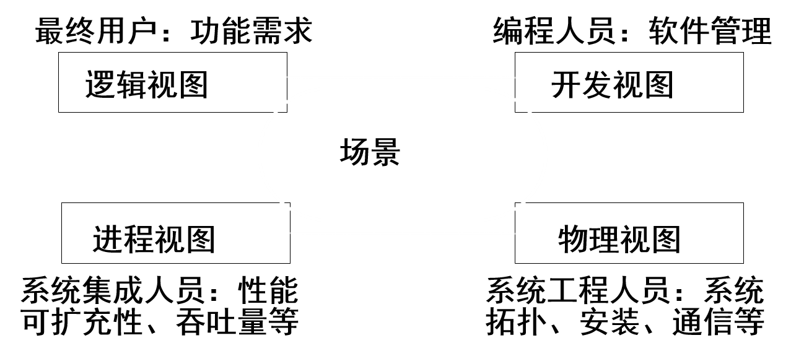

- 逻辑视图
  - 可以从Booch标记法中导出逻辑视图的标记法，只是从体系结构级的范畴来考虑这些符号，用Rational Rose进行体系结构设计
  - 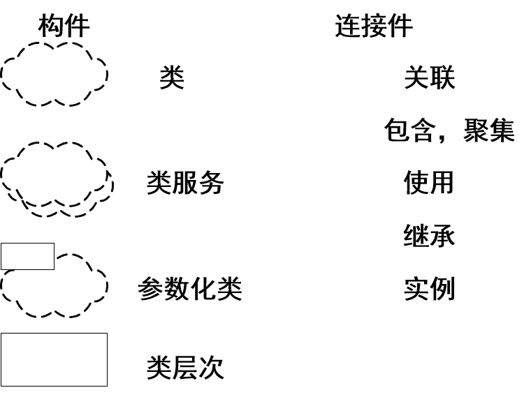
  - 逻辑视图中使用的风格为面向对象的风格，逻辑视图设计中要注意的主要问题是要保持一个单一的、内聚的对象模型贯穿整个系统
    - 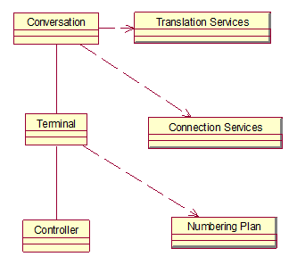,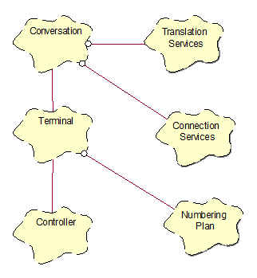
  - 对于规模更大的系统来说，体系结构级中包含数十甚至数百个类
- 开发视图
  - 开发视图也称模块视图，主要侧重于软件模块的组织和管理。
  - 开发视图要考虑软件内部的需求，如软件开发的容易性、软件的重用和软件的通用性，要充分考虑由于具体开发工具的不同而带来的局限性。
  - 开发视图通过系统输入输出关系的模型图和子系统图来描述。
  - 与逻辑视图一样，可以使用Booch标记法中某些符号来表示开发视图
    - 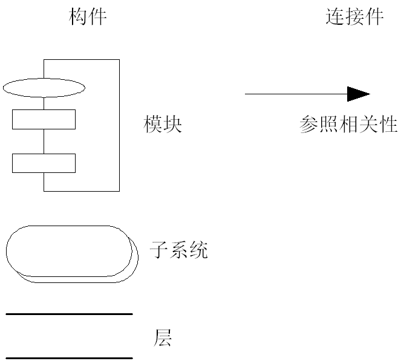
  - 在开发视图中，最好采用4-6层子系统，而且每个子系统仅仅能与同层或更低层的子系统通讯，这样可以使每个层次的接口既完备又精练，避免了各个模块之间很复杂的依赖关系。
  - 设计时要充分考虑，对于各个层次，层次越低，通用性越强，这样，可以保证应用程序的需求发生改变时，所做的改动最小。开发视图所用的风格通常是层次结构风格
  - 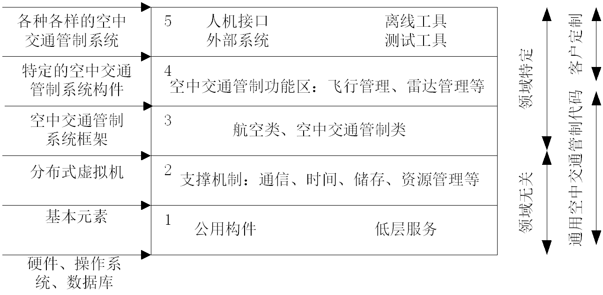
- 进程视图
  - 进程视图侧重于系统的运行特性，主要关注一些非功能性的需求。
进程视图强调并发性、分布性、系统集成性和容错能力，以及从逻辑视图中的主要抽象如何适合进程结构。它也定义逻辑视图中的各个类的操作具体是在哪一个线程中被执行的。
  - 进程视图可以描述成多层抽象，每个级别分别关注不同的方面。在最高层抽象中，进程结构可以看作是构成一个执行单元的一组任务。它可看成一系列独立的，通过逻辑网络相互通信的程序。它们是分布的，通过总线或局域网、广域网等硬件资源连接起来
  - 通过扩展Booch对Ada任务的表示法，来表示进程视图
    - 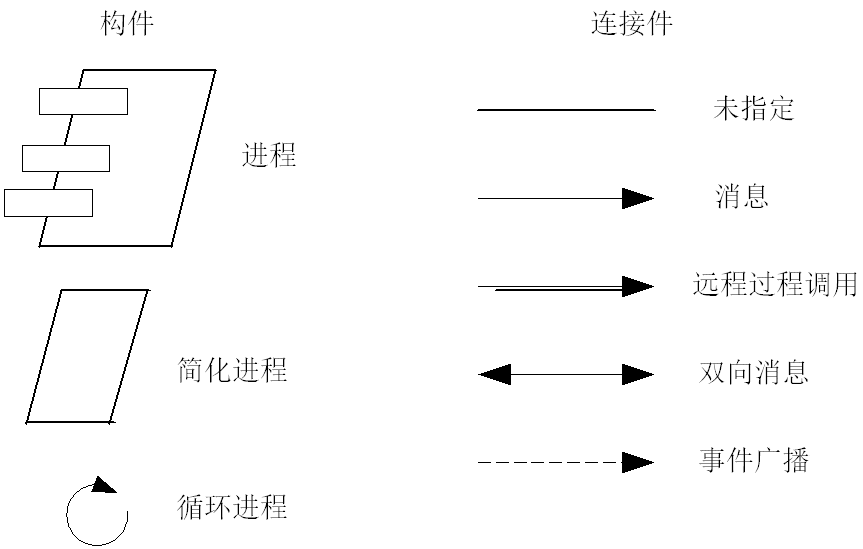
    - 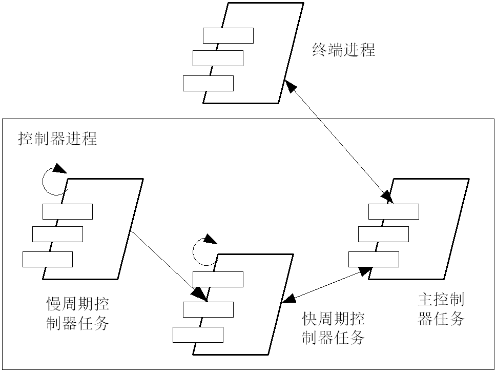
- 物理视图
  - 物理视图主要考虑如何把软件映射到硬件上，它通常要考虑到系统性能、规模、可靠性等。解决系统拓扑结构、系统安装、通讯等问题。
  - 当软件运行于不同的节点上时，各视图中的构件都直接或间接地对应于系统的不同节点上。因此，从软件到节点的映射要有较高的灵活性，当环境改变时，对系统其他视图的影响最小
  - 大型系统的物理视图可能会变得十分混乱，因此可以与进程视图的映射一道，以多种形式出现，也可单独出现
    - 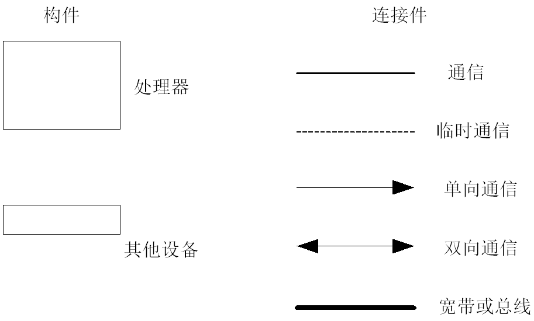
    - ACS系统的物理视图
      - 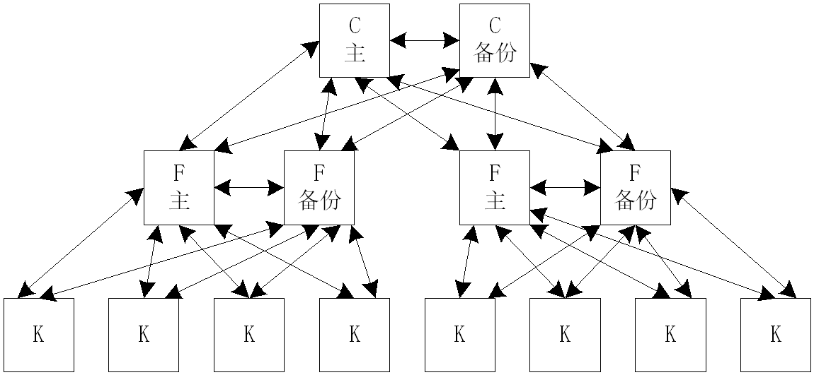
    - 具有进程分配的小型ACS系统的物理视图
      - 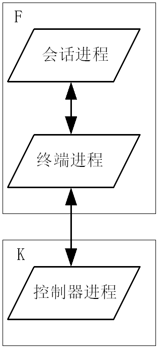
    - 具有进程分配的大型ACS系统的物理视图
      - 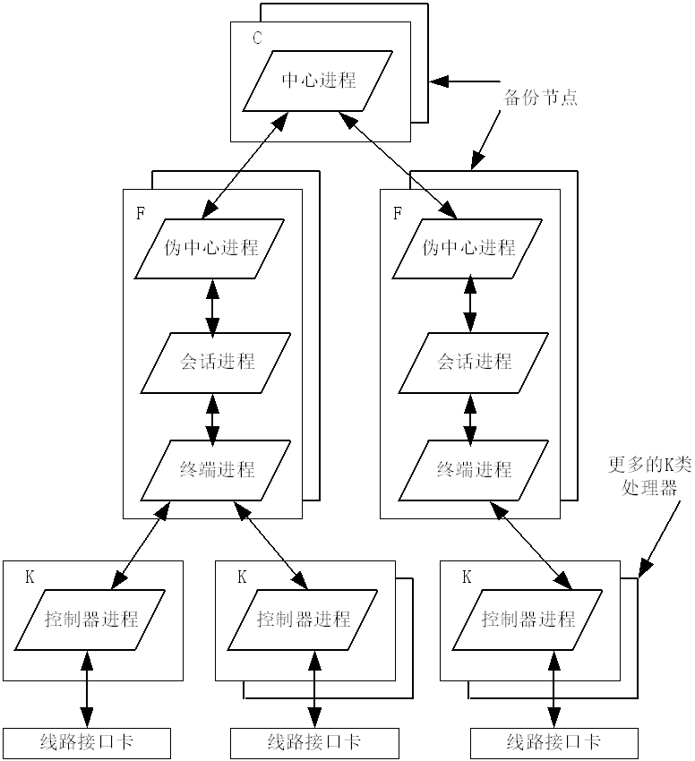
- 场景
  - 场景可以看作是那些重要系统活动的抽象，它使四个视图有机联系起来，从某种意义上说场景是最重要的需求抽象。在开发体系结构时，它可以帮助设计者找到体系结构的构件和它们之间的作用关系。同时，也可以用场景来分析一个特定的视图，或描述不同视图构件间是如何相互作用的。
  - 场景可以用文本表示，也可以用图形表示
  - 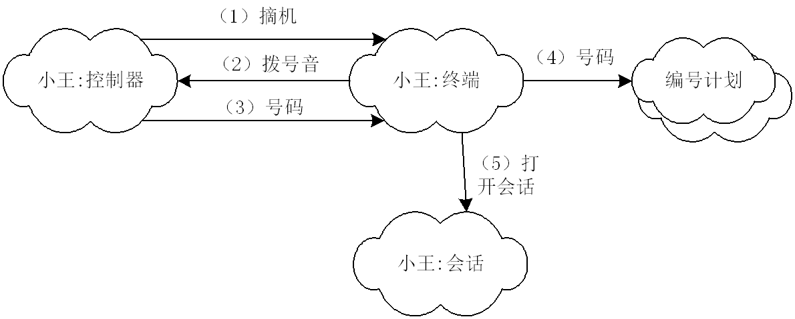
- 小结
  - 逻辑视图和开发视图描述系统的静态结构，而进程视图和物理视图描述系统的动态结构。
  - 对于不同的软件系统来说，侧重的角度也有所不同。例如，对于管理信息系统来说，比较侧重于从逻辑视图和开发视图来描述系统，而对于实时控制系统来说，则比较注重于从进程视图和物理视图来描述系统。
  - 建模工具和符号的选择：没有统一规定

## 软件体系结构风格

- 定义：**软件体系结构风格是软件体系结构的一种分类**。软件体系结构风格是描述**某一特定应用领域中系统组织方式的惯用模式**
  - 是对软件体系结构的分类，每一种软件体系结构风格都代表一类软件的组织模式，是对实践中被重复使用的架构设计的总结。作为一种高层设计的交流手段，体系结构风格定义了一套词汇表，用于描述架构中的构建，连接件及相关约束。

### 调用-返回风格

#### 主程序-子程序软件体系结构

- 在设计上使用层次化的划分方法，该体系结构中使用由编程语言直接支持的单一控制线程。子程序结构是明确的，子程序通常组成程序模块。子程序的调用呈现层次化，器正确与否往往取决于器调用的子程序的正确与否。

#### 面向对象组织

- 这种风格建立在数据抽象和面向对象的基础上，数据的表示方法和它们的相应操作封装在一个抽象数据类型或对象中。
- 这种风格的构件是对象，或者说是抽象数据类型的实例。对象是一种被称作管理者的构件，因为它负责保持资源的完整性。对象是通过函数和过程的调用来交互的。
- 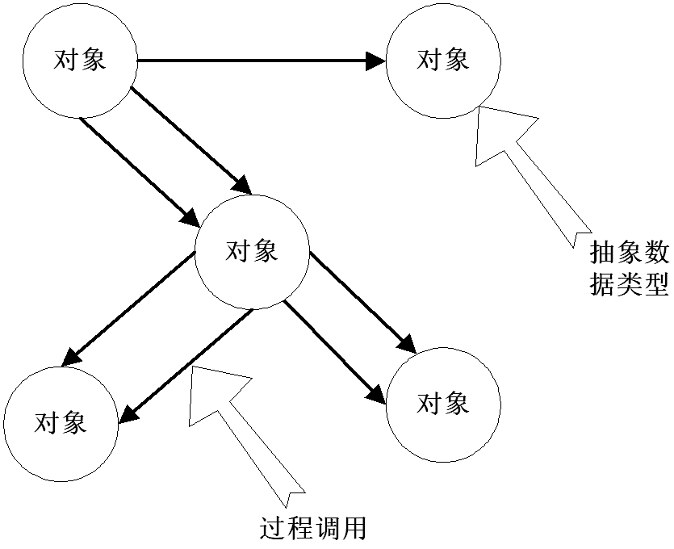

- 优点
  - 因为对象对其它对象隐藏它的表示，所以可以改变一个对象的表示，而不影响其它的对象；
  - 设计者可将一些数据存取操作的问题分解成一些交互的代理程序的集合
- 缺点
  - 为了使一个对象和另一个对象通过过程调用等进行交互，必须知道对象的标识。只要一个对象的标识改变了，就必须修改所有其他明确调用它的对象；
  - 必须修改所有显式调用它的其它对象，并消除由此带来的一些副作用。例如，如果A使用了对象B，C也使用了对象B，那么，C对B的使用所造成的对A的影响可能是料想不到的

### 数据流风格

#### 管道和过滤器

- 是数据流风格体系结构的一个子类型。
- 每个构件都有一组输入和输出，构件读输入的数据流，经过内部处理，然后产生输出数据流。这个过程通常通过对输入流的变换及增量计算来完成，所以在输入被完全消费之前，输出便产生了。

- 这里的构件被称为过滤器，这种风格的连接件就象是数据流传输的管道，将一个过滤器的输出传到另一过滤器的输入
- 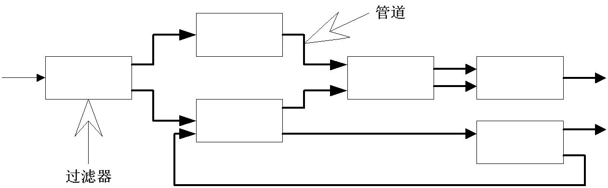
- 优点
  - 使得软构件具有良好的隐蔽性和高内聚、低耦合的特点；
  - 允许设计者将整个系统的输入/输出行为看成是多个过滤器的行为的简单合成；
  - 支持软件重用。只要提供适合在两个过滤器之间传送的数据，任何两个过滤器都可被连接起来；
  - 系统维护和增强系统性能简单。新的过滤器可以添加到现有系统中来；旧的可以被改进的过滤器替换掉；
  - 允许对一些如吞吐量、死锁等属性的分析；
  - 支持并行执行。每个过滤器是作为一个单独的任务完成，因此可与其它任务并行执行
- 缺点
  - 通常导致进程成为批处理的结构。
  - 不适合处理交互的应用。
  - 因为在数据传输上没有通用的标准，每个过滤器都增加了解析和合成数据的工作，这样就导致了系统性能下降，并增加了编写过滤器的复杂性。

### 分层系统

- 层次系统组织成一个层次结构，每一层为上层服务，并作为下层客户。在一些层次系统中，除了一些精心挑选的输出函数外，内部的层只对相邻的层可见。这样的系统中构件在一些层实现了虚拟机（在另一些层次系统中层是部分不透明的）。连接件通过决定层间如何交互的协议来定义，拓扑约束包括对相邻层间交互的约束。
- 这种风格支持基于可增加抽象层的设计。允许将一个复杂问题分解成一个增量步骤序列的实现。由于每一层最多只影响两层，同时只要给相邻层提供相同的接口，允许每层用不同的方法实现，同样为软件重用提供了强大的支持
- 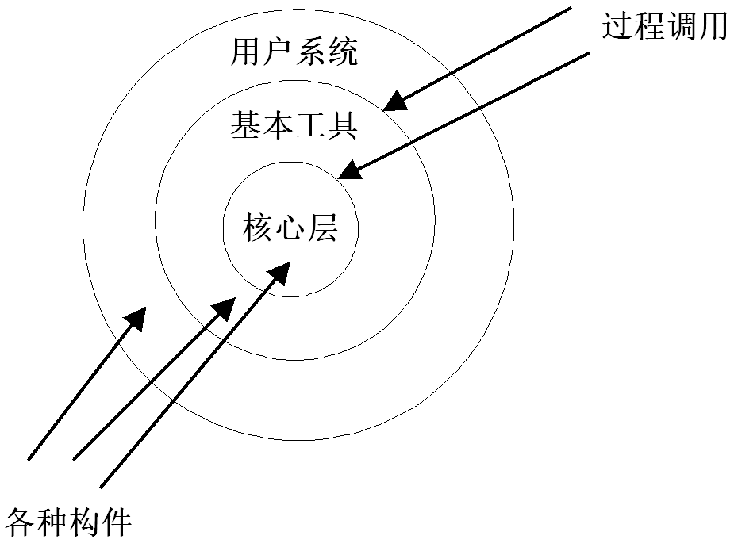
- 优点
  - 支持基于抽象程度递增的系统设计，使设计者可以把一个复杂系统按递增的步骤进行分解；
  - 支持功能增强，因为每一层至多和相邻的上下层交互，因此功能的改变最多影响相邻的上下层；
  - 支持重用。只要提供的服务接口定义不变，同一层的不同实现可以交换使用。这样，就可以定义一组标准的接口，而允许各种不同的实现方法
- 缺点
  - 并不是每个系统都可以很容易地划分为分层的模式，甚至即使一个系统的逻辑结构是层次化的，出于对系统性能的考虑，系统设计师不得不把一些低级或高级的功能综合起来；
  - 很难找到一个合适的、正确的层次抽象方法

### CS风格

- 主要初衷是使企业数据得到集中化的控制，并且允许众多用户访问这些数据，中心存储的数据保证了数据控制和一致性，并且根据一定的权限，仍然能方便的为用户提供数据访问的需要
- C/S软件体系结构是基于资源不对等，且为实现共享而提出来的，是20世纪90年代成熟起来的技术，C/S体系结构定义了工作站如何与服务器相连，以实现数据和应用分布到多个处理机上
- C/S体系结构有三个主要组成部分：数据库服务器、客户应用程序和网络
- 任务分配
  - 服务器
    1. 数据库安全性的要求；
    2. 数据库访问并发性的控制；
    3. 数据库前端的客户应用程序的全局数据完整性规则；
    4. 数据库的备份与恢复
  - 客户应用程序
    1. 提供用户与数据库交互的界面；
    2. 向数据库服务器提交用户请求并接收来自数据库服务器的信息；
    3. 利用客户应用程序对存在于客户端的数据执行应用逻辑要求
- 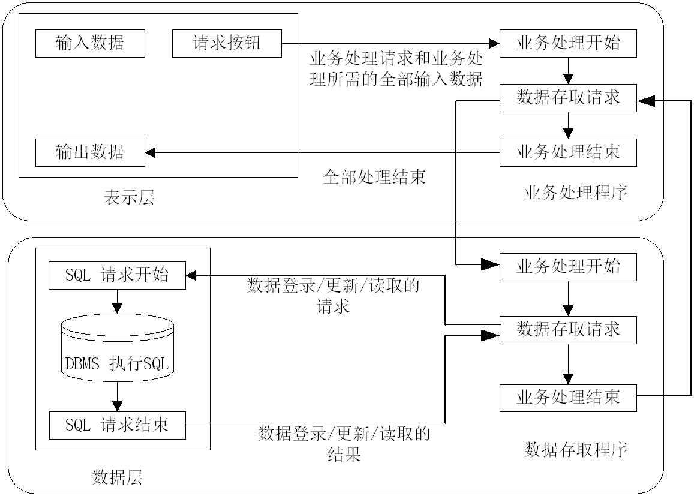 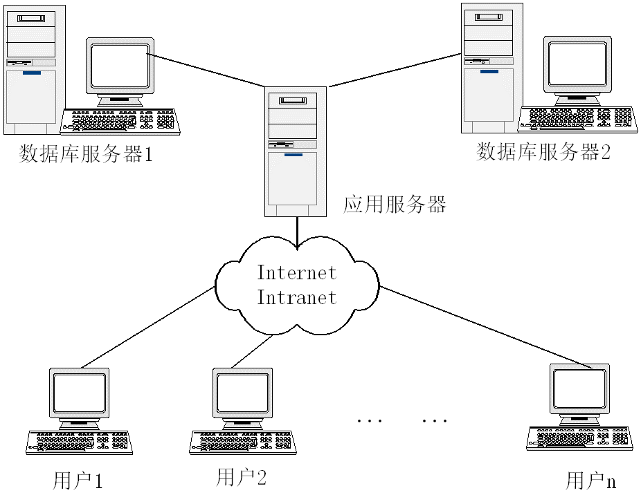
- 优点
  - 模型思想简单，易于人们理解和接受。
  - 灵活、易维护与扩充：系统的客户应用程序和服务器构件分别运行在不同的计算机上，系统中每台服务器都可以适合各构件的要求，这对于硬件和软件的变化显示出极大的适应性和灵活性，而且易于对系统进行扩充和缩小。
  - 资源可以进行合理配置：在C/S体系结构中，系统中的功能构件充分隔离，客户应用程序的开发集中于数据的显示和分析，而数据库服务器的开发则集中于数据的管理，不必在每一个新的应用程序中都要对一个DBMS进行编码。将大的应用处理任务分布到许多通过网络连接的低成本计算机上，以节约大量费用
- 缺点
  - 开发成本较高
  - 客户端程序设计复杂
  - 用户界面风格不一，使用繁杂，不利于推广使用
  - 软件移植困难
  - 软件维护和升级困难
  - 新技术不能轻易应用

#### 三层客户/服务器风格

-  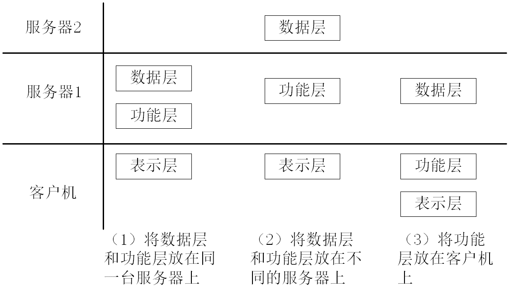
- 优点
  - 允许合理地划分三层结构的功能，使之在逻辑上保持相对独立性，能提高系统和软件的可维护性和可扩展性。
  - 允许更灵活有效地选用相应的平台和硬件系统，使之在处理负荷能力上与处理特性上分别适应于结构清晰的三层；并且这些平台和各个组成部分可以具有良好的可升级性和开放性。
  - 应用的各层可以并行开发，可以选择各自最适合的开发语言。
  - 利用功能层有效地隔离开表示层与数据层，未授权的用户难以绕过功能层而利用数据库工具或黑客手段去非法地访问数据层，为严格的安全管理奠定了坚实的基础。

### BS(浏览器/服务器风格)

- 浏览器/服务器（B/S）风格就是上述三层应用结构的一种实现方式，其具体结构为：浏览器/Web服务器/数据库服务器。
- B/S体系结构主要是利用不断成熟的WWW浏览器技术，结合浏览器的多种脚本语言，用通用浏览器就实现了原来需要复杂的专用软件才能实现的强大功能，并节约了开发成本。从某种程度上来说，B/S结构是一种全新的软件体系结构。
- 优点
  - 基于B/S体系结构的软件，系统安装、修改和维护全在服务器端解决。用户在使用系统时，仅仅需要一个浏览器就可运行全部的模块，真正达到了“零客户端”的功能，很容易在运行时自动升级。
  - B/S体系结构还提供了异种机、异种网、异种应用服务的联机、联网、统一服务的最现实的开放性基础。
- 缺点
  - 没有集成有效的数据库处理功能，对数据处理功能不强。
  - 安全性难以控制。
  - 采用B/S体系结构的应用系统，在数据查询等响应速度上，要远远地低于C/S体系结构。
  - B/S体系结构的数据提交一般以页面为单位，数据的动态交互性不强，不利于在线事务处理(OLTP)应用。

### 异构结构风格

- 不同的结构有不同的处理能力的强项和弱点，一个系统的体系结构应该根据实际需要进行选择，以解决实际问题。
- 关于软件包、框架、通信以及其他一些体系结构上的问题，目前存在多种标准。即使在某段时间内某一种标准占统治地位，但变动最终是绝对的。
- 一些遗留下来的代码，它们仍有效用，但是却与新系统有某种程度上的不协调。然而在许多场合，将技术与经济综合进行考虑时，总是决定不再重写它们。
- C/S与B/S混合之内外有别模型
  - 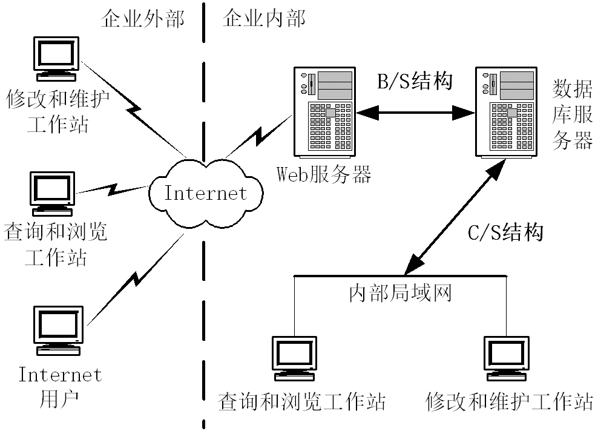
- C/S与B/S混合之查改有别模型
  - 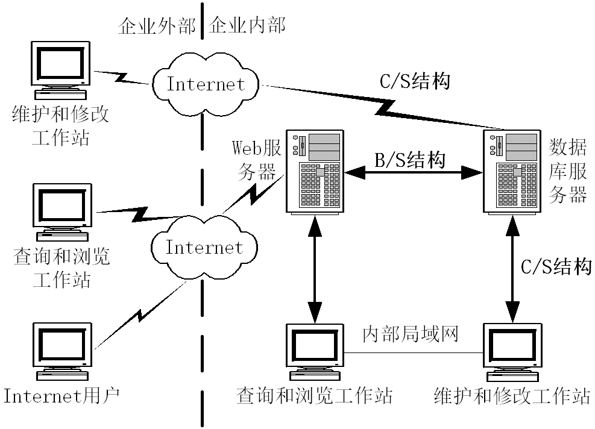

## 设计模式原则

1. **单一职责原则**
   - 定义：不要存在多于一个导致类变更的原因。通俗的说，即一个类只负责一项职责。
   - 问题由来：类T负责两个不同的职责：职责P1，职责P2。当由于职责P1需求发生改变而需要修改类T时，有可能会导致原本运行正常的职责P2功能发生故障。
   - 解决方案：遵循单一职责原则。分别建立两个类T1、T2，使T1完成职责P1功能，T2完成职责P2功能。这样，当修改类T1时，不会使职责P2发生故障风险；同理，当修改T2时，也不会使职责P1发生故障风险。
2. **接口隔离原则**
   - 定义：客户端不应该依赖它不需要的接口；一个类对另一个类的依赖应该建立在最小的接口上。
   - 问题由来：类A通过接口I依赖类B，类C通过接口I依赖类D，如果接口I对于类A和类B来说不是最小接口，则类B和类D必须去实现他们不需要的方法。
   - 解决方案：将臃肿的接口I拆分为独立的几个接口，类A和类C分别与他们需要的接口建立依赖关系。也就是采用接口隔离原则。
3. **开闭原则**
   - 定义：一个软件实体如类、模块和函数应该对扩展开放，对修改关闭。
   - 问题由来：在软件的生命周期内，因为变化、升级和维护等原因需要对软件原有代码进行修改时，可能会给旧代码中引入错误，也可能会使我们不得不对整个功能进行重构，并且需要原有代码经过重新测试。
   - 解决方案：当软件需要变化时，尽量通过扩展软件实体的行为来实现变化，而不是通过修改已有的代码来实现变化。

