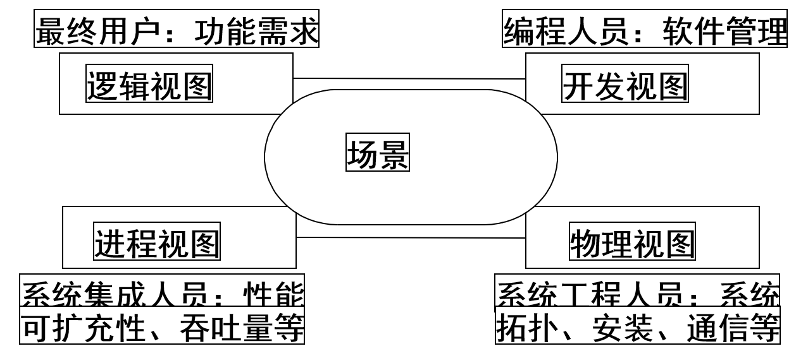
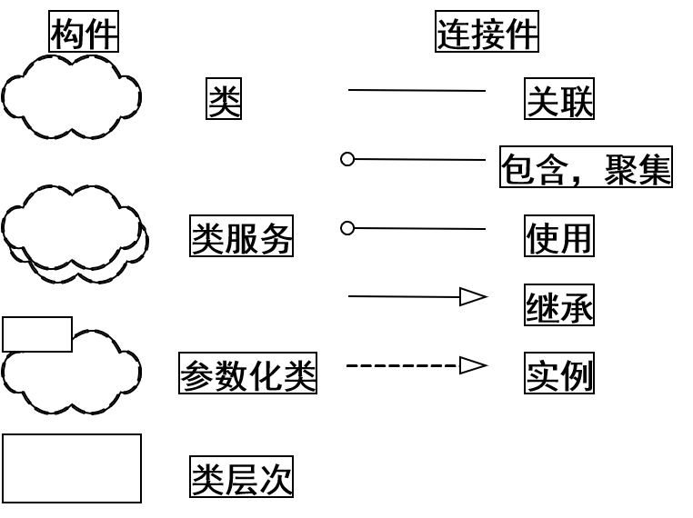

# sa

## 设计模式

- 意义
  - 设计复用。设计模式可以使设计者更加方便地借鉴或者直接使用已验证过的成功设计方案，而不必花大量时间进行重复设计。一些设计模式甚至提供了显式的类图设计及代码示例，为设计的文档化和及软件的开发提供了直接的支持。设计模式可以帮助设计者更快更好的完成软件系统的设计工作
- 一种解决方案，是OO中的数据结构和算法
- 是OO领域中的跟高层次的要求
- 经典的23种设计模式

1. 接口编程
   - 好处：当客户需求变化时，只需编写该业务逻辑的新的实现类，通过更改配置文件(例如Spring框架)中该接口的实现类就可以完成需求，不需要改写现有代码，减少对系统的影响。 采用基于接口编程的项目，业务逻辑清晰，代码易懂，方便扩展，可维护性强。即使更换一批人员，新来的人依然可以快速上手。对于公司来说，意义更大
   - 提供了一种抽象；一种通用的实现规则；
   - 设计更容易，更通用，修改少；
   - 可扩展、符合开闭原则
2. 单例模式
   - 保证一个类只有一个实例，并且提供一个访问他的全局访问点
   - 思路
     - 构造方法私有，不能在外面被创建
     - 公有的、静态的获取实例的方法
     - 获取实例是判定实例是否为空，如果没有，就新建，否则就返回这个存在的实例
     - 有一个静态私有的实例，保存创建的实例
3. 多例模式
   - 思路
     - 构造方法私有，不能在外面被创建
     - 公有的、静态的获取实例的方法
     - 获取实例是否已经达到了指定数量，如果没有，就新建，否则就返回现有的集合
     - 有一个静态私有的实例数组，保存创建的实例
4. 工厂方法，虚构造器
   - 意图：定义一个创建对象的接口，让子类决定实例化哪个类。 Factory Method使一个类的实例化延迟到其子类
5. 抽象工厂
   - 意图：提供一个创建一系列相关或者相互依赖对象的接口，不要指定它们的具体类。
6. 适配器
   - 意图：将一个类的接口转换成用户希望的另一个接口。使得原来由于接口不兼容而不能在一起工作的那些类可以在一起工作

- 抽象工厂模式与工厂模式的区别
  - 抽象工厂模式比工厂模式更复杂，更灵活，一个抽象工厂模式或以先创建出多个具体的工厂，这些具体的工厂再创建出具体的产品。
  - 工厂方法模式，将的是由一个方法，可以产生不同的但是同类的（或者同接口的）产品。工厂方法模式就能满足一般的需要。复杂情况下才用抽象工厂模式
  - 工厂方法采用的是类继承机制（生成一个子类，重写该工厂方法，在该方法中生产一个对象）。而抽象工厂采用的是对象组合机制，专门定义“工厂”对象来负责对象的创建。对象组合的方式就是把“工厂”对象作为参数传递
  - 工厂方法模式：一个抽象产品类，可以派生出多个具体产品类。抽象工厂模式：多个抽象产品类，每个抽象产品类可以派生出多个具体产品类。工厂方法模式的具体工厂类只能创建一个具体产品类的实例，而抽象工厂模式可以创建多个

## ORM 对象-关系映射

- 好处
  - ORM全称Object Relational Mapping，中文是对象关系映射。它其实是创建了一个可在编程语言里使用的–“虚拟对象数据库”。我们在具体的操作实体对象的时候，就不需要再去和复杂的 SQL 语句打交道，只需简单的操作实体对象的属性和方法。至于这个对象里的数据该怎么存储又该怎么获取，通通不用关心。大大缩短了程序员的编码时间，减少了程序员对数据库的学习成本。对于敏捷开发和团队合作开发来说，好处是非常非常大的。
- `com.mysql.jdbc.Driver`
- Hibernate

  ``` xml
  <?xml version="1.0" encoding="UTF-8"?>
  <!DOCTYPE hibernate-configuration PUBLIC
          "-//Hibernate/Hibernate Configuration DTD 3.0//EN"
          "http://www.hibernate.org/dtd/hibernate-configuration-3.0.dtd">
  <hibernate-configuration>
      <session-factory>
          <property name="hibernate.dialect">org.hibernate.dialect.MySQL5InnoDBDialect</property>
          <property name="hibernate.connection.driver_class">com.mysql.jdbc.Driver</property>
          <property name="hibernate.connection.url">jdbc:mysql://localhost:3306/sa</property>
          <property name="hibernate.connection.password">sa</property>
          <property name="hibernate.connection.username">sa</property>
          <property name="hibernate.show_sql">true</property>
          <property name="hibernate.format_sql">true</property>
          <property name="hibernate.hbm2ddl.auto">update</property>
          <mapping resource="cn/edu/scau/cmi/zhuangyuwu/hibernate/domain/Student.hbm.xml" />
          <mapping resource="cn/edu/scau/cmi/zhuangyuwu/hibernate/domain/Teacher.hbm.xml" />
      </session-factory>
  </hibernate-configuration>
  ```

  ``` xml
  <?xml version="1.0"?>
  <!DOCTYPE hibernate-mapping PUBLIC "-//Hibernate/Hibernate Mapping DTD 3.0//EN"
  "http://hibernate.sourceforge.net/hibernate-mapping-3.0.dtd">
  <hibernate-mapping>
      <class name="cn.edu.scau.cmi.zhuangyuwu.hibernate.domain.Student" table="STUDENT">
          <id name="id" type="java.lang.Long" access="field">
              <column name="id" not-null="true"  />
          </id>
          <property name="name" type="java.lang.String">
              <column name="name" not-null="true" />
          </property>
          <property name="teacher" type="java.lang.Long">
              <column name="teacher" not-null="true" />
          </property>
      </class>
  </hibernate-mapping>
  ```

- spring

  ``` xml
  <?xml version="1.0" encoding="UTF-8"?>
  <beans xmlns="http://www.springframework.org/schema/beans"
      xmlns:xsi="http://www.w3.org/2001/XMLSchema-instance" xmlns:p="http://www.springframework.org/schema/p"
      xsi:schemaLocation="http://www.springframework.org/schema/beans http://www.springframework.org/schema/beans/spring-beans-4.1.xsd http://www.springframework.org/schema/tx http://www.springframework.org/schema/tx/spring-tx.xsd"
      xmlns:tx="http://www.springframework.org/schema/tx">
  
      <bean id="liangzaoqing" class="cn.edu.scau.cmi.zhuangyuwu.spring.domain.Teacher">
          <property name="name" value="梁早清"></property>
          <property name="gendar" value="男"></property>
      </bean>
      <bean id="zhangsan" class="cn.edu.scau.cmi.zhuangyuwu.spring.domain.Student">
          <property name="name" value="张三"></property>
          <property name="gendar" value="男"></property>
      </bean>
  
      <bean id="studentDAO" class="cn.edu.scau.cmi.zhuangyuwu.hibernate.DAO.StudentDAO" />
      <bean id="teacherDAO" class="cn.edu.scau.cmi.zhuangyuwu.hibernate.DAO.TeacherDAO" />
  </beans>
  ```

## 体系结构

- 软件危机原因
  - 用户需求不明确
  - 缺乏正确的理论指导
  - 软件规模越来越大
  - 软件复杂度越来越高

- 定义
  - 软件体系结构是具有一定形式的结构化元素，即**构件的集合**，包括处理构件、数据构件和连接构件。
  - 处理构件负责对数据进行加工，数据构件是被加工的信息，连接构件把体系结构的不同部分组合连接起来
  - 软件体系结构是软件设计过程中的一个层次，这一层次超越计算过程中的算法设计和数据结构设计。体系结构问题**包括总体组织和全局控制、通讯协议、同步、数据存取，给设计元素分配特定功能，设计元素的组织，规模和性能，在各设计方案间进行选择等**。
  - 软件体系结构处理算法与数据结构之上关于整体系统结构设计和描述方面的一些问题，如全局组织和全局控制结构、关于通讯、同步与数据存取的协议，设计构件功能定义，物理分布与合成，设计方案的选择、评估与实现等
  - **软件体系结构有四个角度**
    - 概念角度描述 系统的主要构件及它们之间的关系；
    - 模块角度包含 功能分解与层次结构；
    - 运行角度描述 一个系统的动态结构；
    - 代码角度描述 各种代码和库函数在开发环境中的组织
  - 软件体系结构是一个抽象的系统规范，主要**包括用其行为来描述的功能构件和构件之间的相互连接、接口和关系**
  - **软件体系结构是一个程序／系统各构件的结构、它们之间的相互关系以及进行设计的原则和随时间演化的指导方针**
  - **软件体系结构包括一个软件和系统构件，互联及约束的集合；一个系统需求说明的集合；一个基本原理用以说明这一构件，互联和约束能够满足系统需求**
  - **软件体系结构包括一个或一组软件构件、软件构件的外部的可见特性及其相互关系。其中，“软件外部的可见特性”是指软件构件提供的服务、性能、特性、错误处理、共享资源使用等**

### Kruchten提出的“4+1”模型

- 逻辑视图，开发视图，过程视图，物理视图及场景
  - 每一个视图只关心系统的一个侧面，5个视图结合在一起才能反映系统的软件体系结构的全部内容
- 

- 逻辑视图
  - 可以从Booch标记法中导出逻辑视图的标记法，只是从体系结构级的范畴来考虑这些符号，用Rational Rose进行体系结构设计
  - 
- 逻辑视图
  - 逻辑视图中使用的风格为面向对象的风格，逻辑视图设计中要注意的主要问题是要保持一个单一的、内聚的对象模型贯穿整个系统
    - ,
  - 对于规模更大的系统来说，体系结构级中包含数十甚至数百个类
- 开发视图
  - 开发视图也称模块视图，主要侧重于软件模块的组织和管理。
  - 开发视图要考虑软件内部的需求，如软件开发的容易性、软件的重用和软件的通用性，要充分考虑由于具体开发工具的不同而带来的局限性。
  - 开发视图通过系统输入输出关系的模型图和子系统图来描述。
  - 与逻辑视图一样，可以使用Booch标记法中某些符号来表示开发视图
    - 
  - 在开发视图中，最好采用4-6层子系统，而且每个子系统仅仅能与同层或更低层的子系统通讯，这样可以使每个层次的接口既完备又精练，避免了各个模块之间很复杂的依赖关系。
  - 设计时要充分考虑，对于各个层次，层次越低，通用性越强，这样，可以保证应用程序的需求发生改变时，所做的改动最小。开发视图所用的风格通常是层次结构风格
  - 


