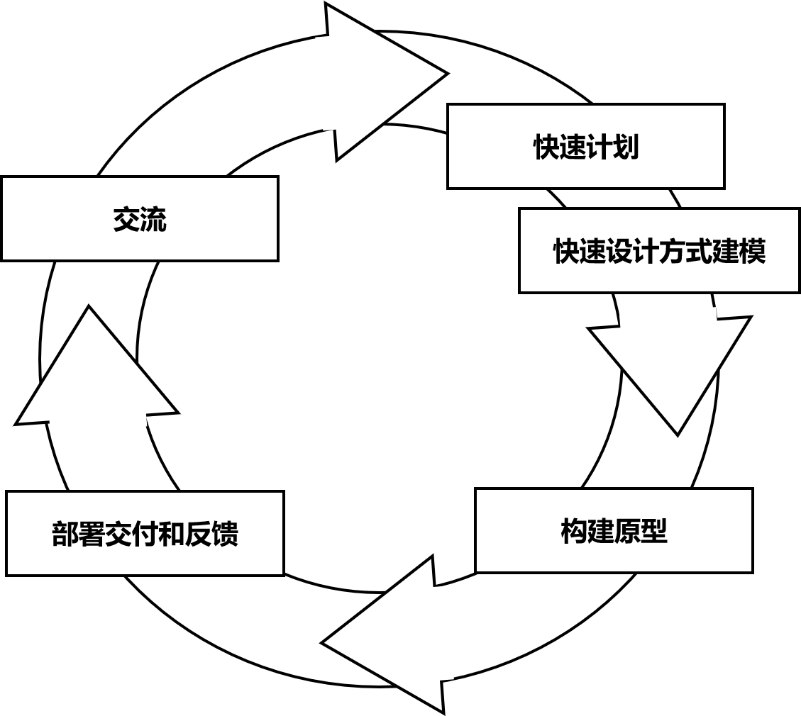
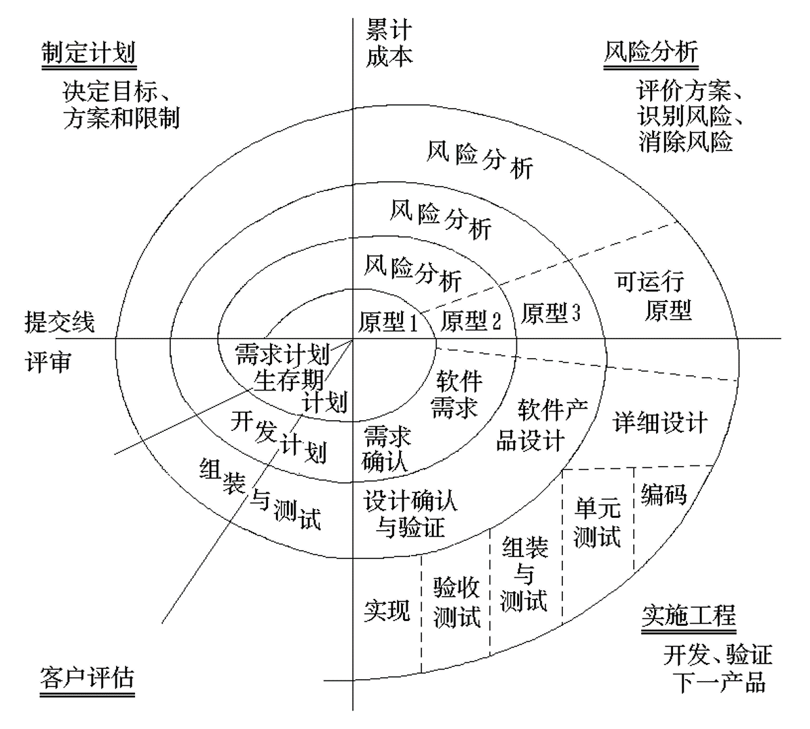

# SE

1. 软件的概念(P1)
   - 计算机系统中的程序及其文档。
     - 程序是计算任务的处理对象和处理规则的描述
     - 文档是为了便于了解程序所需的阐述性资料

2. 软件发展的3个阶段（时间、标志、开发（组织）的方式）(P1)
   - 1946-1956 计算机问世到高级程序语言出现前
     - 计算机存储容量小，速度慢，只有低级语言，以数值计算为主
     - 没有文档，顺序程序
   - 1956-1968 高级程序语言出现到软件工程出现前
     - 大容量存储器，外围设备发展，出现高级语言
   - 1968-至今 软件工程出现到现在

3. 软件的特点 vs 硬件(P3)
   - 软件是一种逻辑实体，而不是有形的系统原件，其开发成本和进度难以准确估计。
   - 软件是被开发的或被设计的，没有明显的制造过程，一旦开发成功，只需复制即可，但其维护工作量巨大
   - 软件的使用没有硬件那样的机械磨损和老化问题。
   - 软件的开发和运行经常受到计算机系统的限制，对计算机系统有着不同程度的依赖性。
   - 软件的开发至今尚未完全摆脱手工的开发方式。
   - 软件的开发费用越来越高，成本相当昂贵。

4. 软件的分类(P3)
   1. 系统软件、支持软件、应用软件
   2. 按工作方式划分：
      - 实时处理软件，分时软件，交互式软件，批处理软件。
   3. 按软件服务对象划分：
      - 项目软件，产品软件。
   4. 按使用的频度进行划分
      - 一次使用，频繁使用。
   5. 按软件失效的影响进行划分
      - 高可靠性软件，一般可靠性软件。

5. **软件工程的定义**(P6)
   1. 将系统化的、严格约束的、可量化的方法应用于软件的开发、运行和维护，即将工程化应用于软件
   2. 在`1`中所述方法的研究

6. 软件生存周期的概念及若干个阶段(P7)
   - 软件生存周期是指软件产品或软件系统从产生、投入使用到被淘汰的全过程
   - 软件生存周期一般可分为以下阶段：
     - 计算机系统工程
       - 计算机系统包括计算机硬件、软件、使用的人、数据库、文档、规程等系统元素
     - 需求分析
     - 设计
     - 编码
     - 测试
     - 运行与维护

7. CMM（能力成熟度模型）目的(P11)
   - 用于评价软件机构的软件过程能力成熟度的模型
   - 提供一种评价软件承接方能力的方法，同时也可以用于帮助软件组织改进其软件过程

8. **瀑布模型**(P16)
   - 特征:
     - 接受上一阶段活动的结果作为本阶段活动的输入
     - 依据上一阶段活动的结果实施本阶段应完成的活动
     - 对本阶段的工作进行评审
     - 将本阶段活动的结果作为输出，传递给下一阶段。
   - 优点：
     - 可强迫开发人员采用规范的方法。
     - 严格地规定了每个阶段必须提交的文档。
     - 要求每个阶段的所有产品都必须经过质量保证小组的仔细验证。
   - 缺点:
     - 缺乏灵活性，难以适应需求不明确或需求经常变化的软件开发。
     - 开发早期存在的问题往往要到交付使用时才发现，维护代价大。
     - 瀑布倒流

9. 原型(P18)
   - 原型(prototype)是为了减少因为对需求了解不确切而给软件开发带来的风险，可以在获取了一组基本需求后，通过快速分析，构造出该软件的一个初始可运行版本。
   - 原型的类型：
     - 探索型（exploratory prototyping）目的是要弄清目标系统的要求，确定所希望的特性，并探讨多种方案的可行性
     - 实验型（experimental prototyping）目的是验证方案或算法的合理性，它是在大规模开发和实现前，用于考核方案是否合适，规格说明是否可靠
     - 演化型（evolutionary prototyping）目的是将原型作为目标系统的一部分，通过对原型的多次改进，逐步将原型演化成最终的目标系统.
     - 原型的使用策略：
       - 废弃（throw away）策略
         - 主要用于探索型和实验型原型的开发。这种原型通常被废丢，然后根据探索或实验的结果用良好的结构和设计思想重新设计目标系统
       - 追加（add on）策略
         - 主要用于演化型原型的开发。这种原型通常是实现了目标系统中已明确定义的特性的一个子集，通过对它的不断修改和扩充，逐步追加新的要求，最后使其演化成最终的目标系统
原型可作为单独的过程模型使用，它也可作为一种方法或实现技术应用于其它的过程模型中

10. 原型模型(P19)
    - 
    - 原型（prototype）是预期系统的一个可执行版本，它反映了系统性质（如功能、计算结果等）的一个选定的子集。一个原型不必满足目标软件的所有约束，其目的是能快速、低成本地构建原型。

11. 螺旋模型(P20)

    - 
    - 是瀑布模型和演化模型的结合，并增加了风险分析
    - 螺旋模型沿着螺线旋转，在四个象限上分别表达四个方面的活动，即：
      1. 制定计划：确定软件目标，选定实施方案，弄清项目开发的限制条件
      2. 风险分析：评价所选的方案，识别风险，消除风险
      3. 工程实施：实施软件开发，验证工作产品
      4. 客户评估：评价开发工作，提出修正建议

    - 螺旋模型出现了一些变种，它可以有3到6个任务区域
    - 螺旋模型指引的软件项目开发沿着螺线自内向外旋转，每旋转一圈，表示开发出一个更为完善的新软件版本
    - 如果发现风险太大，开发者和客户无法承受，则项目就可能因此而终止
    - 多数情况下沿着螺线的活动会继续下去，自内向外，逐步延伸，最终得到所期望的系统

12. **组成基于计算机的系统由哪些元素组成**(P27)
    - **软件、硬件、人员、数据库、文档和规程**

13. **需求工程的概念**(P33)
    - 需求工程是应用已证实有效的技术与方法开展需求分析，确定客户需求、帮助分析人员理解问题、评估可行性、协商合理的解决方案、无歧义的规约方案、确认规约以及将规约转换到可运行系统时的需求管理

14. 需求工程的六个阶段(P33)
    - 需求获取、需求分析与协商、系统建模、需求规约、需求验证、需求管理

15. 软件需求的定义(P35)
    - 软件需求是指用户对目标软件系统在功能，行为，性能，设计约束等方面的期望。

16. 需求获取的方法与策略(P36)
    1. 建立顺畅的通信途径
    2. 访谈与调查
    3. 观察用户工作流程，观察用户的操作
    4. 组成联合小组
    5. 实例（用况）分析

17. 常用的需求分析方法(P41)
    - 面向数据流的结构化分析方法 (SA)
    - 面向数据结构的分析方法
    - 面向对象的分析方法 (OOA)

18. **软件的需求规约主要包含哪些内容**(P43)
    - 引言：陈述软件目标，在基于计算机的系统语境内进行描述。
    - 信息描述：给出软件必须解决问题的详细描述，记录信息内容和关系、流和信息结构。
    - 功能描述：描述解决问题所需的每个功能。其中包括，为每个功能说明一个处理过程；叙述设计约束；叙述性能特征；用一个或多个图形来形象地表示软件的整体结构和软件功能与其他系统元素间的相互影响。
    - 行为描述：描述作为外部事件和内部产生的控制特征的软件操作。
    - 检验标准：描述检验系统成功的标志。即对系统进行什么样的测试，得到什么样的结果，就表示系统已经成功实现了。它是“确认测试”的基础。
    - 参考书目：包含了对所有和该软件相关的文档的引用，其中包括其他的软件工程文档、技术参考文献、 厂商文献以及标准。
    - 附录：包含了规约的补充信息，表格数据、算法的详细描述、图表以及其他材料。

19. 软件设计的任务（注意在回答接口设计的时候，需要讲清楚3个方面的内容）(P46)
    - 使用一种设计方法，软件分析模型中通过数据、功能和行为模型所展示的软件需求的信息被传送给设计阶段，产生数据/类设计、体系结构设计、接口设计、部件级设计。
    - *接口设计主要包括三个方面*
      - 设计软件模块间的接口
      - 设计模块和其他非人的信息生产者和消费者(比如外部实体)之间的接口
      - 设计人(用户)和计算机间的人机接口

20. 软件设计的目标(P48)
    1. 设计必须实现分析模型中描述的所有显式需求，必须满足用户希望的所有隐式需求。
    2. 设计必须是可读、可理解的，使得将来易于编程、易于测试、易于维护。
    3. 设计应从实现角度出发，给出与数据、功能、行为相关的软件全貌。

21. 衡量软件设计的技术标准(P48)
    1. 设计出来的结构应是分层结构，从而建立软件成份之间的控制。
    2. 设计应当模块化，从逻辑上将软件划分为完成特定功能或子功能的部件。
    3. 设计应当既包含数据抽象，也包含过程抽象。
    4. 设计应当建立具有独立功能特征的模块。
    5. 设计应当建立能够降低模块与外部环境之间复杂连接的接口。
    6. 设计应能根据软件需求分析获取的信息，建立可驱动、可重复的方法。

22. 软件设计的过程(P48)
    1. 制定规范
    2. 体系结构和接口设计
    3. 数据/类设计
    4. 部件级（过程）设计
    5. 编写设计文档
    6. 设计评审

23. 数据抽象与过程抽象(P49)
    - 过程抽象（也称功能抽象）是指任何一个完成明确定义功能的操作都可被使用者当作单个实体看待，尽管这个操作实际上是由一系列更低级的操作来完成的。
    - 数据抽象是指定义数据类型和施加于该类型对象的操作，并限定了对象的取值范围，只能通过这些操作修改和观察数据。

24. **模块的概念**(P49)
    - 模块是数据说明、可执行语句等程序对象的集合，它是单独命名的，并且可以通过名字来访问。
    > 模块化实际上是系统分解和抽象的过程

25. **信息隐藏的概念**(P50)
    - 每个模块的实现细节对于其它模块来说应该是隐蔽的
    - 块中所包含的信息（包括数据和过程）不允许其它不需要这些信息的模块使用
    - 隐藏的不是模块的一切信息，而是模块实现细节。通过抽象，帮助人们确定组成软件的过程或信息实体，通过信息隐蔽，则可定义和实施对模块的过程细节和局部数据结构的存取限制

26. **内聚与耦合的概念**(P51)
    - 内聚(cohesion)是一个模块内部各个元素彼此结合的紧密程度的度量
    - 耦合(coupling)是模块之间的相对独立性（互相连接的紧密程度）的度量

27. 功能内聚的概念(P51)
    - 功能内聚 ：指一个模块中各个部分都是为完成一项具体功能而协同工作，紧密联系，不可分割的。

28. 数据耦合的概念(P52)
    - 数据耦合：两个模块之间仅通过参数表传递简单数据，则称为数据耦合。

29. 调用和返回风格的体系结构(P55)
    - 这种风格使一个软件设计者设计出非常容易修改和扩充的体系结构。
    - 包含：主程序/子程序风格体系结构 和 远程过程调用风格的体系结构

30. 部件级设计阶段的主要工作(P58)
    - 为每个部件确定采用的算法，选择某种适当的工具表达算法的过程，编写部件的详细过程性描述；
    - 确定每一部件内部使用的数据结构；
    - 在部件级设计结束时，应该把上述结果写入部件级设计说明书，并且通过复审形成正式文档，作为下一阶段（编码阶段）的工作依据。

31. 程序流程图，判定表(P58)

32. **设计规约主要包含哪些内容**(P63)
    1. 工作范围
    2. 体系结构设计
    3. 数据设计
    4. 接口设计
    5. 各部件的过程设计
    6. 运行设计
    7. 出错处理设计
    8. 安全保密设计
    9. 需求/设计交叉索引
    10. 测试部分
    11. 特殊注解
    12. 附录

33. 结构化分析与设计(P67)
    - 结构化设计与分析方法是一种面向数据流的传统软件开发方法，它以数据流为中心构建软件的分析模型和设计模型。结构化分析(SA)、结构化设计(SD)，结构化程序设计(SP)构成了完整的结构化的方法
    - 适用于信息管理类型的中小规模软件系统(MIS)

34. 结构化分析模型有哪些(P68)
    - 数据流图
      - 数据流，加工，文件，源和宿
    - 实体-关系图，数据流图，数据字典，状态转换图，控制规约，加工规约，数据对象描述

35. 系统响应时间的概念(P230)
    - 系统响应时间指从用户执行某个控制动作（如按回车键或点鼠标）到软件作出响应（期望的输出或动作）的时间。系统响应时间长会使用户感到不安和沮丧。稳定的响应时间（如1秒）比不定的响应时间如0.1秒到2.5秒）要好。

36. 人机界面设计时的常见问题有哪些P230
    - 系统响应时间
    - 用户求助设施（user help facilities），
    - 错误信息处理，
    - 命令标记（command labeling）

37. 人机界面设计的黄金原则是什么P231
    - 让用户拥有控制权
    - 减少用户的记忆负担
    - 保持界面一致

38. 可用性与可用性测试P234
    - 可用性指的是产品的使用效率、易学性和舒适程度。
    - 对界面进行可用性测试和评价是确保产品可用性的重要手段，通过各种可用性测试及早发现界面存在的可用性问题，不仅可以节约开发成本，提高产品的品质，还可以降低用户使用产品的心理负荷，减少操作错误，提高工作效率以及对产品的认可度和满意度。
    - 在进行可用性测试前，设计者需要制订出具体详细的测试计划，包括任务列表、主观满意标准以及所要询问的相关问题。同时，必须确定参与测试的用户数目、类型和来源。
    - 可用性测试可以要求用户完成一系列任务，对用户的完成过程进行记录，再对记录进行评审。这可以给设计人员很大的启发，及时发现缺陷并改正。
    - 局限性：首先，它强调的是首次使用的情况，其次只能涉及到部分的界面。因为可用性测试不能延续太长时间，很难确定长时间使用后的情况。

39. **标识符命名需要注意的问题**P241
    - 这些名字应能反映它所代表的实体，应有一定的实际意义
      - 例如，表示总量的变量名用Total，表示平均值的用Average等
    - 名字不要太长，太长会增加打字量，且易出错,给修改带来困难。应当选择精炼的意义明确的名字
    - 必要时可使用缩写名字，但缩写规则要一致，并且要给每一个缩写名字加注释
    - 不用关键字作标识符
    - 同一个名字不要有多个含义
    - 不用相似的名字，相似的名字容易混淆，不易发现错误
      - 如cm,cn,cmn,cnm,cnn,cmm
    - 名字中避免使用易混淆的字符。
      - 如数字0与字母O
      - 数字1与字母I或l
      - 数字2与字母z

40. 序言性注释P242
    - 通常置于每个程序模块的开头部分，主要描述如下：**
      - 模块的功能
      - 模块的接口：包括调用格式、参数的解释、该模块需要调用的其它子模块名
      - 重要的局部变量：包括用途、约束和限制条件
      - 开发历史：包括模块的设计者、评审者、评审日期、修改日期以及对修改的描述

41. **书写功能性注释需要主要哪些问题**P242
    - 注释要正确，错误的注释比没有注解更坏
    - 为程序段作注释，而不是为每一个语句作注释
    - 用缩进和空行，使程序与注释容易区分
    - 注释应提供一些从程序本身难以得到的信息，而不是语句的重复

42. 编写程序时，对数据说明应该注意哪些问题P244
    - 数据说明次序规范化
    - 说明语句中变量安排有序化
    - 使用注解说明复杂的数据结构

43. **测试用例的概念**(P247)
    - 测试用例（Test Case）由输入数据和预期结果组成，测试时通过输入数据，运行被测程序，如果运行的实际输出和预期结果不一致，则表明发现了程序中的错误。

44. 测试目的P248
    - 软件测试的目的时发现软件中的错误和缺陷，并加以纠正。应该排除对测试的错误观点，设计合适的测试用例，用尽可能少的测试用例，来发现尽可能多的软件错误

45. **白盒测试与黑盒测试的概念**P249
    - **白盒测试又称结构测试：** 把测试对象看作一个透明的盒子，测试人员根据程序内部的逻辑结构及有关信息设计测试用例，检查程序中所有逻辑路径是否都按预定的要求正确地工作
    - **黑盒测试又称行为测试：** 把测试对象看做一个黑盒子，测试人员完全不考虑程序内部的逻辑结构和内部特性，只依据程序的需求规格说明书，检查程序的功能是否符合它的功能需求

46. **测试用例设计**P249
    - **白盒测试：** 逻辑覆盖测试、逻辑表达式错误敏感的测试、基本路径测试、数据流测试、循环测试
    - **黑盒测试：** 等价类划分、边界值分析、比较测试、错误猜测、因果图

47. **各种逻辑覆盖准则以及它们之间的关系**(P249)
    语句覆盖、判定覆盖、条件覆盖、判定/条件覆盖、条件组合覆盖、路径覆盖

    | 逻辑覆盖法种类 | 关系 |
    | ---- | ---- |
    | 语句覆盖 | - |
    | 判定覆盖 | 包含语句覆盖 |
    | 条件覆盖 | - |
    | 判定/条件覆盖 | 包含判定覆盖和条件覆盖 |
    | 条件组合覆盖 | 包含满足判定/条件覆盖 |
    | 路径覆盖 | 包含语句覆盖 |

48. 基本路径测试P255
    - 首先根据程序或设计图画出控制流图，并计算其区域数，然后确定一组独立的程序执行路径（称为基本路径），最后为每一条基本路径设计一个测试用例

49. **等价类的概念**P259
    - 等价类划分方法将所有可能的输入数据划分成若干个等价类，然后在每个等价类中选取一个代表 性的数据作为测试用例

50. **测试V模型中四类测试的对象、依据和任务分别是什么**(P267)
    - **单元测试，依据：详细设计**
      - 单元测试又称模块测试，它着重对软件设计的最小单元(软件构件或模块)进行测试，主要用来揭露编码阶段产生的错误
    - **集成测试，依据：概要设计**
      - 集成测试又称组装测试，经单元测试后的模块需集成为软件系统，集成测试是对集成后的软件系体进行测试，主要用来揭露设计阶段产生的错误
    - **确认测试，依据：需求规约**
      - 确认测试以软件需求规约为依据，以发现软件与需求不一致的错误。主要检查软件是否实现了规约规定的全部功能要求，文档资料是否完整、正确、合理， 其他的需求，如可移植性、可维护性、 兼容性、错误恢复能力等是否满足
    - **系统测试，依据：项目规划/系统工程**
      - 系统测试是对整个基于计算机的系统进行的一系列测试，主要揭露不符合系统工程中对软件要求的错误，分为恢复测试、安全保密性测试、压力测试、性能测试

51. alpha测试和beta测试的概念，属于确认测试P273
    - **α测试**是由一个用户在开发者的场所进行的，软件在开发者对用户的“指导下”进行测试。经α测试后的软件称为β版软件
    - **β测试**是由软件的最终用户在一个或多个用户场所进行的，与α测试不同，开发者通常不在测试现场，因此，β测试是软件在一个开发者不能控制的环境中的“活的”应用，用户记录所有在β测试中遇到的（真正的或想象的）问题，并定期把这些问题报告给开发者，在接到β测试的问题报告后，开发者对软件进行最后的修改，然后着手准备向所有的用户发布最终的软件产品

52. 安全保密性测试，属于系统测试P274
    - 安全保密性测试，用来验证集成在系统中的保护机制能否实际保护系统不受非法侵入

53. 压力测试与性能测试，属于系统测试
    - **压力测试**又称强度测试，它是在一种需要非正常数量、频率或容量的方式下执行系
统，其目的是检查系统对非正常情况的承受程度。
    - **性能测试**用来测试软件在集成的系统中的运行性能。它对实时系统和嵌入式系统尤为重要。

54. 测试完成的标准P277
    - “如果一个在按照概率的方法定义的环境中，1000个CPU小时内不出错运行的概率大于0．995的话，那么我们就有95%的信心说，我们已经进行了足够的测试”
    - 观察测试过程中单位时间内发现错误数目的曲线

55. 调试的目的P277
    - 测试的目的时发现错误，当测试发现错误后需要进行调试，调试(debugging，也称排错)的目的是确定错误的原因和准确位置，并加以纠正

56. 调试过程P277
    - 找到错误的原因和位置，则将其改正，并进行回归测试，以确保这一改正未影响其他正常的功能
    - 未找到错误的原因和位置，此时应假设错误的原因，并设计测试用例来验证此假设，重复这一过程直至找到错误的原因，并加以改正。

57. **软件维护的定义**P297
    - 是指软件系统交付使用以后，为了改正错误或满足新的需要而修改软件的过程

58. 纠错性维护P298
    - 为了改正软件系统中的错误，使软件能够满足预期的正常运行状态的要求而进行的维护

59. **适应性维护**P298
    - 为了使软件适应内部或外部环境变化，而去修改软件的过程

60. 改善性维护P298
    - 满足使用过程中用户提出增加新功能或修改已有功能的建议进行的维护

61. 预防性维护P299
    - 为了提高软件的可维护性、可靠性等，为以后进一步改进软件打下良好基础而修改软件的活动

62. 提高可维护性的方法P304
    - 确定质量管理目标和优先级
    - 使用提高软件质量的技术与工具
    - 选择可维护性高的程序设计语言
    - 完善程序文档
    - 进行质量保证审查

63. **软件质量的定义**P321
在规定条件下使用时，软件产品满足明确或隐含要求的能力
